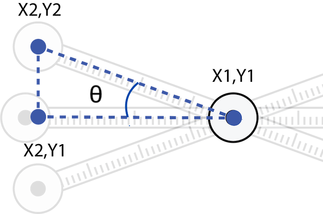
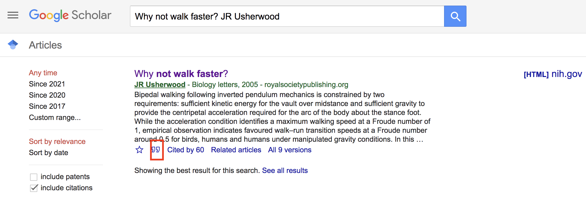
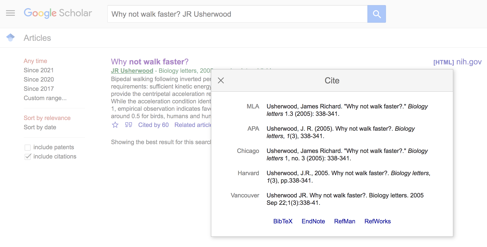

```{r setup, include=FALSE}
knitr::opts_chunk$set(echo = TRUE)
library(tidyverse)
```

<link rel="stylesheet" href="https://cdnjs.cloudflare.com/ajax/libs/font-awesome/5.14.0/css/all.min.css">


## Introduction
Our second Miniproject explores several topics in the biomechanical basis of terrestrial locomotion. In particular, we'll focus on how well the inverted pendulum model applies in predicting the maximum speed of walking humans and to what extent some kinematic variables, like pelvic tilt, contribute to differences in speed. We'll also look at how these kinematic variables vary by size and sex. Our general goals are to:

+ Use imageJ to perform kinematic analysis
+ Use simple mathematical models to predict maximum limb walking speed
+ Test predictions of walking speed with measurements and observations
+ Evaluate the effects sex and size (scaling!) on your observations


```{r pend,echo=F,fig.cap=c("The inverted pendulum model of bipedal locomotion"),fig.align = 'center'}
knitr::include_graphics(c("pend.png"))
``` 


### Conceptual basis
As we've learned, the inverted pendulum (IP) is rather simple model for understanding how we walk. Under the IP model, the leg forms the radius of an arc through which your center of mass (COM) travels. Thus, we can use concepts surrounding centripetal forces to estimate how fast we walk. So far, we've ignored air resistance and the inertial effects of other moving parts (e.g., arms) and assumed the leg is rigid and rotates about the ground at a single point of contact. Under these conditions, we can make predictions as to the maximum linear velocity of our COM. The force associated with this swinging pendulum can be described as

$$
F =ma_c=\frac {mv^2}{R} 
$$

where $a_c$ the acceleration due to gravity and $R$ is the leg length, or the radius of the inverted pendulum. From this we see that the maximum velocity of the rotating mass is never greater than the square root of the product of gravity and the radius, or, in biomechanical terms 

$$
v_{max}^2 \leq gl
$$

$$
v_{max} \leq\sqrt{ gl}
$$

where $g$ is gravity and $l$ the leg length. Thus, as we have learned in class, the Froude efficiency for walking is:

$$
Fr =\frac {v^2}{gL}<=1 
$$
 
where $v$ and any walking velocity is less or equal to than $v_{max}$.

As has become clear in our class discussions and demonstrations, the leg length is the radius and any increase in this length will result in a greater velocity. In addition, any biomechanical mechanism that increases the leg length during otherwise lower phases of the arc (e.g., pelvic tilt, that is lifting the plant-leg side of the pelvis, \autoref{fig:tilt}) will keep the COM higher and increase the velocity.


```{r tilt,echo=F,fig.cap=c("A walker tilting its pelvis"),fig.align = 'center'}
knitr::include_graphics(c("pelvictilt.jpg"))
``` 

 

## Methods
There are two parts to this MP: (1) predicting and testing predictions of maximum walking speed and (2) an analysis of pelvic tilt as it varies between normal walking at comfortable speeds and fast speeds. For both parts of this MP, it is important that you walk and not run. That means a duty factor of >0.5, i.e., you'll always have a foot on the ground. Lab partners, police your colleagues to ensure this.

### Sofware essentials

We'll need a few pieces of software to analyze the kinematics of walking. First, [download and install imageJ](https://imagej.nih.gov/ij/download.html), a free image analysis package that just about everyone in the natural sciences uses at one point in their career. Second, download the following two plugin jar-files: [MTrackJ_.jar (version 1.5.1)](https://imagescience.org/meijering/software/download/MTrackJ_.jar) and [imagescience.jar (version 3.0.0)](https://imagescience.org/meijering/software/download/imagescience.jar). Then install them to imageJ by selecting "Plugins" $\rightarrow$ "Install" and navigating to these jar files and selecting "open". MTrackJ is a simple tracking plugin that allows users to track points across video frames.

We'll be working with video data captured with our phones. The file types associated with videos shot by phones are often unworkable in imageJ. We need a way of converting your phone videos to AVI format, a file type that imageJ can open. Videos can be rendered into AVI files using---you guessed it---free and open source tools like MPEG Streamclip, which [can be downloaded here](http://www.squared5.com/)


### Max out your pendulum
For this part of the MP you will compare a predicted maximum walking velocity ($v_{max}$) to observed maximum walking speed. First things first: mark off a distance of 5 meters on level ground (e.g., in the hall, atrium, etc.).

With your knees locked and your hands by your side and not swinging, walk on your heels as fast as you can across the the marked distance. Concentrate on not using any movement in your pelvis or knees. This may require some practice. You may, if you're careful, have a lab partner push you gently to get you going at the start of the 5-m field. With a phone or watch, record the time it takes to traverse the 5-m distance. 

Using these data, compute the velocity (in m s$^{-1}$) and compare this to your calculated $v_{max}$. Please enter these data [**HERE**](https://docs.google.com/spreadsheets/d/13_dIyeWHcFt_7bKkLkgFhfY0IRjRBRmlI9y5xj2Juhc/edit?usp=sharing). They can be accessed here for later analysis as well.

### Full-tilt walking
The radius of your rotating mass can be effectively increased by subtle changes in posture, including active alterations in pelvic position. Pelvic tilt is one such mechanism and the angle of tilt can be measured using ImageJ. While pelvic tilt results in a lengthening of the plant-leg, there are other postural consequences. 

Start with donning the markers and the yardstick with markers attached at its end as in the figure below. Attach one small marker low on the front of your shin. Attach the yardstick with binder clips to your pantwaist. Be sure that the yard stick rests right above your anterior superior illiac spines (those bony points on the front of your hip). This apparatus will amplify your pelvic motions and make data recording much easier. Have a project partner record video (in normal video mode) of your walk as you walk toward her/him over the 5-m course from the earlier experiment. Be careful that the full width of the yardstick in the frame at all times. You'll perform two trials per partner: (1) walking normally at a comfortable speed and (2) walking normally but as quickly as possible. For both trials, use ImageJ and the MTrackJ plugin to track the markers on your body. From these data, you should compute two things: pelvic tilt angle (i.e. the difference between the maximum and minimum tilt angle) and the angle of the leg relative to the COM (the point below the navel.  Please also enter these data [here](https://docs.google.com/spreadsheets/d/13_dIyeWHcFt_7bKkLkgFhfY0IRjRBRmlI9y5xj2Juhc/edit?usp=sharing). Remember, these data can be accessed for analysis from this directory. Also notice there are data from previous iterations of the class. Be sure to use all of these in your analysis.


To analyze your videos in ImageJ, you'll need to convert them to and AVI file and have the MtrackJ plugin installed (see above). Once the AVI file is stored in a directory, open it with ImageJ (File$\rightarrow$ Import $\rightarrow$ AVI . . .). Launch the MTrackJ plugin (Plugins $\rightarrow$ MtrackJ) and follow the directions from the online [manual](http://www.imagescience.org/meijering/software/mtrackj/quickstart/). The goal here is to track four positions and calculate your two kinematic values: pelvic tilt and leg angle.


```{r walk,echo=F,fig.cap=c("You lookin' all marked and stuff"),fig.align = 'center'}
knitr::include_graphics(c("walkfront.png"))
``` 


## What to address in the report

1. How did class-wide $v_{max}$ compare to actual class-wide walking speed? Were any patterns related to this revealed by calculating the Froude number?
2. How does pendulum walking speed ($v_{max}$) vary with human size and sex? 
<!-- for future . . . How does actual recorded maximum pendulum walking speed ($v_{max}$) vary with human size and sex?  -->
3. How does pelvic tilt change with increased walking speeds. What is the biomechanical basis for this?
4. Does pelvic tilt at comfortable walking speeds vary with human size (i.e., mass and height) and sex? 

As a group, please synthesize the results of your experiments and address these questions in a report in markdown format that follows the structure outlined on our [Min-projects page](mini_projects.html). Reports and any data files reference by them are due Thursday, March 4th, by 11:59 PM. They can should be sent to Prof. Kenaley in a zipped directory over email.


## A kick start

To answer these questions, you'll have to concatenate a bunch of data. Fortunately, we've learned how to do this lately. However, for it to proceed smoothly, you might need some guidance, especially dealing with the data from the MTrackJ analysis. Let's assume you produced 4 files for two teammates that each walked fast and slowly. If we had our data file names begin with "walk" and end in ".txt", we could use a handy `grep` search to find all the files we want to analyze in the directory.

```{r}
walk.files <- list.files()[grep("walk_.*.txt",list.files())]
print(walk.files)
```

Notice how they are similarly named "walk_speed_subject.txt". That familiar convention of adding metadata to the filename makes it easy to extract "data about the data" from the file names. Now, as we did in the first , let's concatenate all the data into one data frame for subsequent plotting and analysis. 

```{r}
walk.dat <- list() #make a list for storing
for(i in walk.files){
  walk.i <- read_delim(i,delim="\t") #read data as a tibble
  met.dat <- unlist(strsplit(i,"_")) #split i for metadata and unlist it
  speed <- met.dat[2] #get speed
  subject <- gsub(".txt","",met.dat[3]) #remove ".txt" 
  walk.dat[[i]] <- walk.i%>%
    mutate(speed=speed,subject=subject)
}
walk.dat <- do.call(rbind,walk.dat)
head(walk.dat)
```

Sweet. But, notice that the column names given to the data are gobblygook with all those spaces in and "[pixel]" and "[sec]" in there. Let's change them for easy referencing with a `str_remove()` (remove string) operation from the`stringr` package loaded with `tidyverse` . . . 


```{r}
colnames(walk.dat) <- str_remove(colnames(walk.dat)," \\[pixel\\]| \\[sec\\]")
head(walk.dat)
```

That's better. Now, let's pare down the data to those columns we actually care about, "x" and "y", the x and y positions of the points, "subject", and "speed". Also notice that the MTrackJ file contains a "TID" and "PID" column identifying to what track (which dot in the image) and point (the series of positions) to which the x and y positions belong. So let's keep these columns, too, then dump the others, and give it a quick plot with ggplot.

```{r}
walk.dat2 <- walk.dat%>%
  select(TID,PID,x,y,subject,speed)
walk.dat2%>%
  ggplot(aes(x,y,col=speed))+geom_point()+facet_grid(subject~.)
```

Notice that our leg point (TID=3) is higher than the hip. That's odd! Well, not really. Convention holds that pixel 0,0 is the upper left of the image, so that means the coordinates are flipped vertically in our images. So let's flip them back by finding the absolution value each y value minus the maximum y position (the image height).

```{r}
walk.dat2 <- walk.dat2%>%
  group_by(speed,subject)%>%
  mutate(y=abs(y-max(y)))
walk.dat2%>%
  ggplot(aes(x,y,col=speed))+geom_point()+facet_grid(subject~.)#grid it with columns = to speed
```

OK, all well 'n good. But does it make sense to identify our tracked points by "TID", that is 1, 2, and 3? Wouldn't it be better to change this to some character description like "hipR", "hipC", and "legR", for right hip, center of the hip, and right leg, respectively. Let's do it by changing TID to these strings using a series of mutate operations that replace each TID value. (if you do this, confirm the order is correct!)

```{r}
walk.dat2 <- walk.dat2%>%
  mutate(TID=replace(TID, TID==1, "hipR"))%>%
  mutate(TID=replace(TID, TID==2, "hipC"))%>%
  mutate(TID=replace(TID, TID==3, "legR"))
head(walk.dat2)
  
```

Now it'll be easier to keep track of which track we intend to reference in any plotting or analysis. 

With the data loaded, let's think about what sort of operations you need to produce on this data set. You need angle for pelvic tilt, right? The angle subtended by the tip of the of our meter-stick amplifiers and the center of the pelvis ($\theta$) can be described in the following: 

```{r tiltcacl, echo=F, fig.align='center', fig.cap=c("A look at the coordinates of the amplified pelvic positions")}

``` 

where points $x_1y_1$, $x_2y_2$, and $x_2y_1$ respectively describe the coordinates of the pelvic center, the tip of the pelvic amplifier, and a theoretical point that represents a vertex horizontally aligned with the pelvis and vertically aligned with the hip amplifier. In other words, $x_1y_1$ describes the coordinates of "hipC"  and $x_2y_2$ describes the coordinates of "hipR" in x and y pixels in the data above. So arranged, we have a right triangle with vertices described by the x and y pixels we have digitized with MTrackJ. With simple trigonometry, we can calculate $\theta$. So please **think about how to do this with calculations in R**.

The goal here is to calculate $\theta$ over every frame. But we have a problem. Notice that the data, as presented above, don't have the x and y pixels for each point aligned in unique rows according to each frame ("PID"). That is, the data are in a "long" format where the column "TID" (the point name) describes "PID" (the frame). Put another way, x and y pixel data are repeated in succession *down* the table for each point name. This makes calculations for frame-specific $\theta$, which will presumably require using the x and y coordinates for three points, very cumbersome. 

Not to worry, however. Data wonks are accustomed to this problem and we can simply transform the table to a "wide" format. By wide, we mean that, for each frame, we'll have sepqrate x and y columns for each point name, making frame-specific calculations based on these points easy peasy.

Here's how it's done:

```{r}
walk.wide <- walk.dat2%>%
  pivot_wider(names_from=TID,values_from=c("x","y"))
head(walk.wide)
```
Notice that we now have columns that are named as "x_" and "y_" with a point name suffix, i.e., we have taken the x and y column and made new ones based the point they describe. We have several new columns and fewer rows of course. For this we used `dplyr`'s `pivot_wider()` functions that, well, pivots long data to wide data. We told `pivot_wider()` to take the names from "TID" (the point names) to form the new columns with values from the columns named "x" and "y". We could now compute $\theta$ for each PID (i.e., frame) based on the coordinates of each point.


## Adding references

As we take on the rest of the mini-projexts, including this one, we'll be reading scientific papers so that we can place our results in context. In addition, as scientists, we always want to support our statements of fact with references. For this,  we'll need to cite and include these papers in a bibliography. 

[Adding reference to an .Rmd](https://rmarkdown.rstudio.com/authoring_bibliographies_and_citations.html) is pretty straight forward. First we'll need to establish a .bib file that will reside in the same directory as your .Rmd file. To do this, select "File->New File->Text File." A new tab will appear with the name "Untitled1.txt". Save this file as "BIOL5380.bib" (note the ".bib" extension) in the same directory as your .Rmd file. This .bib file will be referenced by your .Rmd when inserting citations. 

The framework for citations and references in .Rmd is formulated around [BibTex](https://en.wikipedia.org/wiki/BibTeX). BibTex is handy because you can find BibTex formatted citations in all your typical outlets (see note below). This system of citation uses a .bib file that contains text describing published works. Each work or potential reference in the .bib file is identified with a unique tag at the top of its entry and this entry contains the important bibliographic information. For instance, a .bib file containing a reference to the following paper

Usherwood, J.R., 2005. Why not walk faster?. Biology Letters, 1(3), pp.338-341.

would have the following text:

```
@article{usherwood2005not,
  title={Why not walk faster?},
  author={Usherwood, James Richard},
  journal={Biology Letters},
  volume={1},
  number={3},
  pages={338--341},
  year={2005}
}
```

Notice we have a tag "&#64;article{usherwood2005not,". This identifies the entry as a journal article (as apposed to a book or manual, etc.) and contains a key that is unique among all the other references in the .bib file. After this, the entry then goes on to identify the important bibliographic pieces: title, author, journal, etc.). Go ahead and add this BibTex reference to your BIOL5380.bib file and save it. 
For .Rmd to reference this .bib file, we need to specify a bibliography file in the YAML header. So now alter your YAML header at the top of the .Rmd so that it contains `bibliography: BIOL5380.bib". The YAML header should now look something like this:


```
---
title: "Mini-Project 2"
author: The Inverted Pendula
date: 26/Feb/2021
output: html_document
bibliography: BIOL5380.bib
---
```

With a .bib file now in place, we can use the reference keys to cite works listed in the .bib file. For this, we simply add the key label to the text with '@'. For instance, `@usherwood2005not` will produce @usherwood2005not. 

When citing published works in text, we often follow certain formatting conventions. To be honest, your professor couldn't care less about which format gets used in your .Rmds. Fortunately, R Markdown uses a familiar [Harvard-like](https://www.citethisforme.com/harvard-referencing) format by default and he recommends plowing ahead with it. In a Harvard-like format, a reference in a sentence used in an explicit manner includes the reference year in parentheses. For instance, if we were to express that these authors studied the the Froude number in humans, we would write, "Underwood (2005) studied the Froude number in human walking." The reference `usherwood2005not` is just inserted at the beginning of the sentence as in the following:

```
@usherwood2005not studied the Froude number in human walking.
```

However, Harvard-like convention follows that if we aren't explicit about the study, we include the entire reference in parentheses. For instance, if we wanted to write, "A recent study considered the Froude number in human walking. [@usherwood2005not]." we would include the following:

```
A recent study considered the Froude number in human walking. [@usherwood2005not].
```
Note that `usherwood2005not` is wrapped in `[]`.

In R Markdown, bibliographies will be placed at the end of the document (see below). Normally, this means you want to end your document with the header "References". This will anchor the bibliography in this section.


Note that this .bib file can be used in all your .Rmd documents, not just this one. As long as all the BibTex entries have unique keys, this .bib file can serve as a reference database for all your .Rmd citations.


<div class = "green">
<div class="row">
  <div class="col-sm-2"><a class="far fa-sticky-note fa-5x" style="color:#939681"></a> <!-- regular style --></div>
  <div class="col-sm-9">

You may be wondering where you can find BibTex citations. Like so much of our lives, the answer points to Google, specifically Google Scholar. As an example, go to [Google Scholar](http://scholar.google.com/) and search for the @usherwood2005not paper. The entry under scholar will look like the following:


<br>

Click on the big `"` at the bottom of the entry. This will bring you to a pop-up window that contains different citation formats for the entry. 



<br>

Now click on the "BibTex" link at the bottom of the window. This will lead you to a text file of the BibTex format. Simply copy and paste this to your .bib file. Voila.

</div>
</div>
</div>
<br>

## References