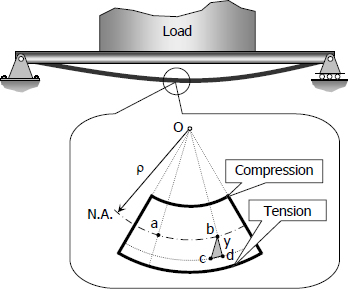
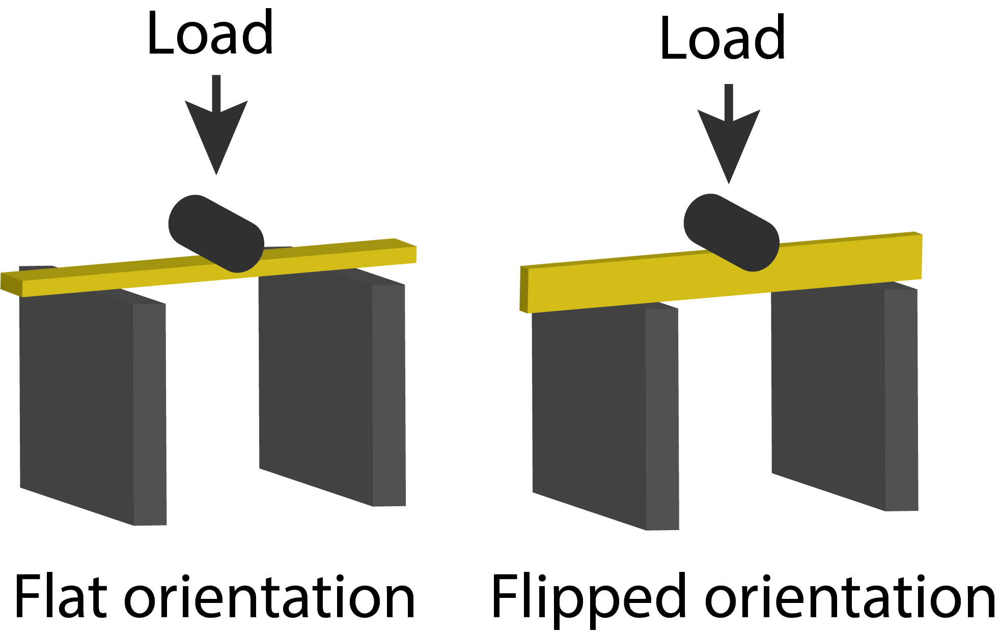

## Introduction

Our third Mini Project explores experimental methods for quantifying the material and structural properties of biological tissue (e.g., wood and intestine). Please recall that material properties (the inherent ones) are independent of structural properties (i.e.,size and shape). The goals of this MP are to:


1. Learn how to measure force and displacement so that you can construct a stress-strain curve.
2. Use a homemade three-point bender to estimate flexural stiffness of biomaterials.
3. Understand data acquisition using a computer and an Arduino.
4. Explore the concept of anisotropy
5. Combine your recently gathered skills in R programming with a proficiency with RMarkdown to write a short 2-page report outlining your results and conclusions.

## Conceptual basis
In lecture recentlty we explored the concepts of stress ($\sigma$), strain ($\varepsilon$), and stiffness ($E$, Young's modulus). These are all material properties and represent mechanical means to characterize biomaterials. These physical quantities are summarized here:


$$\sigma =\frac {F}{A} $$

$$\varepsilon =\frac {\Delta L}{L_o} $$

$$\varepsilon =\frac{d \sigma}{d \varepsilon}$$ 
 

where $F$ is the applied force, $A$ is the cross-sectional area over which that force is applied, $\Delta L$ is the change in length in response to $F$, and $L_o$ is the initial length of the specimen. Young`s modulus ($E$) is the slope of the stress-strain curve and is constant for Hookean materials (i.e., they obey Hooke's Law and are completely spring like). As you may discover in this MP (and we have discussed in class), many biological materials are non-Hookean and the relationship between stress and strain is not linear. In addition, many biological materials may also demonstrate -anisotropic- behavior: the relationship between the stress and strain depends on the direction in which the stress is applied. For example, any biomaterial containing fibers of axial orientation (that is, parallel fibers) will show some degree of anisotropy. Examples of biomaterials with fibers include skin, intestine, wood, plant stems, etc.

In addition to nonlinear and anisotropic behaviors, many biomaterials are viscoelastic (as we have discussed in lecture), demonstrating a time-dependence in their response to loads. There are a host of methods available for quantifying time-dependent properties including creep tests (applying a constant force, i.e., an isotonic load) or applying a load at variable speeds. We'll take this latter approach. 

Lastly, we will learned that loads are not applied in simple tensile or compressive modes. Say, in bending a beam, the load is compressive and tensile at the same time (see below). How a biomaterial responds under bending (e.g., amount of strain, load at failure, etc.) is of a particular interests to biomechanists both to understand organismal design from an evolutionary perspective and what materials may be capable or incapable of in nature. To understand this structural response to a bending load, we may borrow a bag of tricks from material engineers: the three-point bending test. 

<center>
{#bendstress}
<br>
A beam subject to bending.
</center>

<br>

As we'll learn from lecture, the two-dimensional shape of a beam determines its strain relationship to a bending stress or its deformation. So, how much it will deform under a stress is given by the flexural stiffness ($M$): 

$$ M=EI $$
 

where $E$ is the Young's modulus and $I$ is the second moment area, which is essentially the distribution of that stiffness (i.e., area) through the shape with reference to the axis along which a load is applied. Thus, to understand the deformation that will result from a load and vice-versa, we must incorporate information about the shape. So, for a  beam under a symmetrical bending load, the deflection is given by:

$$d=\frac{Fl^3}{3EI}$$

where d is the deflection, $F$ is the applied force, l is the length of the beam, and $EI$ is the flexural stiffness. Using this, if we measure the deflection of a beam of length $l$ under a known load F, we can derive an estimate for the flexural stiffness of the beam, $EI$.

## Measuring forces
We, as biomechanists, can measure measure forces (i.e., loads) in several ways, some direct, some simple, and some more sophisticated. For instance, to apply a load to a material, one may simply add a mass and, because we're on Earth, we know that mass's acceleration, and thus can estimate force. In another manner, we can rely on transducers to convert  (i.e., -transduce-) signals from one type of energy to another. For this method of measuring changes in force, say a signal stored as mechanical energy, we must convert this mechanical energy to electrical energy using a force transducer. Such a device outputs a change in voltage that is proportional to the force that was applied to them. One of the most common elements used in force transducers is a compression-extension load cell, which is what you will be using in this lab. These devices contain elements that, when a load is applied, strains (in this case, shortens or lengthens) a metal foil which is linearly elastic or Hookean. A voltage is passed through the Hookean foil, and, when the cell is loaded, the cylinder changes length and, thus, changes the resistance. This change in resistance changes the voltage.  This voltage can be passed to an amplifier and microcontroller (computer) for analysis.

## Methods

There are two parts to this lab: (1) investigating material properties (stress-strain relationships and anisotropy) and (2) instigating structural properties (beam loading and viscoelasticity). In the former, you will use a simple loading technique, measure the resultant strain, examine stiffness, and the extent to which the material is anisotropic.

In the latter part, you will use 3-point bending tests to determine structural properties and flexural stiffness of wood. You'll also examine how time-dependency varies according to the viscoelastic nature of wood (i.e, how moist it is).


## Stretch the pig

These experiments will be done on your own with your team. Come by Higgins 535 to pick up the materials you need:

+ Ruler
+ Nuts
+ Floss
+ Paper clip
+ Clamp
+ Intestine

For this part of the lab you will use a spring clamp to mount a piece of animal tissue to a table. The animal tissue we will be using is pig intestine, which is an extremely thin and stretchy material typically used as sausage casing. We will measure the stress-strain relationship of pig intestine by cutting a small strip of the material and stretching it by applying a force to one end. This force will create stress within the material and cause it to elongate (strain). As you modulate the amount of stress applied to the material, you will measure its deformation and thereby derive its stress-strain relationship.

### Preparing your sample

The pig intestine was obtained from a local butcher. The material is difficult to work with once it starts to desiccate, so you will want to do as much preparation of the sample as possible before cutting your piece and beginning your experiments. First, cut a piece and  the material along the axial or circumferential direction---you will test the gut in both directions for this lab, so the order doesn't matter. Measure all three of its dimensions to the nearest mm with the supplied ruler. Next, find a clean section of the intestine and clamp it a table. Once you have the material bound, cut away material so that you are left with a thin strip about 5--8 cm long and 1 cm wide. Tie a short section of dental floss to the free end and then tie a hook to the free end of the floss fashioned from a paperclip. 

### Measuring stress and strain 

In this section, you will obtain a stress-strain relationship for your sample by stretching your sample with known weights. Next, you hang weights from the free end of the sample to apply a known stress. Our weights in this case are 3/8-16 nuts, which each weigh 12.5 g, and you will suspend these from your sample using a hooked paperclip weighing 0.2 g. As you add more mass to the free end of the sample, measure the extension of the sample with a ruler. Measure strain under 5 different loads and then remove them, one by one and measure the strain again. Record your results on this worksheet for both an axially-loaded sample and a circumferentially-loaded sample.

## Bend the twig

For this set of experiments, we'll be meeting in Prof. Kenaley's lab (Higgins 535).

### Preparing your sample

For this part of the lab, you will be three-point bending a biomaterial (wood . . . birch, methinks). You will deflect a piece a known distance (1 mm) of wood spanning two supports separated by 20 mm. To begin, record the width and thickness or your piece of wood (in the middle is fine).

Next, break the stirrer in half. Immerse one of the broken halve under water for 5 minutes.

### Measuring load and deformation

Prof. Kenaley will help you initiate the program that reads the load data from the load cell system. The program will depress a cylinder against the span of the wooden beam at either a slow or fast speed while it reads the load in grams. We will bend the dry piece with the wide side flat against the supports ("flat", left in the figure below) at both slow and fast speeds and then flip it 90$^\textrm{o}$ so that the thin side rests against the supports ("flipped", right in the figure below) and load it at a slow speed. 

<center>



<br>
Two orientations of the wood stirrer.
</center>
<br>

Repeat the bending procedure twice for the wet piece, both with the broad side against the supports (i.e., "flat"), but once at a slow speed and once more at a fast speed.

In total, we will have preformed 5 experiments:

```{r,echo=FALSE,message=FALSE}

library(tidyverse)
data.frame(d=c("dry","dry","dry","wet","wet"),o=c("flat","flat","flipped","flat","flat"),s=c("slow","fast","slow","fast","slow")
)%>%knitr::kable(col.names=c("moisture","orientation","speed"))%>%
  kableExtra::kable_styling()
```


All the data will be recorded in a text file and placed in [this directory](https://drive.google.com/drive/folders/12XoBssxGBwXlfpXBXX-Syw_mxc5aBpwN?usp=sharing).


## Data sheet

### Guts

```{r echo = FALSE }

mat.data <- matrix("",nrow=4, ncol=2)
colnames(mat.data) <- c("Longitudinal","Circumferential")
row.names(mat.data) <- c("Length (m)",	"Thickness (m)"	,	"Width (m)",	"Cross-sectional area m$^2$")
knitr::kable(mat.data, caption = "Material Data")%>%kableExtra::kable_styling()
```


### Stress-strain data 


```{r echo = FALSE, results = 'asis'}

mat.data <- matrix("",nrow=6, ncol=2)
colnames(mat.data) <- c("Loading","Unloading")
row.names(mat.data) <- c(paste0(1:5,"."),"")


knitr::kable(mat.data, caption = "Intestine Data")%>%kableExtra::kable_styling()

```

### Beams

```{r echo = FALSE, results = 'asis'}

mat.data <- matrix("",nrow=6, ncol=1)
colnames(mat.data) <- c("Value")
row.names(mat.data) <- c("Length (m)",	"Thickness (m)"	,	"Width (m)",	"Cross-sectional area m$^2$","Three-point span","")
knitr::kable(mat.data, caption = "Material Data")%>%kableExtra::kable_styling()

```


## Questions to address in your report

1. What is the stiffness of the intestine in longitudinal and axial loading? How does the stiffness in these two directions compare?
2. What evidence do you have that an intestinal tube is anisotropic? 
3. What do you think the function of anisotropy is in the intestine? 
4. Did beam orientation result in different flexural stiffness?
5. How would this be important in loads applied to a human skeletal element?
6. In your beam analysis, did you find any evidence of viscoelasticity?


You can find explicit detail concerning the organization of an MP report [here](https://bcbiomech.github.io/class/mini_projects.html).

## What to pay attention to in writing the report

+ Data are plural.
+ Don't use `print()`, `head()`, etc. commands needlessly . . . we don't need a large data table in our reports.
+ Better methods for printing tables (eg. `pander()`, `kable`+`kableExtra`, etc.).
+ Figures and tables need captions! For figures, use `fig.cap` parameter in r chunk options. For tables use the `caption` parameter in `kable()` or similar.
+ Figures should be appropriately sized (check out `fig.width` and `fig.height` in r chunk options).
+ Figure axes should be labeled appropriately.
