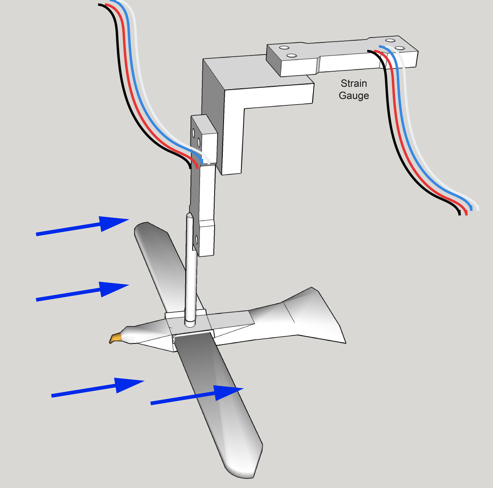
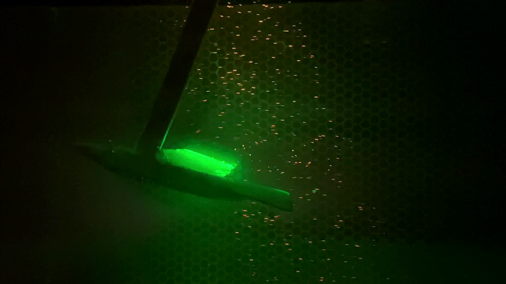
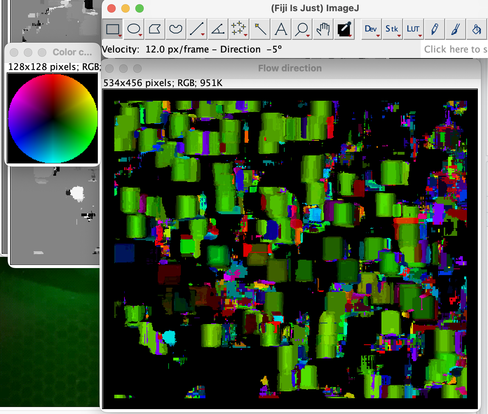

## Introduction
Our fourth Mini Project explores how body shape contributes to the flow patterns associated with foils moving in a fluid. We'll also consider how these lift and drag components may be used to predict the flight behavior of birds. Our general goals are to:

1. Use CAD software and 3D printing technology to fabricate two biomiometic fish bodies with designs that reflect a diversity of fish body shape.
2. Measure drag forces of these bodies using a simple experimental system and Stokes-drag model.
3. Characterize flow patterns using particle tracking.
4. Based drag and flow pattern data, establish what swimming characteristics the bodies impart to the fish.


<!-- https://www.quora.com/Can-the-principle-of-stokes-law-be-applied-to-non-spherical-objects-or-when-turbulent-flow-is-present-although-the-equation-cant-be-used-For-example-would-terminal-velocity-be-proportional-to-r-2-for-objects-that-do 

CFD and visulization
-->

<!-- <center> -->
<!-- {#foil} -->
<!-- </center> -->
<!-- <br> -->

<!-- ## Conceptual basis -->

<!-- The figures directly above and below show how lift and drag forces are applied to a wing as forces perpendicular and parallel to the airflow. If you follow Bernoulli as your model of lift, as air passes over the top of the wing it accelerates and thus the relative pressure stress decreases above. Lower stress on the top of the wing results in a difference between dorsal and ventral stress and thus lift is generated. Lift is the force that keeps birds aloft and solely responsible for gliding flight. Drag on the other hand, acts in the streamwise direction (parallel to flow) and is generally considered a nuisance.  -->

<!-- We have discussed---or will discuss---two forms of drag associated with foils moving in a fluid medium.  Profile drag includes all types of drag that do not depend on the production of lift, i.e., of the skin and pressure variety. Profile drag is a function of fluid speed and density, reference area, and the external shape of the wing or foil. For a three-dimensional wing, there is an additional component of drag called induced drag. This is also a function of fluid speed and density, reference area, and the external shape of the wing, but for this type of drag, there must be lift generated by fluid flow. If lift is generated, fluid is free to move from the region of high pressure below into the region of low pressure above near the tips of the wing. The resulting flow is shown below by the red circular arrow with the arrowhead showing the flow direction. This is called a tip vortex and it induces drag.  -->

<!-- <center> -->
<!-- ```{r,echo=F,fig,fig.width=400} -->
<!-- knitr::include_graphics(c("wingtip.png")) -->
<!-- ```  -->
<!-- </center> -->
<!-- <br> -->

<!-- So, profile and induced drag ($D_p$ and $D_i$, respectively) together account for the drag forces. As we'll also learn, we can use comparisons of lift and drag coefficients ($C_D$ and $C_L$, respectively) to determine the efficiency of a soaring/gliding wing using the lift ratio: -->

<!-- $$\frac{C_L}{C_D}\hspace{12 pt}.$$  -->
<!-- To determine the drag coefficient, we must simultaneously consider the profile and induced drag components, or: -->


<!-- $$\large C_D =C_{Dp}+C_{Di}$$ -->

<!-- To calculate both $C_{Dp}$ and $C_{Di}$, we would use shape and airflow properties. This is relatively straightforward for profile drag ($C_{Dp}$). However, it is cumbersome and complicated to compute the induced coefficient, $C_{Di}$. Fortunately, with a little ingenuity, we can compute the total drag coefficient $C_D$ (and the lift coefficient, $C_L$, too) empirically by putting the wing models in a fluid tunnel (a water flume, specifically). For the drag coefficient:  -->

<!-- $$ -->
<!-- C_D=\large \frac{F_D}{\frac{1}{2}\rho u^2 A} \hspace{12 pt}, -->
<!-- $$ -->

<!-- where $F_D$ is the force generated by drag, $\rho$ fluid density (for water, 1000 kg m$^{-3}$ . . . shockingly), $u$ is the fluid velocity (m s$^{-1}$), and A is the wing area (m$^2$). The lift coefficient ($C_L$) is computed similarly: -->

<!-- $$ -->
<!-- C_L=\large \frac{F_L}{\frac{1}{2}\rho u^2 A}\hspace{12 pt}, -->
<!-- $$ -->

<!-- where $F_L$ is the force generated by lift. Armed with these coefficients, we can assess how much lift is generated compared to the nuisance drag under certain conditions, including $R_e$ and the inclination of the wing (i.e., angle of attack, $\alpha$) if we so desired. The angle of attack is the angle between the chord line of the wing and the vector representing the fluid through which it is moving. The angle of attack can be increased to induce more lift, however, this comes at a cost of more drag as upper surface flow is more separated. Thus, a trade off exists between increasing $\alpha$, increased lift and increased drag. We won't explore this further in MP4---we'll keep the angle of attack relatively constant for all our bird wings. However, it would be a great topic for a final project! -->


<!-- ## Methods -->
<!-- There are three parts to this MP:  -->

<!--   1. Design and 3D print two pairs of biomimetic birds wings. -->
<!--   2. Empirically assess the drag and lift coefficients to compute the lift ratio. ($\frac{C_L}{C_D}$)  of two pairs biomimetic bird wings. -->
<!--   3. Qualitatively characterize flow patterns at the wing tip to assess vorticity. -->

<!-- Based on this analysis, we'll make inferences as to the flight behavior and ecology of the birds whose wings we've studied. -->


<!-- ## Part 1: ["Bird, bird, bird ... bird is the word"](https://www.youtube.com/watch?v=aPrtFxd9u9Y) -->

<!-- In this part of the MP you will design two pairs of biomimetic bird wings. For this we'll use a free version of the CAD software [SketchUp](https://app.sketchup.com/). You can sign up for SketchUp's free web-based using your BC Google credentials. -->

<!-- First, choose two photographs from an image search on the interwebs. Make sure one is from a family in group 1: -->

<!--   * Alcidae -->
<!--   * Parulidae -->
<!--   * Turdidae -->
<!--   * Anatidae -->
<!--   * Phasianidae  -->

<!-- Then choose another another from a family in group 2:  -->

<!--   * Apodidae -->
<!--   * Falconidae -->
<!--   * Diomedeidae -->
<!--   * Laridae -->
<!--   * Cathartidae -->

<!-- Also make sure that the image you choose is a good shot of your birds directly from below or above. In addition, **remember to record the common species names** of the two birds you've chosen. -->

<!-- To find out more about your birds, search for "cornell lab of ornithology SPECIES" The Cornell Lab of Ornithology's [All About Birds site](https://www.allaboutbirds.org/) is an exceptional resource for all things avian: taxonomy, occurrence, sounds, life history. You name it, they got it. -->

<!-- To design your wing models in SketchUp, you may find it easiest to work in millimeters. So open the app and change the default template to "Simple Template-Millimeters" under "App Settings" in the pull-down menu. From here, select "New" from the pull-down menu to start a new model that is measured in mm.  Select the default content (usually a person), delete it, and now you're ready to start your wing design.  -->

<!-- It will probably be easiest to design your wing models directly from the images. Fortunately, you can insert a locally saved image directly into the app and trace the wing. You can then use the rescaling tool in SketchUp to incopoorate the following properties: -->

<!--   * A 60 mm span  -->
<!--   * The same chord length in proportion to the span as the wings in your chosen species -->
<!--   * A wing thickness of 2.5 mm (using the extrude tool) -->

<!-- Don't worry about camber. Producing the right span-chord ratio as your birds is most important.   -->

<!-- The following describes these important wing dimensions. -->

<!-- <center> -->
<!-- { width=50% } -->
<!-- </center> -->
<!-- <br> -->


<!-- From the wing models, calculate the aspect ratio with: -->

<!--  $$AR=\large \frac{S^2}{A_{w}}\hspace{12 pt},$$ -->

<!-- where S is the span and $A_{w}$ is the wetted area of the wing (i.e., surface area of the wing in contact with the air flow). You can use the ruler and shape info features in SketchUp to determine S and $A_{w}$. -->

<!-- When you're finished with AR calculations, you should duplicate the wings (birds have two afterall), **export each as a separate** stereolithography file (.stl), and then load the .stl to [THIS DIRECTORY](https://drive.google.com/drive/folders/1-3G9Ho0sqVXSSEBd-yVSGPtjhSFmOdF5?usp=sharing). With Prof. K's help, you'll 3D print each pair and then glue them to a standard 3D-printed body model (a gull . . . there's no such thing as a seagull). -->


<!-- ## Part 2: A fish back to water -->

<!-- We'll place your biomimetic wings and gull model in the flume and anchor it to a "sting" (see figure below) to measure lift and drag forces. To understand how this works, you'll have to withstand a bit of engineering wonk. We'll use two binocular Wheatstone bridge load cells to simultaneously measure lift and drag (see figure below). These instruments report a force based on how much shear strain occurs when a load is placed at the end of a cantilevered beam of aluminum. Because of the design of the sting, the input arms of our cantilevered sensor systems are longer and amplify the load. But we'll ignore this and assume it doesn't bias one load cell or the other. -->

<!-- Turn on the swim tunnel to the preset velocity (determined by Prof. K and reported at the start of the experiment). "Swim"" the bird for 30 s at this predetermine speed. Lift and drag forces will be recorded on a PC and place in [**THIS DIRECTORY**](https://drive.google.com/drive/folders/15kbeHiL2ksA9ZgsGe5Q2lpLl5cEaAsIj?usp=sharing) that you can access later. -->

<!-- <center> -->
<!-- { width=50% } -->
<!-- </center> -->
<!-- <br> -->

<!-- ## Part 3: Flow Viz -->

<!-- The magnitude of induced drag of a foil generating lift is proportional to the vorticity at the wing tip. Vorticity describes the spinning motion of a fluid in some local area and is therefore a measure of it's rotation. Vorticity is defined quantitatively as the curving of velocity vectors. Thus, to calculate vorticity, one needs to quantify local patterns of velocity.   -->

<!-- Particle image velocimetry (PIV) is an optical method of flow visualization and is often used to obtain instantaneous velocity measurements. This technique relies on visually tracking neutrally buoyant particles suspended in the fluid that follow its motion. Particles are often illuminated and fluoresced with a thin laser light field. In the animation below, small glass spheres are suspeneded in water as if flow past a 3D-printed wing. It's important to note that this thin sheet of light only captures the flow field in this vary narrow plane (the horizontal-vertical or x,y plane in this case). -->

<!-- <center> -->
<!-- { width=70% } -->
<!-- </center> <br> -->

<!-- To derive velocity vectors from moving particles in a field, researchers rely on sophisticated algorithms applied in various software packages, some free and some much more than free. ~~To qualitatively assess the velocity vectors at the wings' tips, we'll be using a free Java-base package, [jPIV](https://eguvep.github.io/jpiv). This is a limited GUI version of [openPIV](https://eguvep.github.io/jpiv/download.html), a very popular command-line interface for PIV.~~ -->

<!-- To qualitatively assess the velocity vectors at the wings' tips, we'll turn to FIJI again and use one of it's preloaded plugins, "Optic Flow". -->

<!-- To use FIJI's optic flow tool, you'll have to prepare your two videos first, one for each bird. Like we did in the [second MP](MP2.html#A_kick_start), convert your videos to AVI format. From each, load them in FIJI as a virtual stack. Then find two **consecutive** images/frames where you see interesting and clear movements of particles behind the wing. Record the frame numbers. Then, create a substack of these two images (`Image` $\rightarrow$ `Stacks` $\rightarrow$ `Tools` $\rightarrow$ `Make substack`). In the dialog box that opens up, punch in the two frame numbers. Next, convert the substack to 8-bit grayscale images (`Image` $\rightarrow$ `Type` $\rightarrow$ `8-bit`). Now crop the image to include the area behind the wing and interesting particles (select the area with the rectangle tool, then `Image` $\rightarrow$ `Crop`). You may also want to adjust the brightness (`Image` $\rightarrow$ `Adjust` $\rightarrow$ `Brightness/Contrast`) to increase the brightness of the particles. -->

<!-- To peform PIV analysis, double select `Analyze` $\rightarrow$ `Optic flow` $\rightarrow$ `PIV analysis` and follow these steps -->

<!-- 1. **Chose the window size.** This will change how large of an area the analysis looks for moving particles between two frames. Too large, and many particles may not escape the window between the two frames and no velocities will be inferred. Too small, and the velocities and their vectors are really noisy. Try several, getting progressively smaller and see what you get. -->

<!-- 2. **Do the analysis.** Click `OK` and the analysis will kick off. When done, FIJI will produce a series of windows and the most important (the "Flow Direction" window) will look like the one in the image below.  -->

<!-- 3. **Interpret the velocity vectors.** Place the cursor over the flow direction window. Notice how the FIJI menu part is now reporting the velocity in px/fram and direction in degrees. Note the 0$^o$ represents a horizontal, left-right direction and 90$^o$ a vertical up-down direction. Use the values over the flow direction window to qualitatively assess the magnitude and direction of volcities and how they vary spatially over the field. Also compare and contrast this pattern between the results for the two bird-wing models. -->


<!-- <center> -->
<!-- { width=50% } -->
<!-- </center> -->
<!-- <br> -->

<!-- ## What to address in your report -->

<!-- When the avian dinosaurs split from the non-avian theropods, flight was a huge advantage. For the birds, their world became much more three dimensional, permitting the exploitation of new resources. This undoubtedly led to their evolutionary success. The origin of flight was associated with rapid evolutionary change in the shape of the bird arm as well as specializations in the body (Did you know a bird resorbs nearly all of its reproductive anatomy after breeding? Why?). These specializations can be viewed as adaptations to optimize flight aerodynamics according to a bird's habitat. -->

<!-- As you formulate your report and consider the evolution of the bird wing in the context of the behavioral diversity of bird flight, begin by generating **an hypothesis as to how wing AR will affect the lift-to-drag ratio**. In addition, be sure to outline the fluid mechanic basis for your hypothesis.  -->

<!-- Using data acquired from the entire class evaluate your hypothesis by considering the following:  -->

<!--   1. What is the relationship between AR and lift-to-drag ratio? Is there any clear pattern across the class data? -->
<!--   2. Which birds that inspired the biomimetic wings are likely to soar long periods? That is, which are most likely to glide? Which are unable to soar for long periods?  -->
<!--   3. What tradeoffs can you identify with the ability or inability to soar easily? Related to this, in what type of environment do you suppose each of the birds we've explored lives?  -->
<!--   4. Consider the lift forces generated by your biomimetic wings. What other adaptations associated with the body would optimize lift resulting from the wing? -->
<!--   5. Are your results with respect to AR and lift ratio supported by previous studies? If not, consider why. -->

<!-- Lastly, using the images of velocity vectors for each of your groups wings, address the following: -->

<!--   6. Were the flow patterns at the wing tip different between your two models? If so, how do these differences relate to their lift-to-drag ratios? -->


<!-- Please synthesize the results of your experiments and address these questions in a report that follows the structure outlined [here](https://bcbiomech.github.io/class/mini_projects.html). Reports are due Sunday, April 16th th at 11:59 pm. Your Rmd files (**with all the associated data!!!**) should be sent to Prof. K via email before then.  -->

<!-- ### Requirements for submission -->

<!-- Like a few other past MPs, important analyses depend on timely submission of each team's data. So, please submit the following data by 11:59 pm on Monday 3rd in [**THIS SPREADSHEET**](https://docs.google.com/spreadsheets/d/1nzo3Qb067LA5CPNkcXndM-C8LJg7EqNFvGgHB4qBI0k/edit?usp=sharing):  -->

<!--   * wing file name for lift and drag data -->
<!--   * span and chord length (in mm) 	 -->
<!--   * wetted area ($S$ in mm$^2$) -->
<!--   * AR  -->
<!--   * $C_D$, $C_L$, and $\frac{C_L}{C_D}$ -->

<!-- This means that each team is responsible for calculating $C_D$, $C_L$, and $\frac{C_L}{C_D}$ for their two wing models **well before the report deadline**. -->

<!-- You can find explicit detail concerning the organization of an MP report [here](https://bcbiomech.github.io/class/mini_projects.html). -->

<!-- ## What to pay attention to in writing the report -->

<!-- + Data are plural. -->
<!-- + Don't use `print()`, `head()`, etc. commands needlessly . . . we don't need a large data table of ray data in our reports. -->
<!-- + Better methods for printing tables (eg. `pander()`, `kable`+`kableExtra`, etc.). -->
<!-- + Figures and tables need captions! For figures, use `fig.cap` parameter in r chunk options. For tables use the `caption` parameter in `kable()` or similar. -->
<!-- + Figures should be appropriately sized (check out `fig.width` and `fig.height` in r chunk options). -->
<!-- + Figure axes should be labeled appropriately. -->


