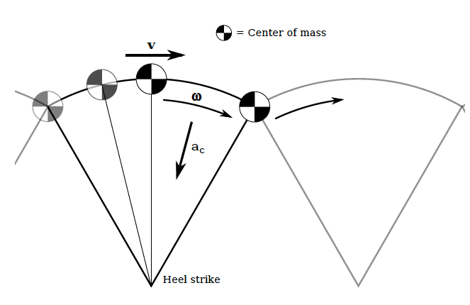
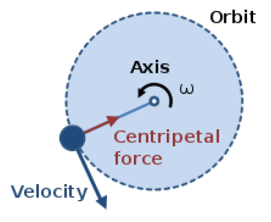
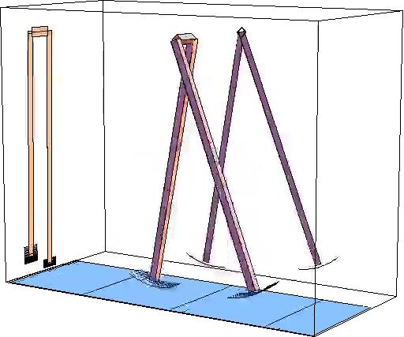
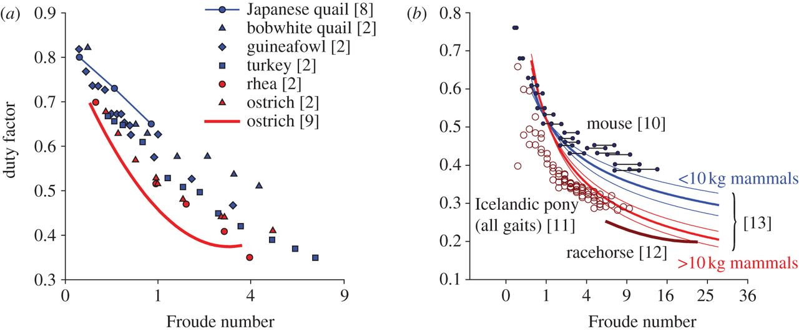
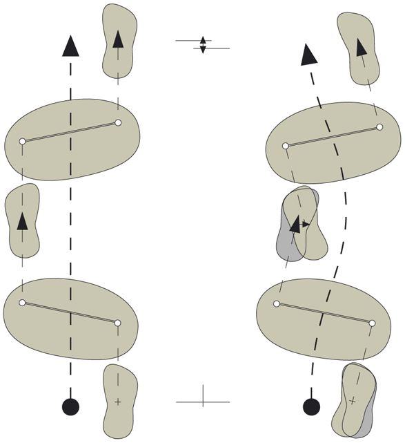
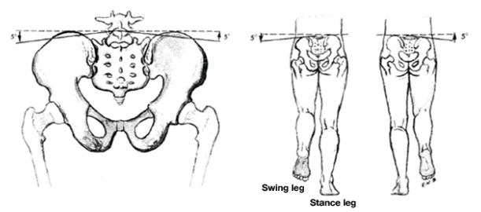

class: inverse, top
# Terrestrial locomotion

```{r,echo=FALSE,message=FALSE}
library(tidyverse)
library(kableExtra)
```

<!-- Add icon library -->
<link rel="stylesheet" href="https://cdnjs.cloudflare.com/ajax/libs/font-awesome/5.14.0/css/all.min.css">


.pull-left[
Today we'll ....


- Consider how we characterize terrestrial walking with legs

- Focus on bipedal locomotion

- Apply the inverted pendulum model to bipedalism

- Discuss the predictions of the model

- Take a peak at AME1 and MP1

]


.pull-right[

]

---

class: top

# But first, some ground rules and metrics


.pull-left[
## Important definitions

- **Kinematics:** Position over space and time (2D or 3D).

- **Kinetics:** Forces moving masses.

- **Dynamics:** Changes in properties like forces, mass, energy, etc. over space and time (i.e. stability).

- **Power:** How quickly work is done (i.e., energetics).


]


.pull-right[

## Some examples

.center[
<video width="500" controls>
<source src="img/eel.mp4" type="video/mp4">
</video>
]


]

---

class: top

# Some ground rules and metrics


.pull-left[
## Important definitions

- **Kinematics:** Position over space and time (2D or 3D).

- **Kinetics:** Forces moving masses.

- **Dynamics:** Changes in properties like forces, mass, energy, etc. over space and time (i.e. stability).

- **Power:** How quickly work is done (i.e., energetics).


]


.pull-right[

## Some examples

.center[

]


]


---

class: top

# Some ground rules and metrics


.pull-left[
## Important definitions

- **Kinematics:** Position over space and time (2D or 3D).

- **Kinetics:** Forces moving masses.

- **Dynamics:** Changes in properties like forces, mass, energy, etc. over space and time (i.e. stability).

- **Power:** How quickly work is done (i.e., energetics).


]


.pull-right[

## Some examples

.center[

]


]


---

class: top

# Some ground rules and metrics


.pull-left[
## Important definitions

- **Kinematics:** Position over space and time (2D or 3D).

- **Kinetics:** Forces moving masses.

- **Dynamics:** Changes in properties like forces, mass, energy, etc. over space and time (i.e. stability).

- **Power:** How quickly work is done (i.e., energetics).


]


.pull-right[

## Some examples

.center[

]


]

$$\textrm{Watt}= \textrm{kg}\cdot \textrm{m}^2\cdot \textrm{s}^{-3} $$

$$1 \textrm{Watt} \approx \textrm{10.5 mL O}_2 \textrm{ min}^{-1}$$


---
class: top
# Some ground rules and metrics

.pull-left[

- **Stride length:** Distance between consecutive footfalls of the same foot (in m)

- **Stride frequency:** number of strides per time (if s, in Hz)

- **Duty factor:** fraction of stride time that a foot is on the ground (non-dimensional)
 
  + e.g.,human walking = 0.5 - 0.6, running = 0.35).
 
  + Gaits with duty factors less than 0.5 imply airborne phases, i.e., running

- **Relative Phase:** Point in time a foot touches as a fraction of the stride time (non dimensional or in $^o$, often).


]


.pull-right[

```{r,echo=FALSE,out.width=250}
#stride length
knitr::include_graphics("https://encrypted-tbn0.gstatic.com/images?q=tbn:ANd9GcRk6lEBWg4QHMBQqBjpOaMKXk5oRgxIjo5JkQ&usqp=CAU")

#df
knitr::include_graphics("https://www.researchgate.net/profile/Thomas_Moeslund/publication/221908232/figure/fig2/AS:305169892954113@1449769580296/Illustration-of-the-duty-factor-The-duration-of-a-gait-cycle-where-each-foot-is-on-the.png")
```


]

---
class: top
<!-- slide 1 -->
# Up first: Walking

## First, a question

Say you're on Mars. Do you walk faster or slower than you do on Earth?

.pull-left[
   


]

.pull-right[

1/3 the gravity as Earth
]

---
class: top
<!-- slide 1 -->
# Up first: Walking

## Modeling walking as an inverted pendulum

.pull-left[
   

.center[
```{r,echo=FALSE,out.width=150}
#stride length


```
]
]

.pull-right[


]


---
class: top

# What are the predictions of such a model?


.pull-left[
   

.center[
```{r,echo=FALSE,out.width=150}
#stride length


```
]
]

.pull-right[

- Velocity?

- Kinetic energy?

- COM oscillations (kinetics, kinematics)?

]


---
class: top
<!-- slide 1 -->
# What are the predictions of such a model?


.pull-left[
   

.center[
```{r,echo=FALSE,out.width=150}
#stride length


```
$$F_c=ma_c=\frac{mv^2}{r}$$
]
]

.pull-right[

Acceleration toward the pivot (center) can be expressed as 

$$a_c=\frac{v^2}{r}$$ [why?]

Which means that  $v^2=a_cr$, or, if $L=r$

$$v^2 \leq gL$$

[why?]


]


---
class: top
<!-- slide 1 -->
# Back to the questions

Say you're on Mars. Do you walk faster or slower than you do on Earth?

.pull-left[


]

.pull-right[
.center[

If

$$v^2 \leq gL$$

then

$$v\leq \sqrt{gL}$$
]
]


---
class: 

# How well does the model do?

Or, How well do our iverted pendula do?


$$Fr =\frac{centripetal force}{gravitational force}=\frac{\frac{mv^2}{L}}{mg}=\frac{v^{2}}{gL}$$
or

$$Fr=\frac{realized force}{predicted force}$$

.center[
```{r,echo=FALSE,out.width=550}
#stride length


```

]

---
class: top
<!-- slide 1 -->
# What can change speed under this model?


.pull-left[

.center[L, right?]

  - Lumbar flexion
  - Pelvic rotation
  - Pelvic tilt (in transverse, frontal planes)
  - Plantar flexion
  
  More on this later . . .
  
```{r,echo=FALSE,out.width=200}


```
]

  
.pull.right[


```{r,echo=FALSE,out.width=300}


```

```{r,echo=FALSE,out.width=200}
knitr::include_graphics("https://anatomypubs.onlinelibrary.wiley.com/cms/asset/9d091d74-842a-46b7-b722-8010fe918ebb/ar23552-fig-0002-m.jpg")
```

]
        

---

# For AME1 and MP1

.pull-left[
```{r,echo=FALSE,out.width=100}
knitr::include_graphics("rlogo.png")
```


]
.pull-right[


IDE: Integrated Development Environment

]

- Download R first

- Download R Studio second


---

class: center, middle

# Thanks!

Slides created via the R package [**xaringan**](https://github.com/yihui/xaringan).

