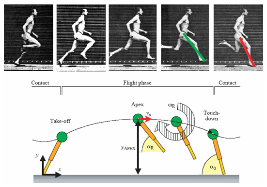

```{r setup, include=FALSE}
options(htmltools.dir.version = FALSE)
```

class: inverse, top
# Terrestrial locomotion

```{r,echo=FALSE,message=FALSE}
library(tidyverse)
library(kableExtra)
```

<!-- Add icon library -->
<link rel="stylesheet" href="https://cdnjs.cloudflare.com/ajax/libs/font-awesome/5.14.0/css/all.min.css">


.pull-left[
Today we'll ....


- Consider other terrestrial gaits (jumping, running)

- Flow of energy in terrestrial gaits

- Postural considerations

- Some work on MP1

]


.pull-right[

]

---

class: top

# Some administrata


.pull-left[

- Link to discussion: https://github.com/orgs/bcbiomech/teams/biol5380_s23

- Must accept team invite from me (BIOL5380_S23) to login

- Of course, this requires a github account

- Post to discussion board by EOD today


]


---

class: top

# Jumping


.pull-left[

- Animals move by exerting forces on a medium of substrate (eg., ground, water, plants, air)

$$\Sigma F=m\cdot a$$

Where on the body to we measure acceleration?

- if we consider the body as an infinite number of particles

$$x_{com}=\frac{1}{m}\int_{0}^{m}xdm$$
$$y_{com}=\frac{1}{m}\int_{0}^{m}ydm$$


]


.pull-right[


.footnote[
**Upshot:** COM is a function of shape
]
]


---

class: top

# Jumping


.pull-left[

- Animals move by exerting forces on a medium of substrate (eg., ground, water, plants, air)

$$\Sigma F=m\cdot a$$

Where on the body to we measure acceleration?

- if we consider the body as an infinite number of particles

$$x_{com}=\frac{1}{m}\int_{0}^{m}xdm$$
$$y_{com}=\frac{1}{m}\int_{0}^{m}ydm$$


]


.pull-right[


.footnote[
**Upshot:** COM is a function of shape
]
]


---

class: top

# What happens in transition?

.center[
```{r,echo=FALSE,out.width=550}
#stride length
knitr::include_graphics("img/froudegait.jpg")

```

]


---

class: top

# What happens in transition?


.pull-left[

.center[
```{r,echo=FALSE,out.width=450}
#stride length
knitr::include_graphics("img/pend.png")

```
]


]


.pull-right[

.center[

```{r,echo=FALSE,out.width=450}
#stride length
knitr::include_graphics("img/springmass.jpg")

```

]


]


---

class: top

# Running mechanics and dynamics
.center[
  ]

---

class: top

# Running mechanics and dynamics
.center[
  ]

---
class: top

# Running mechanics and dynamics

.righ-column[ 

.right[
```{r,echo=FALSE,out.width=500}
#stride length


```
]
]


---
class: top

# Running mechanics and dynamics

.left-column[ 
.center[
$$KE=\frac{1}{2}mv^2$$

$$PE=mgh$$

$$U=\frac{1}{2}kx^2$$
]
]

.righ-column[ 

.right[
```{r,echo=FALSE,out.width=500}
#stride length


```
]
]


---

class: top

# Running mechanics and dynamics

Energy transfer

  


---

class: top

# Energy transfer and damping


.center[

```{r,echo=FALSE,out.width=500}
#stride length
knitr::include_graphics("img/musclesprings.jpg")

```
]


.pull-left[


]

.pull-right[

.footnote[Tendons are viscoelastic]

```{r,echo=FALSE,out.width=225}
#stride length
knitr::include_graphics("https://www.physio-pedia.com/images/thumb/d/db/Hysteresis_curve_intechopen.jpeg/357px-Hysteresis_curve_intechopen.jpeg")


```

]

---

class: top

# Energy transfer and posture


.pull-left[
.center[

[barefoot running](https://www.youtube.com/watch?v=r6YhVN_YIUk)

]
]

.pull-right[

```{r,echo=FALSE,out.width=300}
#stride length
knitr::include_graphics("https://www.physio-pedia.com/images/thumb/d/db/Hysteresis_curve_intechopen.jpeg/357px-Hysteresis_curve_intechopen.jpeg")

```

**What's the problem here?**

]


---

class: top

# Energy transfer and posture


.pull-left[

[shod running](https://www.youtube.com/watch?v=zavoQM3727s)

]

.pull-right[

```{r,echo=FALSE,out.width=300}
#stride length
knitr::include_graphics("https://www.physio-pedia.com/images/thumb/d/db/Hysteresis_curve_intechopen.jpeg/357px-Hysteresis_curve_intechopen.jpeg")

```

**How does this better facilitate energy transfer?**

]


---

class: center, middle

# Thanks!

Slides created via the R package [**xaringan**](https://github.com/yihui/xaringan).

