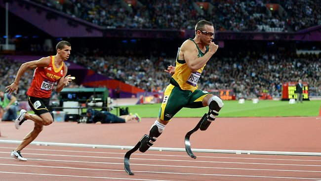
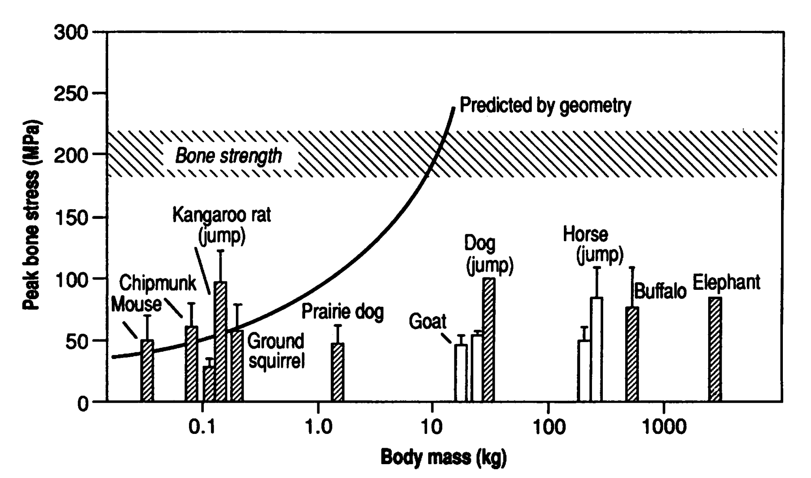
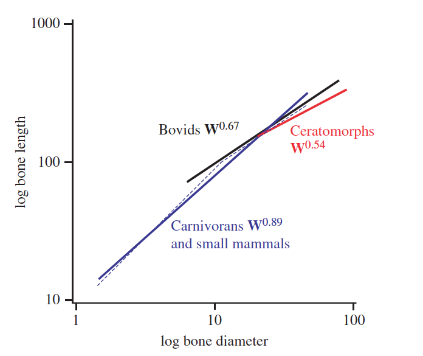
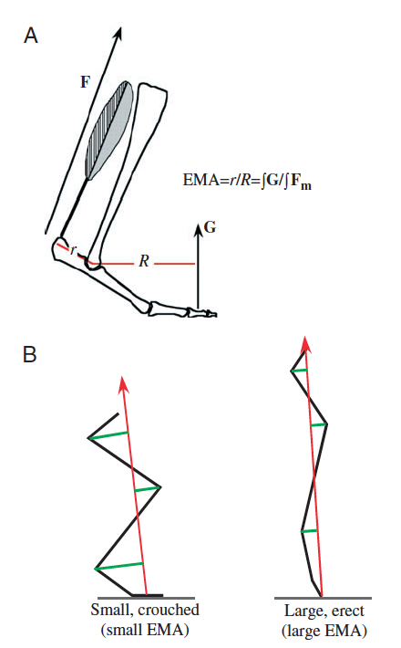
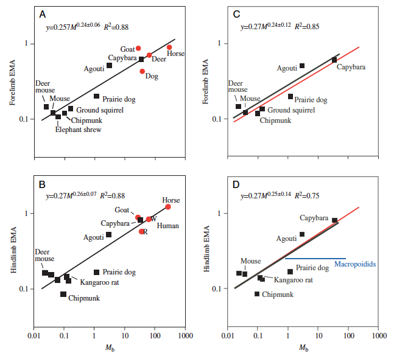

class: inverse, top
# Terrestrial locomotion

```{r,echo=FALSE,message=FALSE}
library(tidyverse)
library(kableExtra)
```

<!-- Add icon library -->
<link rel="stylesheet" href="https://cdnjs.cloudflare.com/ajax/libs/font-awesome/5.14.0/css/all.min.css">


.pull-left[
Today we'll ....


- Consider a controversy

- Unravel scaling in locomotion

]


.pull-right[


]

---
class: top

# First, a controversy


.center[

```{r,echo=FALSE,out.width=550}
#stride length


```
 ]


---

class: top

# First, a controversy


.center[

```{r,echo=FALSE,out.width=500}
#stride length
knitr::include_graphics("img/musclesprings.jpg")

```
]


.pull-left[


]

.pull-right[

.footnote[Tendons are viscoelastic]

```{r,echo=FALSE,out.width=225}
#stride length
knitr::include_graphics("https://www.physio-pedia.com/images/thumb/d/db/Hysteresis_curve_intechopen.jpeg/357px-Hysteresis_curve_intechopen.jpeg")


```

]


---
class: top


# Scaling in locomotion

.pull-left[
- Capacity of a bone to support/generate force decreases relative to the increase in mass or weight of the animal.

- Under geometric similarity (isometry), shape remains constant so that expected increase in withstanding increasing  skeletal stress is given by:

$$ \frac{F}{A} \propto \frac{M^{1.0}}{M^{2/3}} \propto M^{1/3}$$

]

.pull-right[


```{r,echo=FALSE,out.width=350}
#stride length


```


-  $\frac{F}{A} \propto M^{0.28}$, so some allometry in dimensions

]


---

class: top

# Scaling in locomotion


.center[

### Scaling in bone dimenstions

```{r,echo=FALSE,out.width=450}
#stride length


```

]
   

---
class: top

# Scaling in locomotion


.center[

### Scaling in EMA

```{r,echo=FALSE,out.width=250}
#stride length


```
 ]
 
 
---
class: top

# Scaling in locomotion


.center[

### Scaling in EMA

```{r,echo=FALSE,out.width=450}
#stride length


```
 ]
 
 .footnote[
 $$EMA=r/R$$
 ]
 
---
class: top

# Scaling in locomotion


.center[

### Scaling in EMA

```{r,echo=FALSE,out.width=450}
#stride length
knitr::include_graphics("https://vhmsscience.weebly.com/uploads/1/2/7/6/12762866/3006320_orig.jpg")

```
 ]
 
 .footnote[
 $$EMA=r/R$$
 ]
 
 
---
class: top

# Scaling in locomotion


.center[

### Scaling in EMA

```{r,echo=FALSE,out.width=650}
#stride length
knitr::include_graphics("https://www.researchgate.net/profile/Taylor_Dick/publication/312307421/figure/fig2/AS:450892588687361@1484512578260/Effect-of-body-size-and-posture-on-limb-EMA-A-Hindlimb-EMA-scaling-for-mammals-data.png")

```
 ]
 
 .footnote[
 $$EMA=r/R$$
 ]
 


---

class: center, middle

# Thanks!

Slides created via the R package [**xaringan**](https://github.com/yihui/xaringan).

