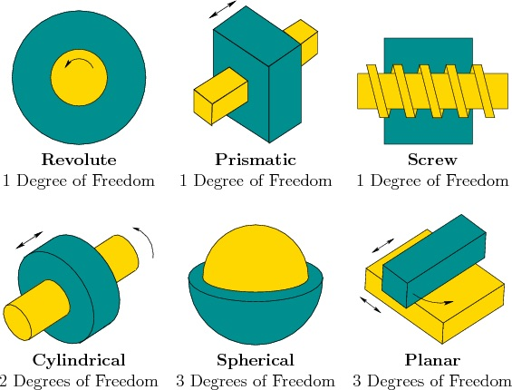

class: inverse, top
# Joints, Levers, and Linkages

```{r,echo=FALSE,message=FALSE}
library(tidyverse)
library(kableExtra)
```

<!-- Add icon library -->
<link rel="stylesheet" href="https://cdnjs.cloudflare.com/ajax/libs/font-awesome/5.14.0/css/all.min.css">


.pull-left[
Today we'll ....

Finish up terrestrial locomotion 

- Consider a controversy

- Unravel scaling in locomotion

Move on to . . 

- Consider joints 

- Consider linkages

]


.pull-right[
<br>
<iframe width="560" height="315" src="https://www.youtube.com/embed/pDU4CQWXaNY" frameborder="0" allow="accelerometer; autoplay; clipboard-write; encrypted-media; gyroscope; picture-in-picture" allowfullscreen></iframe>
]

---
class: top

# First, a controversy


.center[

```{r,echo=FALSE,out.width=550}
#stride length
knitr::include_graphics("img/pistorius.jpg")

```
 ]


---

class: top

# First, a controversy


.center[

```{r,echo=FALSE,out.width=500}
#stride length
knitr::include_graphics("img/musclesprings.jpg")

```
]


.pull-left[


]

.pull-right[

.footnote[Tendons are viscoelastic]

```{r,echo=FALSE,out.width=225}
#stride length
knitr::include_graphics("https://www.physio-pedia.com/images/thumb/d/db/Hysteresis_curve_intechopen.jpeg/357px-Hysteresis_curve_intechopen.jpeg")


```

]


---
class: top


# Scaling in locomotion

.pull-left[
- Capacity of a bone to support/generate force decreases relative to the increase in mass or weight of the animal.

- Under geometric similarity (isometry), shape remains constant so that expected increase in withstanding increasing  skeletal stress is given by:

$$ \frac{F}{A} \propto \frac{M^{1.0}}{M^{2/3}} \propto M^{1/3}$$

]

.pull-right[


```{r,echo=FALSE,out.width=350}
#stride length
knitr::include_graphics("img/bonestress.png")

```


-  $\frac{F}{A} \propto M^{0.28}$, so some allometry in dimensions

]


---

class: top

# Scaling in locomotion


.center[

### Scaling in bone dimenstions

```{r,echo=FALSE,out.width=450}
#stride length
knitr::include_graphics("img/bonescaling.png")

```

]
   

---
class: top

# Scaling in locomotion


.center[

### Scaling in EMA

```{r,echo=FALSE,out.width=250}
#stride length
knitr::include_graphics("img/emascale.png")

```
 ]
 
 
---
class: top

# Scaling in locomotion


.center[

### Scaling in EMA

```{r,echo=FALSE,out.width=450}
#stride length
knitr::include_graphics("img/emascalinglimbs.png")

```
 ]
 
 .footnote[
 $$EMA=r/R$$
 ]
 
---
class: top

# Scaling in locomotion


.center[

### Scaling in EMA

```{r,echo=FALSE,out.width=450}
#stride length
knitr::include_graphics("https://vhmsscience.weebly.com/uploads/1/2/7/6/12762866/3006320_orig.jpg")

```
 ]
 
 .footnote[
 $$EMA=r/R$$
 ]
 
 
---
class: top

# Scaling in locomotion


.center[

### Scaling in EMA

```{r,echo=FALSE,out.width=650}
#stride length
knitr::include_graphics("https://www.researchgate.net/profile/Taylor_Dick/publication/312307421/figure/fig2/AS:450892588687361@1484512578260/Effect-of-body-size-and-posture-on-limb-EMA-A-Hindlimb-EMA-scaling-for-mammals-data.png")

```
 ]
 
 .footnote[
 $$EMA=r/R$$
 ]
 


---
class: top

# How do skeletal elements permit predictable movement?

## Joints!

.pull-left[ 

Rigid elements that form linkages that constrain/permit movement. That is, they have degrees of freedom . . . 

- choice/comb of planar or rotational motion (3+3=6 DOF)
- 1-3 DOF/Joint
- Arrangements of 1 DOF results in several DOF
- Require superlow resistance or low stiffness
	
]

.pull-right[

]
        
   
---
class: top

# How do skeletal elements permit predictable movement?

## How many degrees of freedom?

.pull-left[ 
 
- $M=6-c$
- 6 possible DOF
- c=constraints		


]

.pull-right[


]
   
 

---

class: top

# How do skeletal elements permit predictable movement?

.center[

## Arthroidal membrane 

]

.pull-left[ 


             

        
 
        ]

.pull-right[

]

---
class: top


# Synovial joints: The knee, for example

.pull-left[
- cruciate ligaments constrain motion
- wring causes weeping lubrication
- coeff. friction = 0.003
- good ball bearings =0.02


]

.pull-right[


```{r,echo=FALSE,out.width=350}
#stride length
knitr::include_graphics("img/knee.jpg")

```


]


---

class: top

# Joints are fulcrums: thus, we move with levers


.pull-left[


```{r,echo=FALSE,out.width=450}
#stride length
knitr::include_graphics("img/thirdorder.png")

```

]
      
.pull-right[

In equilibrium net moment (torque)=0 

$$F_{out}L_{out}=F_{in}L_{in}$$

Mechanical advantage (MA): 

$$\frac{F_{out}}{F_{n}}=\frac{L_{in}}{L_{out}}$$

Speed ratio (gearing):

$$\frac{L_{out}}{L_{in}}$$

]
   

---
class: top

# Lever types and examples


---
class: top

# Trade offs in action

.center[
```{r,echo=FALSE,out.width=550}
#stride length
knitr::include_graphics("img/limblevers.png")

```

 Which limb belongs to a fast runner? A digger?
 
 ] 

 
---
class: top

# Levers are part of a postural system


.center[


```{r,echo=FALSE,out.width=250}
#stride length
knitr::include_graphics("https://cob.silverchair-cdn.com/cob/content_public/journal/jeb/208/9/10.1242_jeb.01520/3/m_jeb01520f2.jpeg?Expires=1677687419&Signature=Zfduf0VrvNjVn0EwT9twTMwO6xuSykw~MV4TxHIcJBQdSCLqGaWUyLb8n6jGsqsKTPfoYMdAV3Q7Qw5QL4VtBjs9Efa-avOiyEQjaIeZkqwsKAjECx4euDIsEdOpbZpNwdWZk-aq4zQLqT7RNdSRAqkrLYDLFoLqARgI8NmQCxjJD7bvHFozyj6p8uhKc6AARABHBSYunSGzU9wiUWD5QAiyO9kn9F2hD5CbsBm0nuI1ssbUXRyvqlYGbMjVAD2elPs41-TdhQv7JSrVAuK0gyxCniFLGAXmZNiz8slyukuvIxKZdTdachf2vQGLsnesixkJl44OVBKpRw4ifbC-CQ__&Key-Pair-Id=APKAIE5G5CRDK6RD3PGA")

```
 ]
 
 .footnote[
 $$EMA=r/R$$
 ]
 
 
---
class: top

# Linkages

## 4-bar linkage

.pull-left[

### Can predict KE and ME based on morphology:

- Force amplification = $r/q$
- Speed ampflication = $q/r$
]

.pull-right[

]

---
class: top

# Linkages

.center[

### Famous 4-bar from fish


```{r,echo=FALSE,out.width=550}
#stride length
knitr::include_graphics("img/fish4bar.jpg")

```
]
---

class: center, middle

# Thanks!

Slides created via the R package [**xaringan**](https://github.com/yihui/xaringan).

