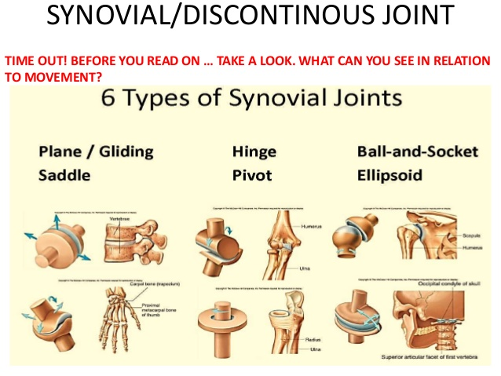
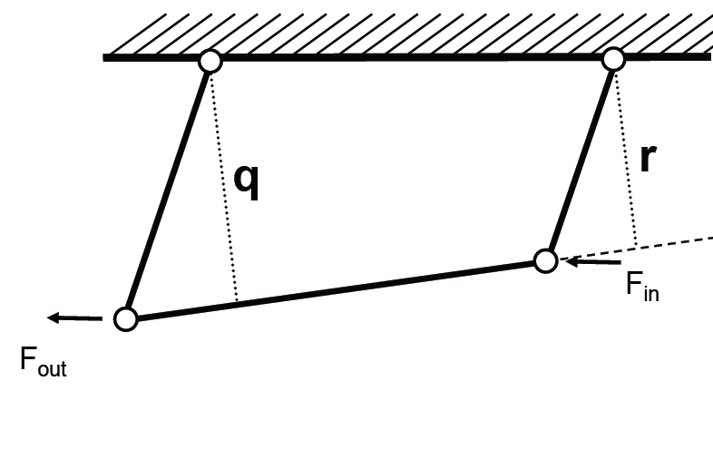
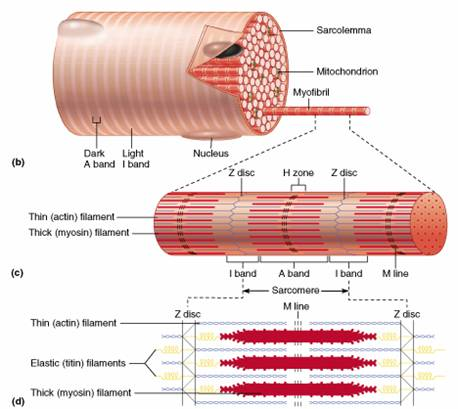
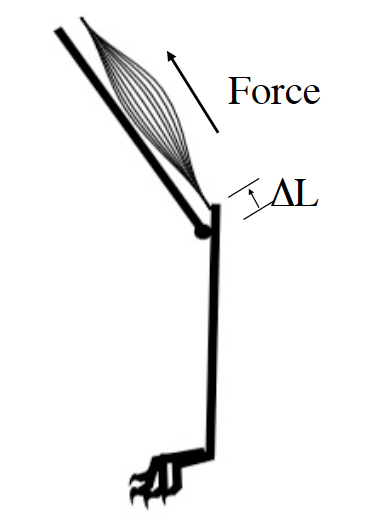
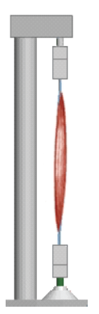
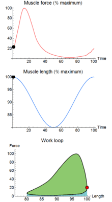

class: inverse, top
# Joints, Levers, and Linkages

```{r,echo=FALSE,message=FALSE}
library(tidyverse)
library(kableExtra)
```

<!-- Add icon library -->
<link rel="stylesheet" href="https://cdnjs.cloudflare.com/ajax/libs/font-awesome/5.14.0/css/all.min.css">


.pull-left[
Today we'll ....

- Consider joints 

- Consider linkages

- Muscles moving levers

- MP1 and AMEs open floor


]


.pull-right[
<br>
<iframe width="560" height="315" src="https://www.youtube.com/embed/pDU4CQWXaNY" frameborder="0" allow="accelerometer; autoplay; clipboard-write; encrypted-media; gyroscope; picture-in-picture" allowfullscreen></iframe>
]

---
class: top

# How do skeletal elements permit predictable movement?

## How many degrees of freedom?

.pull-left[ 
 
- $M=6-c$
- 6 possible DOF
- c=constraints		


]

.pull-right[


]
   
 

---

class: top

# How do skeletal elements permit predictable movement?

.center[

## Arthroidal membrane 

]

.pull-left[ 


             

        
 
        ]

.pull-right[

]

---
class: top


# Synovial joints: The knee, for example

.pull-left[
- cruciate ligaments constrain motion
- wring causes weeping lubrication
- coeff. friction = 0.003
- good ball bearings =0.02


]

.pull-right[


```{r,echo=FALSE,out.width=350}
#stride length


```


]


---

class: top

# Joints are fulcrums: thus, we move with levers


.pull-left[


```{r,echo=FALSE,out.width=450}
#stride length
knitr::include_graphics("img/thirdorder.png")

```

]
      
.pull-right[

In equilibrium net moment (torque)=0 

$$F_{out}L_{out}=F_{in}L_{in}$$

Mechanical advantage (MA): 

$$\frac{F_{out}}{F_{n}}=\frac{L_{in}}{L_{out}}$$

Speed ratio (gearing):

$$\frac{L_{out}}{L_{in}}$$

]
   

---
class: top

# Lever types and examples


---
class: top

# Trade offs in action

.center[
```{r,echo=FALSE,out.width=550}
#stride length
knitr::include_graphics("img/limblevers.png")

```

 Which limb belongs to a fast runner? A digger?
 
 ] 

 
---
class: top

# Levers are part of a postural system


.center[


```{r,echo=FALSE,out.width=250}
#stride length
knitr::include_graphics("https://cob.silverchair-cdn.com/cob/content_public/journal/jeb/208/9/10.1242_jeb.01520/3/m_jeb01520f2.jpeg?Expires=1708446257&Signature=wbl56urFKEF9LA-e0QEReLQOAkjNpfqk-ik1WvQoReoOqkHtj2hFCeCXjHJqDhMcif4Dchgx8di~bT2T7ABR8X2ttAPvNCDPNtBFUkYH1BtnhtmL6kPiy5SXS~ZhK9WSZHJ~aG2~R3HkBZvlIlM6vCbMX~Y4RX-sGaDJHZN-rWXJ1~yWJiiJ3fdWMiqwmJhAkxGszI8yuoTbGNfw5hc5aJBQt8~MTHFNKy-yiSaiXDcezFcq-0x3pv8sbrckQ3yLbqkuinUS11q4fdN1~gkLGP22Qwk3MkHBLtYU652Frg21Xw2Q3MMPbNiICGa50ULWosCDblFsRPbsGcvZyIkD3A__&Key-Pair-Id=APKAIE5G5CRDK6RD3PGA")

```
 ]
 
 .footnote[
 $$EMA=r/R$$
 ]
 
 
---
class: top

# Linkages

## 4-bar linkage

.pull-left[

### Can predict KE and ME based on morphology:

- Force amplification = $r/q$
- Speed ampflication = $q/r$
]

.pull-right[

]

---
class: top

# Linkages

.center[

### Famous 4-bar from fish


```{r,echo=FALSE,out.width=550}
#stride length
knitr::include_graphics("img/fish4bar.jpg")

```
]


---
class: top
# Muscles

```{r,echo=FALSE,message=FALSE}
library(tidyverse)
library(kableExtra)
library(scales)
```

<!-- Add icon library -->
<link rel="stylesheet" href="https://cdnjs.cloudflare.com/ajax/libs/font-awesome/5.14.0/css/all.min.css">


.pull-left[
Today we'll consider ....

- How muscles produce force (i.e., tension)

- What predicts the amount of force (length, time, velocity)

- How muscles function

]


.pull-right[


]


---
class: top

# Muscles generate mechanical work and power. How?
 
.center[

```{r,echo=FALSE,out.width=550}
#stride length
knitr::include_graphics("img/muscle.jpg")

```

]

---
class: top

# Muscles generate mechanical work and power. 

## How?
 
.center[

```{r,echo=FALSE,out.width=400}
#stride length


```

]


---
class: top

# Muscles generate mechanical work and power. 

## How?
 
.center[

```{r,echo=FALSE,out.width=350}
#stride length
knitr::include_graphics("img/filamenttheory.png")

```

]

.footnote[ Sliding filament (crossbridge) theory. Gordon, Huxley & Julian (1966)]


---

class: top

# What determines amount of force produced by muscle?

.pull-left[
1. Time after activation

]


.pull-right[
```{r,echo=FALSE,out.width=450}
#stride length
knitr::include_graphics("img/latent.jpg")

```
]


---
class: top

# What determines amount of force produced by muscle?

.pull-left[
1. Time after activation
2. Muscle (sarcomere) length

<br>
<br>

```{r,echo=FALSE,out.width=550}
#stride length
knitr::include_graphics("img/filiments.jpg")

```
]

.pull-right[
<br>
<br>
<br>
<br>

```{r,echo=FALSE,out.width=550}
#stride length
knitr::include_graphics("img/forcelength.png")

```
]

---
class: top

# What determines amount of force produced by muscle?

.pull-left[
1. Time after activation
2. Muscle (sarcomere) length
3. Shortening velocity

<br>

```{r,echo=FALSE,out.width=550}
#stride length
knitr::include_graphics("img/forcevel.png")

```

    
]


---
class: top

# What determines amount of force produced by muscle?

.pull-left[
1. Time after activation
2. Muscle (sarcomere) length
3. Shortening velocity

<br>

```{r,echo=FALSE,out.width=550}
#stride length
knitr::include_graphics("img/forcevel.png")

```


]

.pull-right[

V=? to maximize power?


$$P=F\times V$$
    
<br>
<br>

```{r,echo=FALSE,out.width=550}
#stride length
knitr::include_graphics("https://d3i71xaburhd42.cloudfront.net/2b0ce8ae4ce7e28430b71ba8983e33c3bad9c196/3-Figure2-1.png")

```
]

---
class: top

# What determines amount of force produced by muscle?

.pull-left[
1. Time after activation
2. Muscle (sarcomere) length
3. Shortening velocity

<br>

```{r,echo=FALSE,out.width=550}
#stride length
knitr::include_graphics("img/forcevel.png")

```


]

.pull-right[

Formalize F-V relationship... the Hill equation:

$$\frac{T}{T_o}=T^\prime=\frac{1-\frac{v}{v_{max}}}{1+c\frac{v}{v_{max}}}=\frac{1-v^\prime}{1+cv^\prime}$$
    

```{r,echo=FALSE,out.width=550}
#stride length
knitr::include_graphics("https://d3i71xaburhd42.cloudfront.net/2b0ce8ae4ce7e28430b71ba8983e33c3bad9c196/3-Figure2-1.png")

```
.footnote[
$c\approx 1.2-4$
]


]


---
class: top

# Metrics of muscle function

## Generate mechanical work and power

.pull-left[
- Work = $F\cdot\Delta L$ (Joules)
- Power = Work/time (Joles/s = Watts)
- Power = Work x Frequency (Joules/s = Watts)
- Power = F x V (Joules/s = Watts)

<br>


]

.pull-right[
    
<br>
```{r,echo=FALSE,out.width=250}
#stride length


```
.footnote[

]


]

---
class: top

# Metrics of muscle function

## The work loop technique

.pull-left[
- Work = $F\cdot\Delta L$ (Joules)
- Power = Work/time (Joles/s = Watts)
- Power = Work x Frequency (Joules/s = Watts)
- Power = F x V (Joules/s = Watts)

.center[
```{r,echo=FALSE,out.width=60}
#stride length



```
]

]

.pull-right[
    
<br>
```{r,echo=FALSE,out.width=200}
#stride length


```
.footnote[

]

 
]

---
class: top

# Metrics of muscle function


.center[

```{r,echo=FALSE,out.width=600}
#stride length

knitr::include_graphics("img/motorbreakstrut.png")

```
]


---

class: top

# Lots more to study


We know we don't know a lot about muscles

.center[

```{r,echo=FALSE,out.width=400}
#stride length

knitr::include_graphics("https://s3-eu-west-1.amazonaws.com/s3-euw1-ap-pe-ws4-cws-documents.ri-prod/9780367190811/central/musclefuels/images/gastrocnemius.jpg")

```
Doublet potentiation

]


---

class: top

# Lots more to study


We know we don't know a lot about muscles

.center[

```{r,echo=FALSE,out.width=400}
#stride length

knitr::include_graphics("https://journals.physiology.org/cms/10.1152/jappl.1997.82.4.1219/asset/images/large/japp0542801.jpeg")

```
Doublet potentiation

]


---

class: top

# Lots more to study


We know we don't know a lot about muscles

.center[

```{r,echo=FALSE,out.width=400}
#stride length

knitr::include_graphics("https://www.researchgate.net/profile/Stanley-Salmons/publication/11155153/figure/fig5/AS:276867023163394@1443021650100/Mean-nFTIpP-n-6-for-doublets-lower-surface-triplets-intermediate-surface-and.png")

```

]
---

class: center, middle

# Thanks!

Slides created via the R package [**xaringan**](https://github.com/yihui/xaringan).

