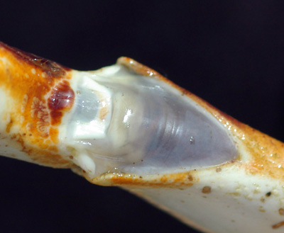
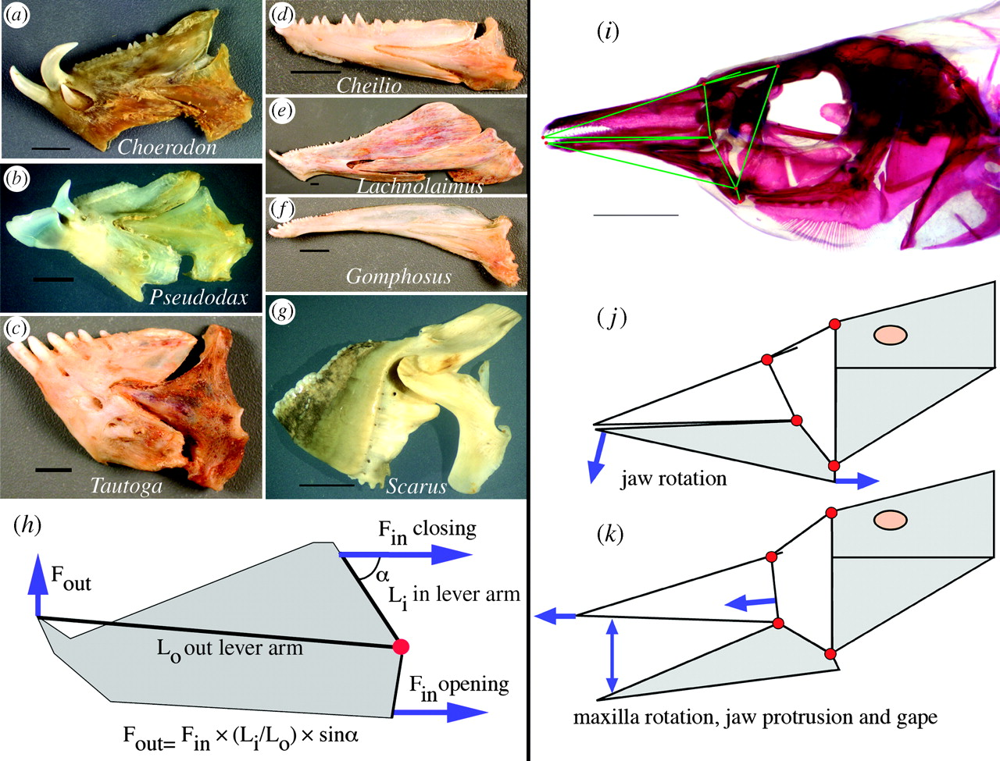

class: inverse, top
# Joints, Levers, and Linkages

```{r,echo=FALSE,message=FALSE}
library(tidyverse)
library(kableExtra)
```

<!-- Add icon library -->
<link rel="stylesheet" href="https://cdnjs.cloudflare.com/ajax/libs/font-awesome/5.14.0/css/all.min.css">


.pull-left[
Today we'll ....


- Consider joints 

- Consider linkages

]


.pull-right[
<br>
<iframe width="560" height="315" src="https://www.youtube.com/embed/pDU4CQWXaNY" frameborder="0" allow="accelerometer; autoplay; clipboard-write; encrypted-media; gyroscope; picture-in-picture" allowfullscreen></iframe>
]

---
class: top

# How do skeletal elements permit predictable movement?

## Joints!

.pull-left[ 

Rigid elements that form linkages that constrain/permit movement. That is, they have degrees of freedom . . . 

- choice/comb of planar or rotational motion (3+3=6 DOF)
- 1-3 DOF/Joint
- Arrangements of 1 DOF results in several DOF
- Require superlow resistance or low stiffness
	
]

.pull-right[

]
        
   
---
class: top

# How do skeletal elements permit predictable movement?

## How many degrees of freedom?

.pull-left[ 
 
- $M=6-c$
- 6 possible DOF
- c=constraints		


]

.pull-right[


]
   
 

---

class: top

# How do skeletal elements permit predictable movement?

.center[

## Arthroidal membrane 

]

.pull-left[ 


             

        
 
        ]

.pull-right[

]

---
class: top


# Synovial joints: The knee, for example

.pull-left[
- cruciate ligaments constrain motion
- wring causes weeping lubrication
- coeff. friction = 0.003
- good ball bearings =0.02


]

.pull-right[


```{r,echo=FALSE,out.width=350}
#stride length
knitr::include_graphics("img/knee.jpg")

```


]


---

class: top

# Joints are fulcrums: thus, we move with levers


.pull-left[


```{r,echo=FALSE,out.width=450}
#stride length


```

]
      
.pull-right[

In equilibrium net moment (torque)=0 

$$F_{out}L_{out}=F_{in}L_{in}$$

Mechanical advantage (MA): 

$$\frac{F_{out}}{F_{n}}=\frac{L_{in}}{L_{out}}$$

Speed ratio (gearing):

$$\frac{L_{out}}{L_{in}}$$

]
   

---
class: top

# Lever types and examples


---
class: top

# Trade offs in action

.center[
```{r,echo=FALSE,out.width=550}
#stride length


```

 Which limb belongs to a fast runner? A digger?
 
 ] 

 
---
class: top

# Levers are part of a postural system


.center[


```{r,echo=FALSE,out.width=250}
#stride length
knitr::include_graphics("https://jeb.biologists.org/content/jexbio/208/9/1665/F2.large.jpg")

```
 ]
 
 .footnote[
 $$EMA=r/R$$
 ]
 
 
---
class: top

# Linkages

## 4-bar linkage

.pull-left[

### Can predict KE and ME based on morphology:

- Force amplification = $r/q$
- Speed ampflication = $q/r$
]

.pull-right[

]

---
class: top

# Linkages

.center[

### Famous 4-bar from fish


```{r,echo=FALSE,out.width=550}
#stride length


```
]
---

class: center, middle

# Thanks!

Slides created via the R package [**xaringan**](https://github.com/yihui/xaringan).

