class: inverse, top
# Joints, Levers, and Linkages

```{r,echo=FALSE,message=FALSE,warning=F}

library(tidyverse)
library(kableExtra)
```

<!-- Add icon library -->
<link rel="stylesheet" href="https://cdnjs.cloudflare.com/ajax/libs/font-awesome/5.14.0/css/all.min.css">


.pull-left[
Today we'll ....

- Wrap up with muscls

- What is stress, strain?

- Define stiffness and other material properties

- Start MP2

]


.pull-right[

]


---
class: top

# Muscles generate mechanical work and power. 

## How?
 
.center[

```{r,echo=FALSE,out.width=400}
#stride length
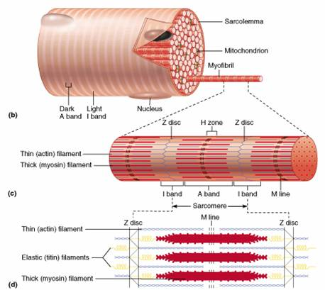

```

]


---
class: top

# Muscles generate mechanical work and power. 

## How?
 
.center[

```{r,echo=FALSE,out.width=350}
#stride length
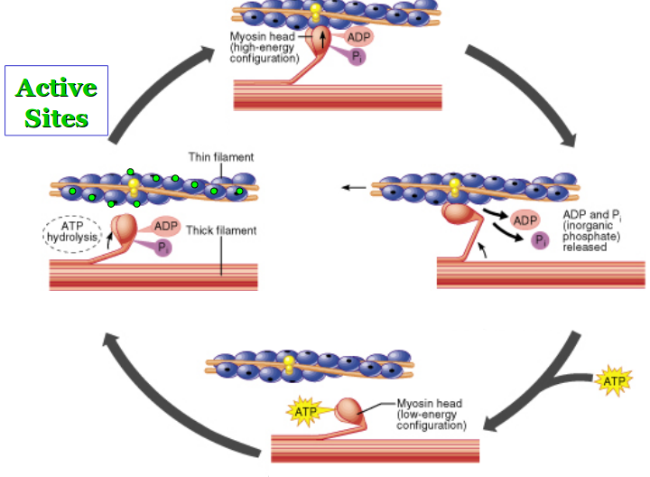

```

]

.footnote[ Sliding filament (crossbridge) theory. Gordon, Huxley & Julian (1966)]


---

class: top

# What determines amount of force produced by muscle?

.pull-left[
1. Time after activation

]


.pull-right[
```{r,echo=FALSE,out.width=450}
#stride length
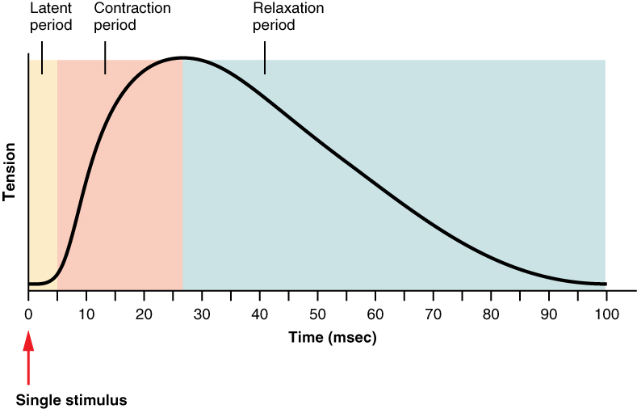

```
]


---
class: top

# What determines amount of force produced by muscle?

.pull-left[
1. Time after activation
2. Muscle (sarcomere) length

<br>
<br>

```{r,echo=FALSE,out.width=550}
#stride length
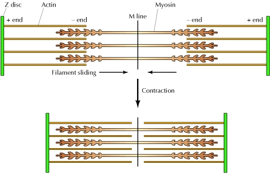

```
]

.pull-right[
<br>
<br>
<br>
<br>

```{r,echo=FALSE,out.width=550}
#stride length
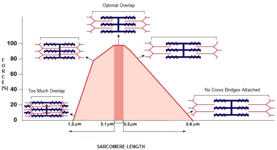

```
]

---
class: top

# What determines amount of force produced by muscle?

.pull-left[
1. Time after activation
2. Muscle (sarcomere) length
3. Shortening velocity

<br>

```{r,echo=FALSE,out.width=550}
#stride length
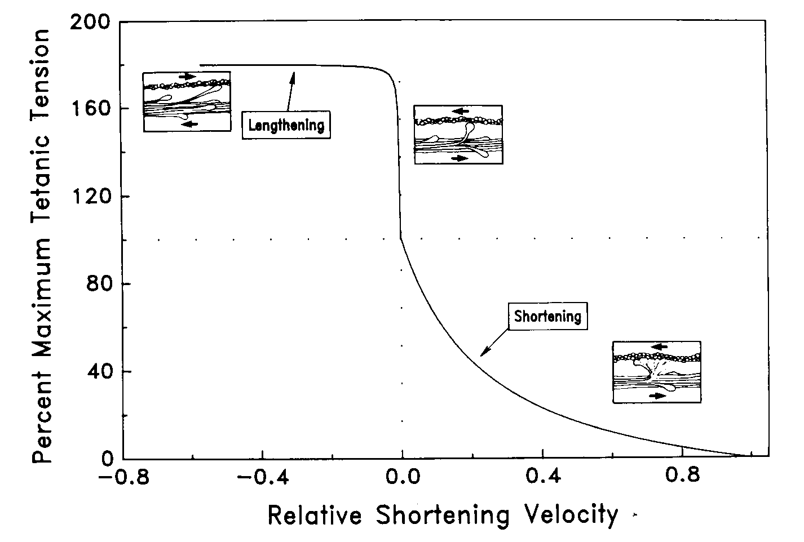

```

    
]


---
class: top

# What determines amount of force produced by muscle?

.pull-left[
1. Time after activation
2. Muscle (sarcomere) length
3. Shortening velocity

<br>

```{r,echo=FALSE,out.width=550}
#stride length


```


]

.pull-right[

V=? to maximize power?


$$P=F\times V$$
    
<br>
<br>

```{r,echo=FALSE,out.width=550}
#stride length
knitr::include_graphics("https://d3i71xaburhd42.cloudfront.net/2b0ce8ae4ce7e28430b71ba8983e33c3bad9c196/3-Figure2-1.png")

```
]

---
class: top

# What determines amount of force produced by muscle?

.pull-left[
1. Time after activation
2. Muscle (sarcomere) length
3. Shortening velocity

<br>

```{r,echo=FALSE,out.width=550}
#stride length


```


]

.pull-right[

Formalize F-V relationship... the Hill equation:

$$\frac{T}{T_o}=T^\prime=\frac{1-\frac{v}{v_{max}}}{1+c\frac{v}{v_{max}}}=\frac{1-v^\prime}{1+cv^\prime}$$
    

```{r,echo=FALSE,out.width=550}
#stride length
knitr::include_graphics("https://d3i71xaburhd42.cloudfront.net/2b0ce8ae4ce7e28430b71ba8983e33c3bad9c196/3-Figure2-1.png")

```
.footnote[
$c\approx 1.2-4$
]


]


---
class: top

# Metrics of muscle function

## Generate mechanical work and power

.pull-left[
- Work = $F\cdot\Delta L$ (Joules)
- Power = Work/time (Joles/s = Watts)
- Power = Work x Frequency (Joules/s = Watts)
- Power = F x V (Joules/s = Watts)

<br>


]

.pull-right[
    
<br>
```{r,echo=FALSE,out.width=250}
#stride length
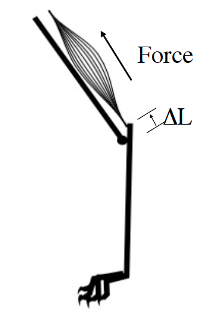

```
.footnote[

]


]

---
class: top

# Metrics of muscle function

## The work loop technique

.pull-left[
- Work = $F\cdot\Delta L$ (Joules)
- Power = Work/time (Joles/s = Watts)
- Power = Work x Frequency (Joules/s = Watts)
- Power = F x V (Joules/s = Watts)

.center[
```{r,echo=FALSE,out.width=60}
#stride length

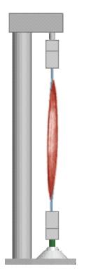

```
]

]

.pull-right[
    
<br>
```{r,echo=FALSE,out.width=200}
#stride length
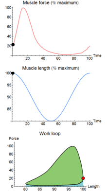

```
.footnote[

]

 
]

---
class: top

# Metrics of muscle function


.center[

```{r,echo=FALSE,out.width=600}
#stride length

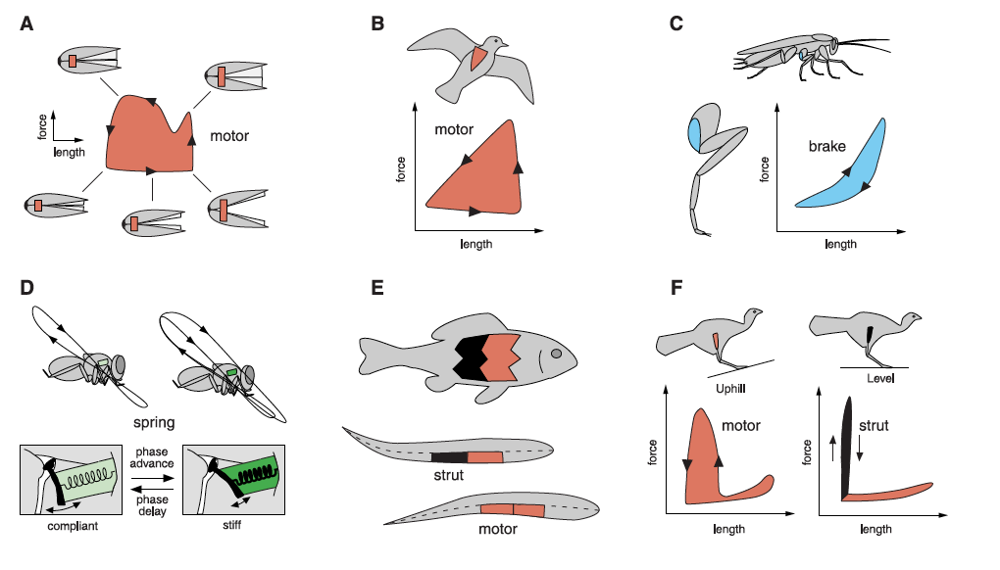

```
]


---

class: top

# Lots more to study


We know we don't know a lot about muscles

.center[

```{r,echo=FALSE,out.width=400}
#stride length

knitr::include_graphics("https://s3-eu-west-1.amazonaws.com/s3-euw1-ap-pe-ws4-cws-documents.ri-prod/9780367190811/central/musclefuels/images/gastrocnemius.jpg")

```
Doublet potentiation

]


---

class: top

# Lots more to study


We know we don't know a lot about muscles

.center[

```{r,echo=FALSE,out.width=400}
#stride length

knitr::include_graphics("https://journals.physiology.org/cms/10.1152/jappl.1997.82.4.1219/asset/images/large/japp0542801.jpeg")

```
Doublet potentiation

]


---

class: top

# Lots more to study


We know we don't know a lot about muscles

.center[

```{r,echo=FALSE,out.width=400}
#stride length

knitr::include_graphics("https://www.researchgate.net/profile/Stanley-Salmons/publication/11155153/figure/fig5/AS:276867023163394@1443021650100/Mean-nFTIpP-n-6-for-doublets-lower-surface-triplets-intermediate-surface-and.png")

```

]
---
class: top

# Material and structures

.pull-left[ 

- Loads and deformations -- basic concepts
- Stress: the distribution of force over an area
- Strain: a dimensionless measure of deformation
- Stiffness: a measure of how materials respond to stress (or strain)
- Loads: the relationship between stress and strain
- Strength: the stress at breaking
	

	
]

.pull-right[
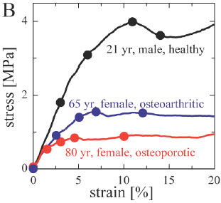
]
        
   
---
class: top

# Material and structures

.pull-left[ 
 
- All (biological) materials respond to external forces by deforming
- We seek a way to understand and characterize these responses
- Material behavior as separate from structural behavior
- We will formalize the relationships between force and deformation	


]

.pull-right[


]
   
 
---
class: top

# Material properties 

## Types of deformation

.center[

]

.center[ 


             
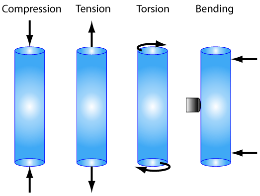
        
 
        ]


 
---
class: top

# Material properties

## Types of deformation

.pull-left[

Stress: $$\sigma=\frac{F}{A}$$

$Pa=N\cdot m^2$
           
Strain $$\varepsilon=\frac{L-L_o}{L_o}$$

Units?


]

.pull-right[


```{r,echo=FALSE,out.width=350}
#stride length


```


]

  
---
class: top

# Material properties 
  
  
.pull-left[

$$stress(\sigma)=\frac{F}{A}$$

```{r,echo=FALSE,out.width=350}
#stride length
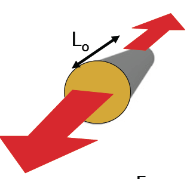

```

   Young's modulus: $E=\frac{\sigma}{\varepsilon}$
   
   What are units of $E$?
   
]

 
.pull-right[

 $strain(\varepsilon)=\frac{L-L_o}{L_o}$
 
 Hook's law: $F=K\Delta L$
 
```{r,echo=FALSE,out.width=350}
#stride length
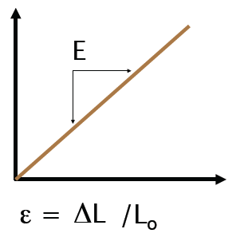

```
             
              
]

---
class: top

# Material properties 
  
  
.pull-left[

$\sigma$: distribution of force over and area

$\varepsilon$: dimensionless measure of length of change

stiffness (E): change in stress relative to strain (slope of stress-strain curve)


```{r,echo=FALSE,out.width=250}
#stride length
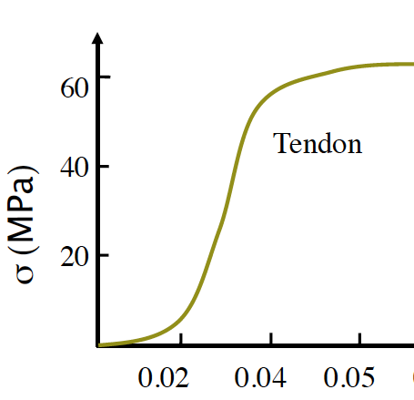

```

]

 
.pull-right[

Most biological materials are non-linearly elastic

```{r,echo=FALSE,out.width=250}
#stride length
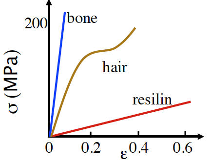

```
             


]

---
class: top

# Material properties 
  
  
.pull-left[

$\sigma$: distribution of force over and area

$\varepsilon$: dimensionless measure of length of change

stiffness (E): change in stress relative to strain (slope of stress-strain curve)


```{r,echo=FALSE,out.width=250}
#stride length


```

]

 
.pull-right[

Most biological materials are non-linearly elastic

```{r,echo=FALSE,out.width=250}
#stride length
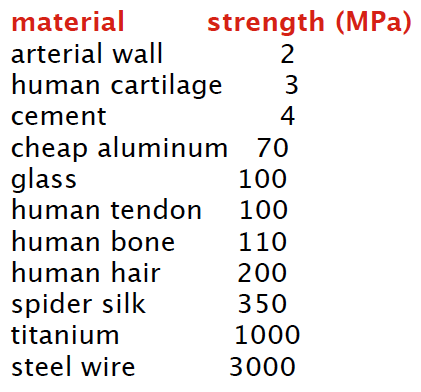

```
             


]

---
class: top

# Material properties 
  
  
.pull-left[

$\sigma$: distribution of force over and area

$\varepsilon$: dimensionless measure of length of change

stiffness (E): change in stress relative to strain (slope of stress-strain curve)


```{r,echo=FALSE,out.width=350}
#stride length
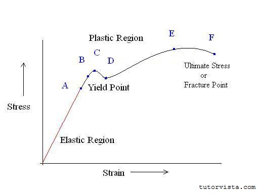

```

]

 
.pull-right[

Most biological materials are non-linearly elastic

```{r,echo=FALSE,out.width=250}
#stride length


```
             


]


---

class: center, middle

# Thanks!

Slides created via the R package [**xaringan**](https://github.com/yihui/xaringan).

