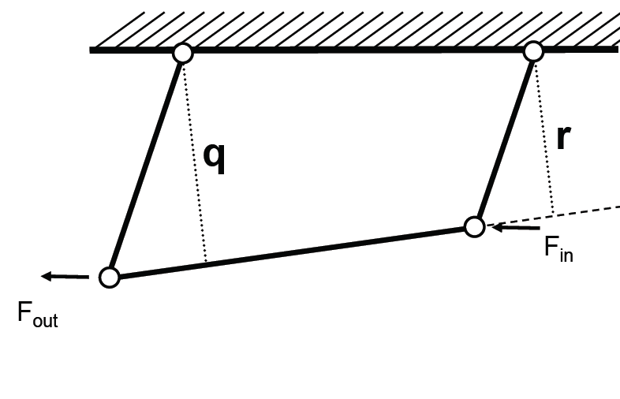
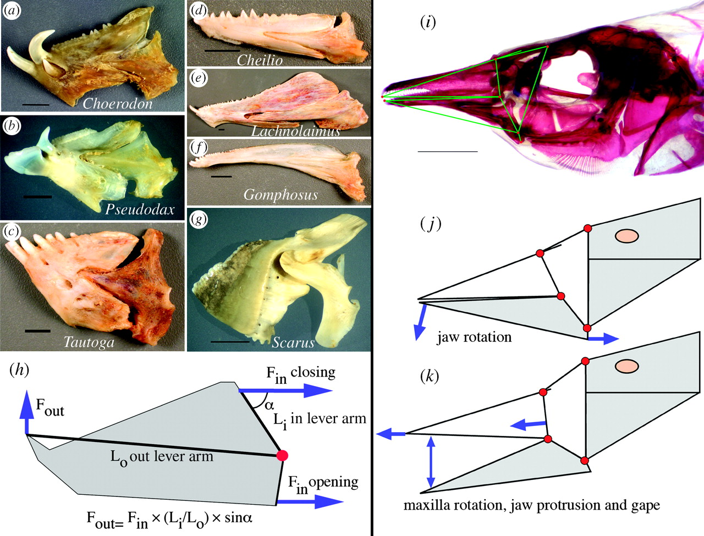

class: inverse, top
# Joints, Levers, and Linkages

```{r,echo=FALSE,message=FALSE}
library(tidyverse)
library(kableExtra)
```

<!-- Add icon library -->
<link rel="stylesheet" href="https://cdnjs.cloudflare.com/ajax/libs/font-awesome/5.14.0/css/all.min.css">


.pull-left[
Today we'll ....

- Wrap up with linkages

- What is stress, strain?

- Define stiffness and other material properties

- Start MP2

]


.pull-right[

]


---
class: top

# Levers are part of a postural system


.center[


```{r,echo=FALSE,out.width=350}
#stride length
knitr::include_graphics("https://d3i71xaburhd42.cloudfront.net/9f2b00f5fc3474ba3ef190c9571a9d934cb561bb/5-Figure3-1.png")

```
 


 .footnote[
 $$EMA=r/R$$ HIGH
 ]]
 
 
---
class: top

# Linkages

## 4-bar linkage

.pull-left[

### Can predict KE and ME based on morphology:

- Force amplification = $r/q$
- Speed ampflication = $q/r$
]

.pull-right[

]

---
class: top

# Linkages

.center[

### Famous 4-bar from fish


```{r,echo=FALSE,out.width=550}
#stride length


```
]

---
class: top

# Material and structures

.pull-left[ 

- Loads and deformations -- basic concepts
- Stress: the distribution of force over an area
- Strain: a dimensionless measure of deformation
- Stiffness: a measure of how materials respond to stress (or strain)
- Loads: the relationship between stress and strain
- Strength: the stress at breaking
	

	
]

.pull-right[

]
        
   
---
class: top

# Material and structures

.pull-left[ 
 
- All (biological) materials respond to external forces by deforming
- We seek a way to understand and characterize these responses
- Material behavior as separate from structural behavior
- We will formalize the relationships between force and deformation	


]

.pull-right[


]
   
 
---
class: top

# Material properties 

## Types of deformation

.center[

]

.center[ 


             

        
 
        ]


 
---
class: top

# Material properties

## Types of deformation

.pull-left[

Stress: $$\sigma=\frac{F}{A}$$

$Pa=N\cdot m^2$
           
Strain $$\varepsilon=\frac{L-L_o}{L_o}$$

Units?


]

.pull-right[


```{r,echo=FALSE,out.width=350}
#stride length
knitr::include_graphics("img/loads.png")

```


]

  
---
class: top

# Material properties 
  
  
.pull-left[

$$stress(\sigma)=\frac{F}{A}$$

```{r,echo=FALSE,out.width=350}
#stride length
knitr::include_graphics("img/strainarrows.png")

```

   Young's modulus: $E=\frac{\sigma}{\varepsilon}$
   
   What are units of $E$?
   
]

 
.pull-right[

 $strain(\varepsilon)=\frac{L-L_o}{L_o}$
 
 Hook's law: $F=K\Delta L$
 
```{r,echo=FALSE,out.width=350}
#stride length
knitr::include_graphics("img/stressstrainstiff.png")

```
             
              
]

---
class: top

# Material properties 
  
  
.pull-left[

$\sigma$: distribution of force over and area

$\varepsilon$: dimensionless measure of length of change

stiffness (E): change in stress relative to strain (slope of stress-strain curve)


```{r,echo=FALSE,out.width=250}
#stride length
knitr::include_graphics("img/tendoncurve.png")

```

]

 
.pull-right[

Most biological materials are non-linearly elastic

```{r,echo=FALSE,out.width=250}
#stride length
knitr::include_graphics("img/bonehaircurve.png")

```
             


]

---
class: top

# Material properties 
  
  
.pull-left[

$\sigma$: distribution of force over and area

$\varepsilon$: dimensionless measure of length of change

stiffness (E): change in stress relative to strain (slope of stress-strain curve)


```{r,echo=FALSE,out.width=250}
#stride length
knitr::include_graphics("img/tendoncurve.png")

```

]

 
.pull-right[

Most biological materials are non-linearly elastic

```{r,echo=FALSE,out.width=250}
#stride length
knitr::include_graphics("img/failuretable.png")

```
             


]

---
class: top

# Material properties 
  
  
.pull-left[

$\sigma$: distribution of force over and area

$\varepsilon$: dimensionless measure of length of change

stiffness (E): change in stress relative to strain (slope of stress-strain curve)


```{r,echo=FALSE,out.width=350}
#stride length
knitr::include_graphics("img/stressstraincurve.jpg")

```

]

 
.pull-right[

Most biological materials are non-linearly elastic

```{r,echo=FALSE,out.width=250}
#stride length
knitr::include_graphics("img/failuretable.png")

```
             


]


---

class: center, middle

# Thanks!

Slides created via the R package [**xaringan**](https://github.com/yihui/xaringan).

