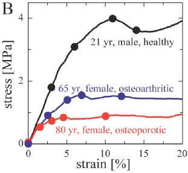
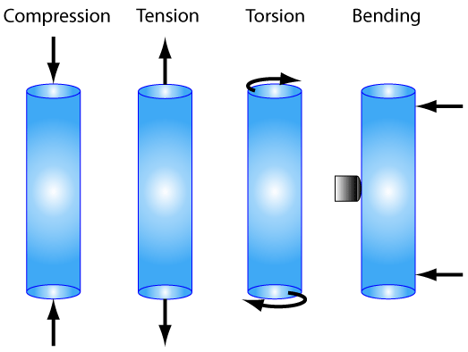
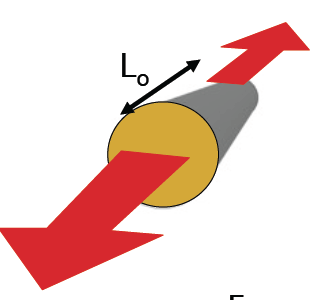
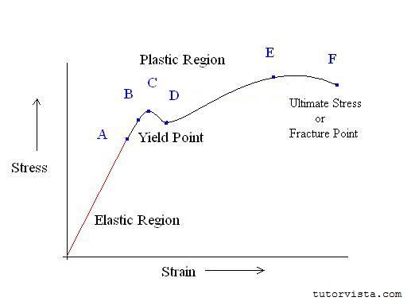

class: inverse, top
# Material Properties of the Dead, Toughness, and Resilience

```{r,echo=FALSE,message=FALSE}
library(tidyverse)
library(kableExtra)
```

<!-- Add icon library -->
<link rel="stylesheet" href="https://cdnjs.cloudflare.com/ajax/libs/font-awesome/5.14.0/css/all.min.css">


.pull-left[
Today we'll ....

- Consider material properties going way back

- Consider toughness

- Considier resilience

]


.pull-right[


]

---
class: top

# Material and structures

.pull-left[ 

- Loads and deformations -- basic concepts
- Stress: the distribution of force over an area
- Strain: a dimensionless measure of deformation
- Stiffness: a measure of how materials respond to stress (or strain)
- Loads: the relationship between stress and strain
- Strength: the stress at breaking
	

	
]

.pull-right[

]
        
   
---
class: top

# Material and structures

.pull-left[ 
 
- All (biological) materials respond to external forces by deforming
- We seek a way to understand and characterize these responses
- Material behavior as separate from structural behavior
- We will formalize the relationships between force and deformation	


]

.pull-right[


]
   
 
---
class: top

# Material properties 

## Types of deformation

.center[

]

.center[ 


             

        
 
        ]


 
---
class: top

# Material properties

## Types of deformation

.pull-left[

Stress: $$\sigma=\frac{F}{A}$$

$Pa=N\cdot m^2$
           
Strain $$\varepsilon=\frac{L-L_o}{L_o}$$

Units?


]

.pull-right[


```{r,echo=FALSE,out.width=350}
#stride length


```


]

  
---
class: top

# Material properties 
  
  
.pull-left[

$$stress(\sigma)=\frac{F}{A}$$

```{r,echo=FALSE,out.width=350}
#stride length


```

   Young's modulus: $E=\frac{\sigma}{\varepsilon}$
   
   What are units of $E$?
   
]

 
.pull-right[

 $strain(\varepsilon)=\frac{L-L_o}{L_o}$
 
 Hook's law: $F=K\Delta L$
 
```{r,echo=FALSE,out.width=350}
#stride length
knitr::include_graphics("img/stressstrainstiff.png")

```
             
              
]

---
class: top

# Material properties 
  
  
.pull-left[

$\sigma$: distribution of force over and area

$\varepsilon$: dimensionless measure of length of change

stiffness (E): change in stress relative to strain (slope of stress-strain curve)


```{r,echo=FALSE,out.width=250}
#stride length
knitr::include_graphics("img/tendoncurve.png")

```

]

 
.pull-right[

$\sigma_{max}$: Strength, max stress applied without failure or plastic deformation.

Most biological materials are non-linearly elastic

```{r,echo=FALSE,out.width=250}
#stride length
knitr::include_graphics("img/bonehaircurve.png")

```
             


]

---
class: top

# Material properties 
  
  
.pull-left[

$\sigma$: distribution of force over and area

$\varepsilon$: dimensionless measure of length of change

stiffness (E): change in stress relative to strain (slope of stress-strain curve)


```{r,echo=FALSE,out.width=250}
#stride length
knitr::include_graphics("img/tendoncurve.png")

```

]

 
.pull-right[

$\sigma_{max}$: Strength, max stress applied without failure or plastic deformation.

Most biological materials are non-linearly elastic

```{r,echo=FALSE,out.width=250}
#stride length
knitr::include_graphics("img/failuretable.png")

```
             


]

---
class: top

# Material properties 
  
  
.pull-left[

$\sigma$: distribution of force over and area

$\varepsilon$: dimensionless measure of length of change

stiffness (E): change in stress relative to strain (slope of stress-strain curve)


```{r,echo=FALSE,out.width=350}
#stride length


```

]

 
.pull-right[

Most biological materials are non-linearly elastic

```{r,echo=FALSE,out.width=250}
#stride length
knitr::include_graphics("img/failuretable.png")

```
             


]


---
class: top

# A comparison of E across domains


.center[


```{r,echo=FALSE,out.width=500}
#stride length
knitr::include_graphics("https://d3i71xaburhd42.cloudfront.net/1eb86e8732a38a0753510236e5c023b5decd5340/7-Figure7-1.png")

```
 ]
 
---
class: top

# Materials and the largest among us


.center[

### Are land animals constrained by the strength of bone?

```{r,echo=FALSE,out.width=700}
#stride length
knitr::include_graphics("https://upload.wikimedia.org/wikipedia/commons/3/34/Longest_dinosaurs2.svg")

```
 ]
 
 

---
class: top

# Materials and the largest among us

.center[

```{r,echo=FALSE,out.width=700}
#stride length
knitr::include_graphics("https://upload.wikimedia.org/wikipedia/commons/2/2f/Patagotitan_vs_Mammals_Scale_Diagram_SVG_Steveoc86.svg")

```
 ]

.pull-left[
 Baluchitherium weighed about 30 Tons (27000 kg)
 
- Could the foot bones support its weight?
- $\sigma_{max} =  \textrm{100 MPa } (10^{6}  \textrm{ Pa})$
- Diameter = 14 cm
- $\textrm{CSA} = \textrm{151 10}^{-4} \textrm{ m}^2$

]

.pull-right[

```{r,echo=FALSE,out.width=150}
#stride length
knitr::include_graphics("https://upload.wikimedia.org/wikipedia/commons/thumb/a/ab/Indricotherium_transouralicum_hind_foot.jpg/170px-Indricotherium_transouralicum_hind_foot.jpg")

```


]

---
class: top

# Materials and the largest among us

.center[

```{r,echo=FALSE,out.width=700}
#stride length
knitr::include_graphics("https://upload.wikimedia.org/wikipedia/commons/2/2f/Patagotitan_vs_Mammals_Scale_Diagram_SVG_Steveoc86.svg")

```
 ]

.pull-left[
 Baluchitherium weighed about 30 Tons (27000 kg)
 
- Could the foot bones support its weight?
- $\sigma_{max} =  \textrm{100 MPa } (10^{6}  \textrm{ Pa})$
- Diameter = 14 cm
- $\textrm{CSA} = \textrm{151 10}^{-4} \textrm{ m}^2$

]

.pull-right[

```{r,echo=FALSE,out.width=150}

# stress=f/a

#100*10^6=(9.8*27000)/(151*10^-4)

#(9.8*27000)/(151*10^-4)


```

$\sigma_{max} \geq  \frac{9.8\cdot27000}{151\cdot10^{-4}}$

$\sigma_{max} \geq  \textrm{= 17 MPa}$
]

---
class: top

# Materials and the largest among us


.center[

### But what about these guys?

```{r,echo=FALSE,out.width=700}
#stride length
knitr::include_graphics("https://upload.wikimedia.org/wikipedia/commons/3/34/Longest_dinosaurs2.svg")

```
```{r,echo=FALSE,out.width=400}
#stride length
knitr::include_graphics("https://static.scientificamerican.com/blogs/cache/file/23C1EE59-CC6F-4542-A5EAACB8E6336F06_source.jpg?w=590&h=800&D6BDF76C-BA43-435B-A12E3263F71F10FF")

```
 ]
 
---
class: top

# Materials and the largest among us

.center[

### But what about these guys?

```{r,echo=FALSE,out.width=700}
#stride length
knitr::include_graphics("https://upload.wikimedia.org/wikipedia/commons/3/34/Longest_dinosaurs2.svg")

```

How agile were they?

Design a comparative research project to assess this
]

+ What level of agility would impose larger/smaller GRFs and stresses?
+ What properties of the bones would you study?
+ What species would be part of your comparative program?

 
 
---
class: top

# Materials and the largest among us


.center[


```{r,echo=FALSE,out.width=400}
#stride length


```


 ]
 
---
class: top

# Toughness

.center[

### The energy imparted is the **mechanical strain energy** that can be returned or be so great as to break the material

]

.pull-left[
.center[
$U=\int\sigma d\varepsilon$
]

```{r,echo=FALSE,out.width=350}
#stride length
knitr::include_graphics("img/toughness.png")

```
]

.pull-right[
$T=\int\sigma d\varepsilon$

**Toughness:** the energy per unit volume required to break a material

]

---
class: top

# Toughness

.center[

### Some (but not necessarily all) of the mechanical energy can be returned

]

.pull-left[
.center[
$U=\int\sigma d\varepsilon$
]

```{r,echo=FALSE,out.width=350}
#stride length
knitr::include_graphics("https://static.cambridge.org/binary/version/id/urn:cambridge.org:id:binary:20191021053530314-0709:9781108686624:72215fig26_6b.png?pub-status=live")

```
]

.pull-right[

**Resilience (R)**=

$$\frac{\textrm{strain energy returned}}{\textrm{strain energy absorbed}}$$

```{r,echo=FALSE}

R <- data.frame(material=c("Silk","Elastin","Abductin","Collagen (tendon)","Resilin (wing hinge)"),
           R=c("35%","76%","80%","93%","97%"))

knitr::kable(R, format = 'html')
```
]

---
class: top

# Resilience in the vertebrate body

### The cardiovascular system?


---
class: top

# Resilience in the vertebrate body

### The cardiovascular system?

.center[ 

```{r,echo=FALSE,out.width=400}
#stride length
knitr::include_graphics("https://www.austincc.edu/apreview/NursingPics/VascularPics/Picture8.jpg")

```
]


---

class: center, middle

# Thanks!

Slides created via the R package [**xaringan**](https://github.com/yihui/xaringan).

