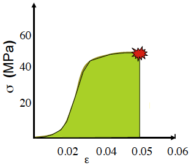

class: inverse, top
# Material Properties, Failure, and the Viscous World

```{r,echo=FALSE,message=FALSE}
library(tidyverse)
library(kableExtra)
```

<!-- Add icon library -->
<link rel="stylesheet" href="https://cdnjs.cloudflare.com/ajax/libs/font-awesome/5.14.0/css/all.min.css">


.pull-left[
Today we'll ....

- Finish up with solid material properties

- Consider fractures and imperfections

- Consider fluids vs. solids

- Consider fluids + solids (viscoelastics)

]


.pull-right[


]


---
class: top

# Toughness

.center[

### The energy imparted is the **mechanical strain energy** that can be returned or be so great as to break the material

]

.pull-left[
.center[
$U=\int\sigma d\varepsilon$
]

```{r,echo=FALSE,out.width=350}
#stride length


```
]

.pull-right[
$T=\int\sigma d\varepsilon$

**Toughness:** the energy per unit volume required to break a material

]

---
class: top

# Toughness

.center[

### Some (but not necessarily all) of the mechanical energy can be returned

]

.pull-left[
.center[
$U=\int\sigma d\varepsilon$
]

```{r,echo=FALSE,out.width=350}
#stride length
knitr::include_graphics("https://static.cambridge.org/binary/version/id/urn:cambridge.org:id:binary:20191021053530314-0709:9781108686624:72215fig26_6b.png?pub-status=live")

```
]

.pull-right[

**Resilience (R)**=

$$\frac{\textrm{strain energy returned}}{\textrm{strain energy absorbed}}$$

```{r,echo=FALSE}

R <- data.frame(material=c("Silk","Elastin","Abductin","Collagen (tendon)","Resilin (wing hinge)"),
           R=c("35%","76%","80%","93%","97%"))

knitr::kable(R, format = 'html')
```
]

---
class: top

# Resilience in the vertebrate body

### The cardiovascular system?


---
class: top

# Resilience in the vertebrate body

### The cardiovascular system?

.center[ 

```{r,echo=FALSE,out.width=400}
#stride length
knitr::include_graphics("https://www.austincc.edu/apreview/NursingPics/VascularPics/Picture8.jpg")

```
]


---
class: top

# Fracture theory (without all the equations)

### In an ucompromised structure, stress in applied uniformly


 
  
.pull-left[
```{r,echo=FALSE,out.width=700}
#stride length
knitr::include_graphics("img/fracturemode.png")

```

### With imperfections, stress is applied nonuniformly
 ]
 
---
class: top

# Fracture theory (without all the equations)

### In an ucompromised structure, stress in applied uniformly

  
.pull-left[
```{r,echo=FALSE,out.width=700}
#stride length
knitr::include_graphics("img/fracturemode.png")

```

### With imperfections, stress is applied nonuniformly
 ]

.pull-right[
- Why do bones and shells break explosively?
- Why do cracks propagate?
]

---
class: top

# Fracture theory (without all the equations)

### In an ucompromised structure, stress in applied uniformly

  
.pull-left[
.center[
```{r,echo=FALSE,out.width=150}
#stride length
knitr::include_graphics("img/crack.png")

```
]
### With imperfections, stress is applied nonuniformly

$\textrm{Strain energy}=U=\int\sigma d\varepsilon=\frac{\sigma^2}{2E}$
 ]

.pull-right[
- Why do bones and shells break explosively?
- Why do cracks propagate?

$\textrm{Strain energy release}=  \frac{\sigma^2}{E} \pi a^2t$

Strain energy releases by crack


```{r,echo=FALSE,out.width=300}
#stride length
knitr::include_graphics("img/cracklength.png")

```

]

---
class: top

# Viscoelastics


.center[

### Materials that show time dependency are **viscoelastic**

```{r,echo=FALSE,out.width=700}
#stride length
knitr::include_graphics("img/viscos.png")

```
 ]
 
.pull-left[
.center[
$F\sim \Delta L$

$\sigma\sim \varepsilon$

$\sigma \sim E\varepsilon$
]]

.center[
.pull-right[
$F\sim \Delta L/\Delta t$

$\sigma\sim d\varepsilon/dt$

$\sigma \sim d\mu \varepsilon/dt$

$\mu=\textrm{viscosity}$

Newton's third law
]
]

---
class: top

# Fluids

.center[

```{r,echo=FALSE,out.width=400}
#stride length


```
 ]


- Hookean materials (solids): stress vs. strain relationship is linear (constant stiffness)

- Newtonian fluids: stress vs. strain **rate** is linear (constant viscosity)


---
class: top

# How do we know when we have a fluid?


.center[
```{r,echo=FALSE,out.width=650}
#stride length
knitr::include_graphics("img/creep2.png")

```

]

.pull-left[


.center[
$\sigma = E \varepsilon$

]


]

.pull-right[
.center[

$\sigma = d\mu \varepsilon/dt$

]
]


.center[

```{r,echo=FALSE,out.width=600}
#stride length
knitr::include_graphics("img/springdashpot.png")

```


]

---
class: top

# Methods to reveal a viscoelastic property

### Creep and stress relaxtion tests

.center[
```{r,echo=FALSE,out.width=450,eval=FALSE}
#stride length
knitr::include_graphics("https://ars.els-cdn.com/content/image/3-s2.0-B9780128098318000052-f05-04-9780128098318.jpg")

```

Apply a constant stress?  

Relax a stress? 

What happens to deformation? Why?
]

---
class: top

# Methods to reveal a viscoelastic property

### Creep and stress relaxtion tests

.center[
```{r,echo=FALSE,out.width=450}
#stride length
knitr::include_graphics("https://ars.els-cdn.com/content/image/3-s2.0-B9780128098318000052-f05-04-9780128098318.jpg")

```

Apply a constant stress? (A) 

Relax a stress? (B)

What happens to deformation? Why?
]


---
class: top

# What if we have both?


.center[
```{r,echo=FALSE,out.width=650}
#stride length
knitr::include_graphics("img/mucuscartilage.png")

```

]

.pull-left[


.center[
Maxwell model

]


]

.pull-right[
.center[

Voigt model

]
]


---
class: top

# Why this in a tendon?


.center[
```{r,echo=FALSE,out.width=450}
#stride length
knitr::include_graphics("https://www.physio-pedia.com/images/thumb/b/be/Rep_loading-unloading_curve_intechopen.jpeg/357px-Rep_loading-unloading_curve_intechopen.jpeg")

```

]


---

class: center, middle

# Thanks!

Slides created via the R package [**xaringan**](https://github.com/yihui/xaringan).

