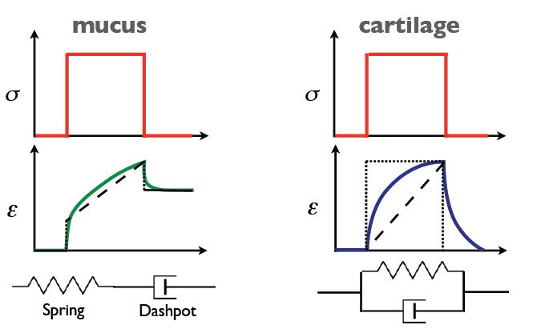

class: top
# Structural properties

```{r,echo=FALSE,message=FALSE}
library(tidyverse)
library(kableExtra)
library(scales)
```

<!-- Add icon library -->
<link rel="stylesheet" href="https://cdnjs.cloudflare.com/ajax/libs/font-awesome/5.14.0/css/all.min.css">


.pull-left[
Today we'll ....

- Consider safety factors

- Consider how structures fail

- Consider how structures resist bending

]


.pull-right[


]


---
class: top

# What if we have both?


.center[
```{r,echo=FALSE,out.width=650}
#stride length


```

]

.pull-left[


.center[
Maxwell model

]


]

.pull-right[
.center[

Voigt model

]
]


---
class: top

# Why this in a tendon?


.center[
```{r,echo=FALSE,out.width=450}
#stride length
knitr::include_graphics("https://www.physio-pedia.com/images/thumb/b/be/Rep_loading-unloading_curve_intechopen.jpeg/357px-Rep_loading-unloading_curve_intechopen.jpeg")

```

]


---
class: top

# A comparison of SF 

.center[
$\textrm{Safety factor: n} = \sigma_{br}/\sigma_{ex}$
]
.pull-left[

Compression safety factor during locomotion

```{r,echo=FALSE}
R <- data.frame(species=c("Dog jumping","Kangaroo hopping","Possum","Elephant running","Man weightlifting"),
                  SF=c(2.8,3.2,3,"1-1.7",6)
                  )

R%>%kable%>%kableExtra::kable_styling()

```
.center[

<br>
<br>
<br>
<br>
Alexander, R.McN. 1981. Sci. Prog. Oxf. 67:109-120


 ]
 ]

.pull-right[

Mean bending safety factor during running

```{r,echo=FALSE}
R <- data.frame(species=c("Bullfrog","Salamanders","Possum","Eutherians","Iguana","Turtles","Crocs","Birds"),
                  SF=c(8,10.5,5.1,2.5,10.8,4.4,6.3,3.3)
                  )

R%>%kable%>%kableExtra::kable_styling()

```
.center[

Blob, R.W. et al. 2014. Int. & Comp. Biol., 54 (6):1058–1071


 ]
 ]
 
---
class: top

# A comparison of SF 

.center[
$\textrm{Safety factor: n} = \sigma_{br}/\sigma_{ex}$
]

.body[
These are SF from experiments: the real world is different. Loads (direction, scale) vary and so does the capacity to withstand them. Geometry and structural arrangement is important!]

```{r,echo=FALSE,,fig.height=2.5,fig.width=7,dev='svg'}

x <- seq(-4, 4, length=100)
ex <- dnorm(x)
mx <- dnorm(x+3,mean = 3,sd = 0.7)

p <- rbind(
  data.frame(P=x,sig=ex,type="ex"),
  data.frame(P=x+3,sig=mx,type="max")
)

p%>%
  ggplot(aes(P,sig,col=type))+geom_line()+theme_classic(15)+geom_ribbon(aes(ymin = 0, ymax = sig),alpha=0.2)+labs(
       x = expression(P),
       y= expression(sigma),
       col = expression(paste(sigma))) + 
  scale_colour_discrete(labels = parse_format())+theme(axis.text = element_blank())

```

<br>
.pull-left[
.footnote[
$\textrm{0.0004 yr}^{-1} \textrm{ human humerus}$

$\textrm{0.0006 yr}^{-1} \textrm{ human femur}$
]
]

.pull-right[
.footnote[
$\textrm{0.4 life}^{-1} \textrm{gibbons}$

$\textrm{0.5 life}^{-1} \textrm{ deer antler/spider webs}$
]
]

---
class: top

# Shape matters


.center[

```{r,echo=FALSE,out.width=250}
#stride length


```
 ]
 

.pull-left[

.center[

local buckling

$\sigma_{cr}  = kEt/D$

(k ~ 0.7) 
]
]

.pull-right[

.center[

Euler buckling

$\sigma_{cr}={\frac {\pi ^{2}EI}{(kL)^{2}}}$


(k ~ 0.5) 
]
]

.center[

k = column effective length factor
]

---
class: top

# Shape matters

.pull-left[

EI: Flexural stiffness of a structure

I = second moment of area: a measure of how shape affects stress distribution in a structure

]

.pull-right[
.center[

```{r,echo=FALSE,out.width=120}
#stride length


```

Euler buckling

$\sigma_{cr}={\frac {\pi ^{2}EI}{(kL)^{2}}}$

 ]
]


---
class: top

# Shape matters


EI: Flexural stiffness of a structure

I = second moment of area: a measure of how shape affects stress distribution in a structure


.center[

```{r,echo=FALSE,out.width=550}
#stride length
knitr::include_graphics("img/secondmomentlist.png")


``` 


 ]

---
class: top

# Shape matters


Where are hip fractures most common? Where will hip most likely fail?

.center[

```{r,echo=FALSE,out.width=550}
#stride length
knitr::include_graphics("https://comportho.com/wp-content/uploads/2017/12/hipfx-1080x675.jpg")


``` 


 ]


---

class: center, middle

# Thanks!

Slides created via the R package [**xaringan**](https://github.com/yihui/xaringan).

