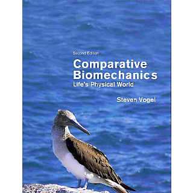
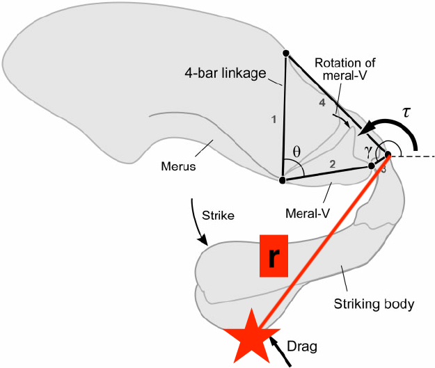
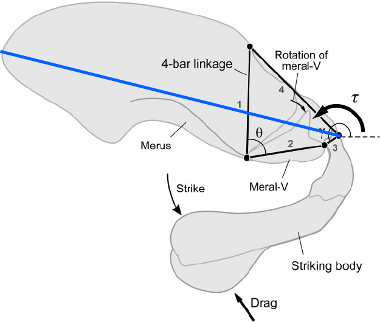
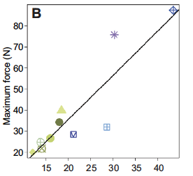

class: inverse, top
# Hello! 

```{r,echo=FALSE,message=FALSE}
library(tidyverse)
library(kableExtra)
```

<!-- Add icon library -->
<link rel="stylesheet" href="https://cdnjs.cloudflare.com/ajax/libs/font-awesome/5.14.0/css/all.min.css">


.pull-left[
Today we'll ....

- Learn what the course about

- See how the course organized

- Talk about the basic physical principles to review	

- Work through an illustrative example
]

.pull-right[

]
---
class: inverse, top
<!-- slide 1 -->
# Class details

.pull-left[


bcbiomech.github.io/class/

Tuesday & most Thursdays. 12:00-13:15 for in-person lectures

Some Thursdays (in-person, TBD) for launch of asynchronous lab activities (i.e, Mini-Projects) 
]

.pull-right[


kenaley@bc.edu

<!-- Add font awesome icons -->
<p style="text-align: left;">
    <a href="https://twitter.com/kenaley" class="fab fa-twitter">@kenaley</a>
</p>

kenaleylab.org

office hours in Higgins Higgins 425B/535 (by appointment)
]


---
class: 

# Meet and potatoes

```{r,echo=FALSE}
g <- rbind(c("","","Points"),
  c("AMEs","","5x10"),
c("Discussion Board ","","10x5"), 
c("Mini-Project Reports ","","5x50"),
c("Final Project Report","", "1x100"),
c("Final Project Presentation","","1x50"),
c("","total","500")
)

kbl(g)%>%row_spec(row = 1:nrow(g),background = "white")%>%kable_styling()
```

---

# Course text

.pull-left[

- Available from online sellers

- Excellent resource now and later

- Copy on reserve in O'Neil

]
.pull-right[



Vogel, S. 2013. Comparative Biomechanics: Life's Physical World. 2nd Ed.

]

---

# Course software

.pull-left[
```{r,echo=FALSE,out.width=100}
knitr::include_graphics("rlogo.png")
```


]
.pull-right[


IDE: Integrated Development Environment

]

**ANY COMMERCIAL SOFTWARE IS STRICTLY FORBIDDEN**


---
# Lectures

.pull-left[

- Discussion-based (I can only talk so much)
- Interrupt me!
- No exams, no quizzes, but AMEs
- Read assignments **before** class


]

.pull-right[

]
---
# Discussion

.pull-left[

- 1/week
- On slack 
- Question and answer
- Lab and lecture both

]

.pull-right[

]
---
class:  top
# Labs

.pull-left[

## Lab logistics

- Huddle and scatter model
- Meet to discuss/plan beforehand
- Scatter with team over 2-3 weeks to complete Mini-Project
- Check out material from Higgins 535

]

.pull-right[

## Mini-projects

- MP descriptions released before Thursday meetings
- 2-3 weeks to finish MP
- Reports due on Wednesdays
- Team-based, new team each MP
- Report written in R Markdown (AME1)


]

.center[

]


---
class:  top

## Analysis and Modeling Execises

- Posted online on Tuesdays
- 2-3 weeks to finish AME
- Self-Assessment (usually) due on following Tuesday
- Revisions (usually) due second Tuesday after release
- Individual submissions
- Written in R Markdown (AME1)


.center[

]


---
class:  top
# Final project

.pull-left[

### Overview

- Team-based (new team, too)
- Topic of your choice (build off of MPs)
- Same report guidelines as MPs (.Rmd, format, etc.)
- Additional presentation (10 min, at a PARTAY!!!!)

]

.pull-right[

### Timeline

- ~1 month to develop (start in April), execute
- Report due a few days before presentation (~May 10)
- Presentation submitted and given after report (~May 15)

]
.center[
<video width="300">
<source src="longjump_project.mp4" type="video/mp4">
</video>

]

---

# Starting up

.pull-left[
How comfortable are you with physics?

How comfortable are you with scripting?


]

.pull-right[

```{r, echo=FALSE,warning=FALSE,dev='svg'}
res <- read.csv("results.csv")
colnames(res) <- c("time","physics","scripting")
res%>%pivot_longer(cols=c("physics","scripting"),values_to = "resp")%>%
  ggplot()+geom_histogram(aes(x=resp),bins=5)+facet_wrap(name~.,ncol=1)+ggtitle("How comportable are you with . . . ")+theme_classic(20)+xlab("")

```

]


---

# What sort of physics will we use?

.pull-left[
- Nearly all classical, i.e., Newtonian
- linear and angular

.center[
```{r,echo=FALSE,out.width=300}
knitr::include_graphics("https://www.grc.nasa.gov/www/k-12/airplane/Images/torque.gif")
```
]

]

.pull-right[
$$F=MA$$ $$A=\frac{M}{F}$$
$$A = \alpha r$$ 


]


---
class: top
# What sort of physics will we use?

Really just a case of applying mathematical models
.pull-left[


```{r,echo=FALSE,out.width=250}

```

.body[
If $\alpha=6\cdot 10^6$ rad $\cdot s^{-2}$

and r=8 cm

and M=1 g

How much strike force does the appendage (dactylus) generate?

```{r,echo=FALSE,eval=FALSE}
F=6*10^6*0.08*0.001
print(F)

#of a bullet 4.4 x 10^5 m/s2
```

]


]


.pull-right[
$$F=MA$$ $$A=\frac{M}{F}$$
$$A = \alpha r$$ 


.center[
```{r,echo=FALSE,out.width=300}
knitr::include_graphics("https://encrypted-tbn0.gstatic.com/images?q=tbn:ANd9GcQgaAd07tXZhRC3b7BMpPzPsGIEsiM9jNrsMA&usqp=CAU")
```
]

]


--
- 480 N


---
class: top
# What sort of scripting will we use?

.pull-left[Is this a reasonable prediction? 480 N?! A typical bullet is ~500N

Let's first see how the $F_{max}$ changes with merus length (L), a standard measurement for the group. 

]

.pull-right[
```{r,echo=FALSE,out.width=200}

```
]

Establish a function of the linear form:

$$F(m)=a+Lb$$
with coefficients from Blanco and Patek (2014) where $a=-4.4$ and $L=2.1$. So the functions takes the form

```{r}
force <-function(x){-4.4+x*2.2}  
```

 .footnote[Blanco, M.M. and Patek, S.N., 2014. Muscle trade‐offs in a power‐amplified prey capture system. Evolution, 68(5), pp.1399-1414.]
 
---
class: top
# What sort of scripting will we use?

Now, establish a length range (8-40 cm) for merus length and predict force?

```{r}
L=seq(8,40,0.1)
merus.pred <- force(L)
```

Now let's plot to relationship.


```{r,dev='svg',fig.show="hold", out.width="30%",out.height="10%",fig.height=6,message=F,warning=F}
qplot(L,merus.pred)+theme_classic(30)+ylab("Force (N)")


```

.center[
Looks pretty good.
]

---
class: top

# What sort of scripting will we use?

Back to our question?

Is this way too much? Too little?

```{r,dev='svg',fig.show="hold", out.width="50%",out.height="20%",fig.height=6,warning=F}
qplot(L,merus.pred)+theme_classic(30)+ylab("Force (N)")+geom_point(aes(x=15,y=480),col="red")


```


---

class: center, middle

# Thanks!

Slides created via the R package [**xaringan**](https://github.com/yihui/xaringan).

