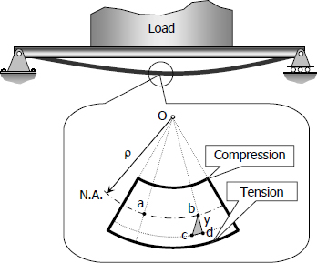
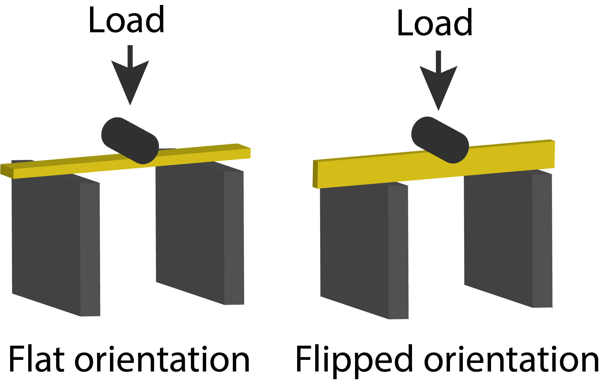
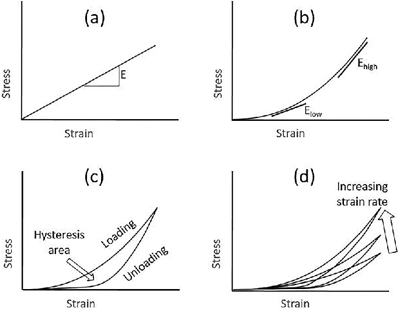
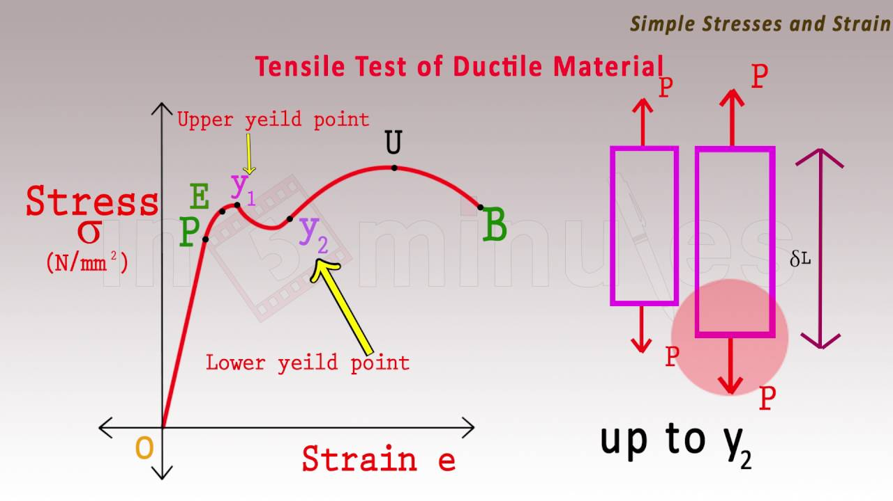
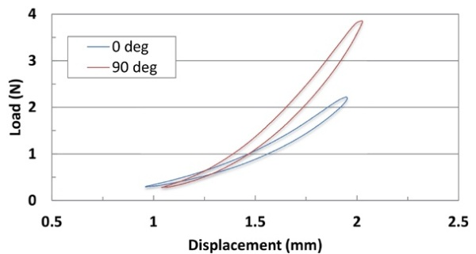

class: inverse, top
# Material Properies of the Dead, Toughness, and Resilience

```{r,echo=FALSE,message=FALSE}
library(tidyverse)
library(kableExtra)
```

<!-- Add icon library -->
<link rel="stylesheet" href="https://cdnjs.cloudflare.com/ajax/libs/font-awesome/5.14.0/css/all.min.css">


.pull-left[
Today we'll ....

- Learn simple methods to assess stiffnesses

- MP3 headstart


]





]


---
class: top

# Bending 

+ In bending, load is compressive and tensile at the same time. 
+ Need a new model, not simply stress vs. strain

.center[

]

---
class: top

# Bending 


How much a beem will deform under a stress is given by the flexural stiffness (*M*): 

$$ M=EI $$
 

+ $E$ is the Young's modulus 
+ $I$ is the second moment area, which is essentially the distribution of that stiffness (i.e., area) 

For a  beam under a symmetrical bending load, the deflection is given by:

$$d=\frac{Fl^3}{3EI}$$

.center[


]


---
class: top

# Bending 

We'll be bending wood (in lab--signup link coming!!)

+ How do changes in *I* effect *M*?

.center[




<br>
Two orientations of the wood stirrer.
<br>
 ]
 
 
---
class: top

# Bending 

We'll be bending wood, both wet and dry.

+ How does strain (deformation) rate effect *M*?

.center[




 ]
---
class: top

# Instestine: Simple tensile tests

We'll be stretching pig intestine.


+ What is the stiffness of the intestine in longitudinal and axial loading?


.center[




 ]
 
 
---
class: top

# Instestine: Simple tensile tests

We'll be stretching pig intestine (on your own).


+ Is this material anisostropic?


.center[




 ]


 
---

class: center, middle

# Thanks!

Slides created via the R package [**xaringan**](https://github.com/yihui/xaringan).

