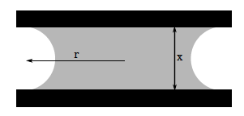

class: top
# Adhesion and Micro-motors

```{r,echo=FALSE,message=FALSE}
library(tidyverse)
library(kableExtra)
library(scales)
```

<!-- Add icon library -->
<link rel="stylesheet" href="https://cdnjs.cloudflare.com/ajax/libs/font-awesome/5.14.0/css/all.min.css">


.pull-left[

Today we'll consider ....

- Mechanical adhesion mechanisms

- Molecular adhesion mechanisms

- Multiple mechanisms in biological systems

]


.pull-right[


]


---
class: top

# Types of adhesion mechanisms
 

.pull-left[
- Claws and hooks
- Suction
- Stefan adhesion
- Capillary adhesion
- Molecular adhesion
- All of the above

```{r,echo=FALSE,out.width=300}
#stride length

```
]

.pull-right[

```{r,echo=FALSE,out.width=250}
#stride length


```


]


---
class: top

# Claws

.pull-left[
- Require rough surface/irregularities (a.k.a, asperities)

- Hook acts as a cantilever beam

```{r,echo=FALSE,out.width=250}
#stride length

knitr::include_graphics("https://www.civilclick.com/wp-content/uploads/2020/05/Cantilever-load-pic.jpg")

```
]

.pull.right[

```{r,echo=FALSE,out.width=300}
#stride length
knitr::include_graphics("img/tarsus.jpg")
knitr::include_graphics("https://www.icaboston.org/sites/default/files/styles/original_crop_height/public/2015-08aug-ica-first-fridays-63.jpg?itok=TZUkTMDx")

```
]

---
class: top

# Suction

.pull-left[
- Structures that generate seal separating regions of fluid
- Animal can change volume 

- $\rightarrow \textrm{huge } \Delta \textrm{ pressure}$

```{r,echo=FALSE,out.width=500}
#stride length


```
]

.pull.right[

$$F_1=P_{out}A_{out}-P_{in}A_{in}$$


```{r,echo=FALSE,out.width=350}
#stride length
knitr::include_graphics("https://www.jsme-fed.org/experiment-e/2015_10/images/002/fig.gif")

```

]

---
class: top

# Stefan adhesion

.pull-left[
- Fluid between two structures
- Stress of fluid shear resists expansion 
- Viscosity important 

$$F\sim\mu\frac{dx}{dt}$$

```{r,echo=FALSE,out.width=500}
#stride length


```
]

.pull.right[


For two discs of radius *R*

$$F=\mu\frac{3\pi R^4}{2h^3}\frac{dh}{dt}$$


```{r,echo=FALSE,out.width=300}
#stride length


```

]

---
class: top

# Capillary adhesion

.pull-left[
- Fluid between two structures
- Energy at fluid boundary resists displacement  

for discs of radius r

$$\Delta p=\gamma \Big(\frac{1}{r}-\frac{2}{x}\Big)$$
$\gamma  \textrm{ = surface tension (N/m)}$

```{r,echo=FALSE,out.width=600}




```
]

.pull.right[


```{r,echo=FALSE,out.width=300}


m <- c(
"Blood",
"Water",
"Water",
"Water",
"Water",
"Sucrose (55%) + water",
"Mercury")

t <- c(	22,	100,50,	25,0,20,	15)

g <- c(55.89,58.85,	67.91,71.97,75.64,76.45,487.00)

d <- data.frame(m,t,g)
colnames(d) <- c("fluid","$^o$C","$\\gamma$")

d%>%
  knitr::kable(caption = "Surface tenion of various fluids")%>%kableExtra::kable_styling()

```


]

---
class: top

# Molecular mechanisms

.pull-left[
- Glue
- van der Waal's forces 

for spheres of radius r and distance d

$$F_{vdW}=\frac{Hr}{6d^2}$$

*H* is Hamaker constant
```{r,echo=FALSE,out.width=600}


```
]

.pull.right[


```{r,echo=FALSE,out.width=300}


```


]

---
class: top

# Multiple Mechanisms
.pull-left[
- Suction
- Cantiliver

```{r,echo=FALSE,out.width=350}


```


]

.pull.right[

<br>
<br>
<br>


<iframe width="370" height="208" src="https://www.youtube.com/embed/hl20GmqhfE0" frameborder="0" allow="accelerometer; autoplay; clipboard-write; encrypted-media; gyroscope; picture-in-picture" allowfullscreen></iframe
]


      


---

class: center, middle

# Thanks!

Slides created via the R package [**xaringan**](https://github.com/yihui/xaringan).

