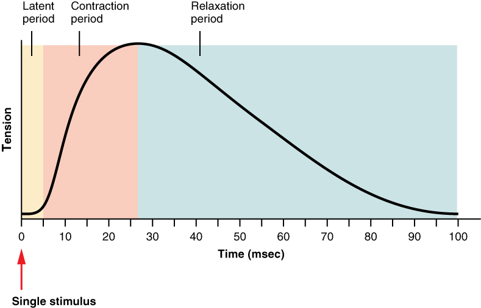
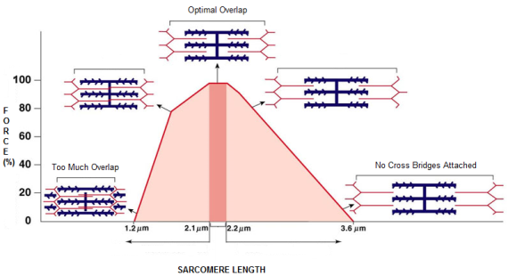
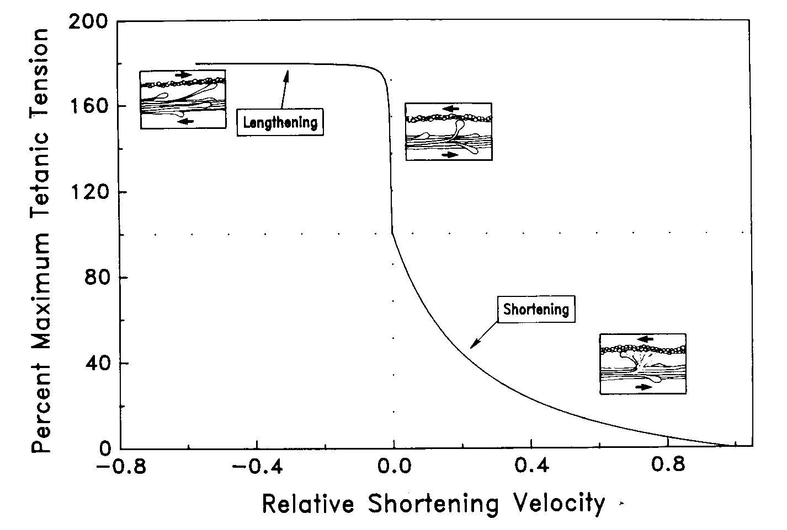

class: top
# Muscles

```{r,echo=FALSE,message=FALSE}
library(tidyverse)
library(kableExtra)
library(scales)
```

<!-- Add icon library -->
<link rel="stylesheet" href="https://cdnjs.cloudflare.com/ajax/libs/font-awesome/5.14.0/css/all.min.css">


.pull-left[
Today we'll consider ....

- How muscles produce force (i.e., tension)

- What predicts the amount of force (length, time, velocity)

- How muscles function

]


.pull-right[


]


---
class: top

# Muscles generate mechanical work and power. How?
 
.center[

```{r,echo=FALSE,out.width=550}
#stride length


```

]

---
class: top

# Muscles generate mechanical work and power. 

## How?
 
.center[

```{r,echo=FALSE,out.width=400}
#stride length
knitr::include_graphics("img/sarcomere.jpg")

```

]


---
class: top

# Muscles generate mechanical work and power. 

## How?
 
.center[

```{r,echo=FALSE,out.width=350}
#stride length
knitr::include_graphics("img/filamenttheory.png")

```

]

.footnote[ Sliding filament (crossbridge) theory. Gordon, Huxley & Julian (1966)]


---

class: top

# What determines amount of force produced by muscle?

.pull-left[
1. Time after activation

]


.pull-right[
```{r,echo=FALSE,out.width=450}
#stride length


```
]


---
class: top

# What determines amount of force produced by muscle?

.pull-left[
1. Time after activation
2. Muscle (sarcomere) length

<br>
<br>

```{r,echo=FALSE,out.width=550}
#stride length
knitr::include_graphics("img/filiments.jpg")

```
]

.pull-right[
<br>
<br>
<br>
<br>

```{r,echo=FALSE,out.width=550}
#stride length


```
]

---
class: top

# What determines amount of force produced by muscle?

.pull-left[
1. Time after activation
2. Muscle (sarcomere) length
3. Shortening velocity

<br>

```{r,echo=FALSE,out.width=550}
#stride length


```

    
]


---
class: top

# What determines amount of force produced by muscle?

.pull-left[
1. Time after activation
2. Muscle (sarcomere) length
3. Shortening velocity

<br>

```{r,echo=FALSE,out.width=550}
#stride length


```


]

.pull-right[

V=? to maximize power?


$$P=F\times V$$
    
<br>
<br>

```{r,echo=FALSE,out.width=550}
#stride length
knitr::include_graphics("https://d3i71xaburhd42.cloudfront.net/2b0ce8ae4ce7e28430b71ba8983e33c3bad9c196/3-Figure2-1.png")

```
]

---
class: top

# What determines amount of force produced by muscle?

.pull-left[
1. Time after activation
2. Muscle (sarcomere) length
3. Shortening velocity

<br>

```{r,echo=FALSE,out.width=550}
#stride length


```


]

.pull-right[

Formalize F-V relationship... the Hill equation:

$$\frac{T}{T_o}=T^\prime=\frac{1-\frac{v}{v_{max}}}{1+c\frac{v}{v_{max}}}=\frac{1-v^\prime}{1+cv^\prime}$$
    

```{r,echo=FALSE,out.width=550}
#stride length
knitr::include_graphics("https://d3i71xaburhd42.cloudfront.net/2b0ce8ae4ce7e28430b71ba8983e33c3bad9c196/3-Figure2-1.png")

```
.footnote[
$c\approx 1.2-4$
]


]


---
class: top

# Metrics of muscle function

## Generate mechanical work and power

.pull-left[
- Work = $F\cdot\Delta L$ (Joules)
- Power = Work/time (Joles/s = Watts)
- Power = Work x Frequency (Joules/s = Watts)
- Power = F x V (Joules/s = Watts)

<br>


]

.pull-right[
    
<br>
```{r,echo=FALSE,out.width=250}
#stride length
knitr::include_graphics("img/musclework.png")

```
.footnote[

]


]

---
class: top

# Metrics of muscle function

## The work loop technique

.pull-left[
- Work = $F\cdot\Delta L$ (Joules)
- Power = Work/time (Joles/s = Watts)
- Power = Work x Frequency (Joules/s = Watts)
- Power = F x V (Joules/s = Watts)

.center[
```{r,echo=FALSE,out.width=60}
#stride length

knitr::include_graphics("img/muscletest.png")

```
]

]

.pull-right[
    
<br>
```{r,echo=FALSE,out.width=200}
#stride length
knitr::include_graphics("img/workloop.png")

```
.footnote[

]

 
]

---
class: top

# Metrics of muscle function


.center[

```{r,echo=FALSE,out.width=600}
#stride length

knitr::include_graphics("img/motorbreakstrut.png")

```
]


     
---

class: center, middle

# Thanks!

Slides created via the R package [**xaringan**](https://github.com/yihui/xaringan).

