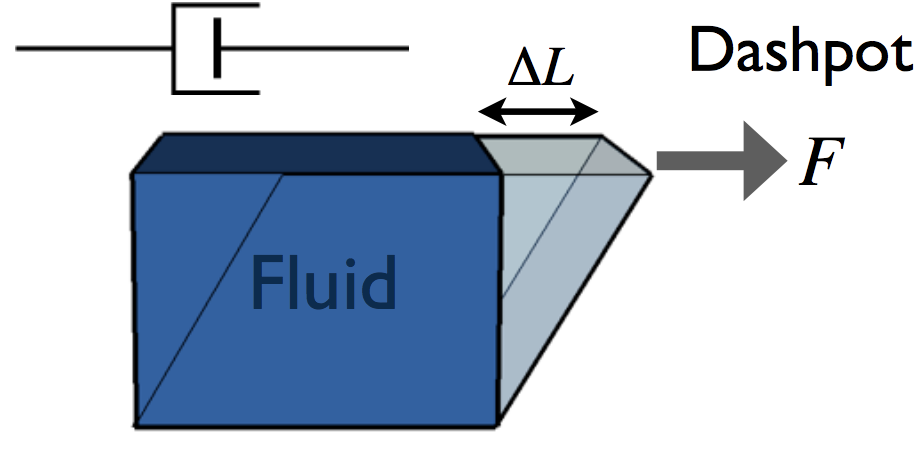
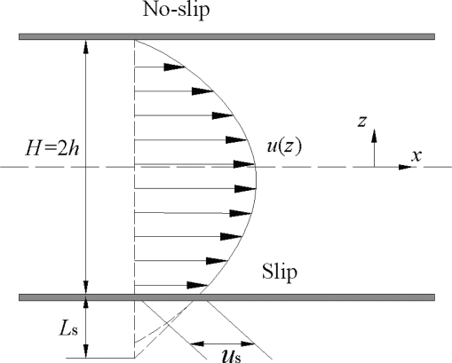

class: top
# Fluids

```{r,echo=FALSE,message=FALSE,warning=F}
library(tidyverse)
library(kableExtra)
library(scales)
```

<!-- Add icon library -->
<link rel="stylesheet" href="https://cdnjs.cloudflare.com/ajax/libs/font-awesome/5.14.0/css/all.min.css">


.pull-left[
Today we'll ....

- Define fluids

- Define the conditions under which we can predict flows

- Viscosity in the real (biological) world

]


.pull-right[


]

---
class: top

# Where We've Been, Where We're Going
 
Solid and structural mechanics: stress and strain distributions, movements of bodies, their parts in response to muscle forces and gravity.

Now on to . . . 

Fluid dynamics and mechanics. These govern . . . 

- Internal flows (blood and respiratory flow)
- External flows (swimming and  flying)
- Dispersal (particles, seeds, aerosols)
- Transport of nutrients to and from biological surfaces (CO2, H2O, O2, etc).

Lastly . . . 

  - A check in . . . How are you doing?

---
class: top

# Fluid Properties

The **continuum hypothesis** explains so much.

Roughly put, fluids can be treated as continuous, even though, on a microscopic scale, they are composed of molecules. So at our scales:

  - density
  - temperature
  - momentum
  - energy 
  
all vary **continuously** and these state variations are responsible for flow. 


---
class: top

# Defining a Fluid

A fluid (gas or liquid) deforms continuously under an applied stress

 
.center[
```{r,echo=FALSE,out.width=400}
#stride length


```

$F\sim \Delta L/\Delta t$

$\sigma\sim d\varepsilon/dt$

$\sigma \sim d\mu \varepsilon/dt$

$\mu=\textrm{viscosity}$

Newton's third law
]

---
class: top

# Defining How a Fluid Flows: Two Conditions

.pull-left[

$$\tau=\mu \frac{du}{dy}=v\frac{d(\rho u)}{dy}$$


```{r,echo=FALSE,out.width=400}
#stride length
knitr::include_graphics("img/shearvelocity.png")

```
 ]
 
.pull-right[

No-slip condition (fluids adhere to surfaces) 

```{r,echo=FALSE,out.width=400}
#stride length


```
}    
]


---

class: top

# What Determines Viscosity?

.pull-left[
- Temperature

- Concentration of dissolved (solutes) or suspended entities

- **Shear rate**

]


.pull-right[
```{r,echo=FALSE,out.width=300}
#stride length
knitr::include_graphics("https://www.cradle-cfd.com/dcms_media/image/en_columnsic02_a0317.png")

```
]

.center[
```{r,echo=FALSE,out.width=650}
#stride length
knitr::include_graphics("https://www.pumpfundamentals.com/images/visc_vs_strain.jpg")

```
]


---

class: top

# non-Newtonian Fluids

.pull-left[

```{r,echo=FALSE,out.width=400}
#stride length
knitr::include_graphics("https://www.researchgate.net/profile/Helmut-Baumert/publication/290789681/figure/fig1/AS:318865641885696@1453034901545/The-effective-kinematic-viscosity-in-shear-thickening-green-shear-thinning-red-and.png")

```


.foonote[ $\mu=\frac{\tau}{\frac{du}{dy}}$ or

slope of $\tau$ vs $\frac{du}{dy}$
]

]


.pull-right[

```{r,echo=FALSE,out.width=400}
#stride length
knitr::include_graphics("https://www.researchgate.net/profile/Claude-Vigneron-2/publication/13358433/figure/fig2/AS:771539007971333@1560960642865/Plot-of-whole-blood-viscosity-mPa-s-vs-shear-rate-s-1-determined-in-rabbit-blood.pbm
")

```

.foonote[gradient of velocity change changes (shear rate) with shear stress 

$$S=\frac{du}{dy}$$
Functional significance?

]

]

---

class: top

# What Determines Viscosity?


- **Temperature**

- Concentration of dissolved (solutes) or suspended entities

- Shear rate

.center[

```{r,echo=FALSE,out.width=400}
#stride length
knitr::include_graphics("https://www.heatxperts.com/img/cms/1-viscosity-and-temperature.jpg")

```


]

---

class: top

# What Determines Viscosity?


- **Temperature**

- Concentration of dissolved (solutes) or suspended entities

- Shear rate

.center[

```{r,echo=FALSE,out.width=400}
#stride length
knitr::include_graphics("https://www.engineeringtoolbox.com/docs/documents/596/Water_viscosity_C.jpg")

```


]


---
class: top

# What Determines Viscosity?


- Temperature

- **Concentration of dissolved (solutes) or suspended entities**

- Shear rate

.center[

```{r,echo=FALSE,out.width=700}
#stride length


```


]

---
class: top

# A coevolutionary process: Why do plants produce dilute nectars?


.center[

```{r,echo=FALSE,out.width=700}
#stride length


```

.footnote[Tom Daniel, UW]

]


---
class: top

# A coevolutionary process: Why do plants produce dilute nectars?


.center[

```{r,echo=FALSE,out.width=700}
#stride length
knitr::include_graphics("https://www.researchgate.net/profile/Harald-Krenn/publication/49642863/figure/fig2/AS:268826830962692@1441104719219/A-Head-of-Eurybia-lycisca-SEM-with-coiled-proboscis-B-Proboscis-tip-with-four.png")

```


]


---
class: top

# A coevolutionary process: Why do plants produce dilute nectars?


.center[


```{r,echo=FALSE,out.width=700}
#stride length


```

]


---

class: center, middle

# Thanks!

Slides created via the R package [**xaringan**](https://github.com/yihui/xaringan).

