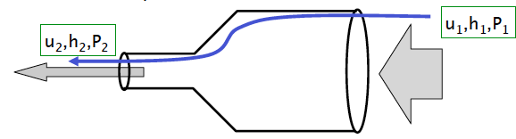

class: top
# Fluids

```{r,echo=FALSE,message=FALSE,warning=FALSE}
library(tidyverse)
library(kableExtra)
library(scales)
```

<!-- Add icon library -->
<link rel="stylesheet" href="https://cdnjs.cloudflare.com/ajax/libs/font-awesome/5.14.0/css/all.min.css">


.pull-left[
Today we'll ....

- Consider Mass

- Consider Energy

- MP3 questions

]


.pull-right[

```{r,echo=FALSE}
knitr::include_graphics("https://www.neuromon.eu/images/vasculardiameter.jpg")
```

]


---
class: top

# Two Important Conditions

.pull-left[

$$\tau=\mu \frac{du}{dy}=v\frac{d(\rho u)}{dy}$$


```{r,echo=FALSE,out.width=400}


```
 ]
 
.pull-right[

No-slip condition (fluids adhere to surfaces) 

```{r,echo=FALSE,out.width=400}
#stride length
knitr::include_graphics("img/noslip.png")

```
  
]

---
class: top

#  Two More Important Conditions . . . Laws Really

.pull-left[
- Conservation of mass, a.k.a., the Principle of Continuity

- Conservation of energy, a.k.a., Bernoulli's Principle     
]
 
.pull-right[


```{r,echo=FALSE,out.width=400}
#stride length


```
    
]
---

class: top

# Conservation of Mass: Principle of Continuity

.pull-left[

Rate of mass flow in must equal rate of mass flow out (water is incompressible)

$\frac{v_{out}}{t}=\frac{v_{in}}{t}$

 $u_{out}A_{out}=u_{in}A_{in}$


```{r,echo=FALSE,out.width=300}
#stride length


```

]


.pull-right[


```{r,echo=FALSE,out.width=500}
#stride length


```
]

---

class: top

# Conservation of Mass: Principle of Continuity

.pull-left[
Rate of mass flow in must equal rate of mass flow out (water is incompressible)

$\frac{v_{out}}{t}=\frac{v_{in}}{t}$

$u_{out}A_{out}=u_{in}A_{in}$
 
$\Sigma u_{in}A_{in}=\Sigma u_{out}A_{out}$


]


.center[

```{r,echo=FALSE,out.width=650}
#stride length


```
]

---

class: top

# Conservation of Mass: Principle of Continuity

.pull-left[
Rate of mass flow in must equal rate of mass flow out (water is incompressible)

$\frac{v_{out}}{t}=\frac{v_{in}}{t}$

$u_{out}A_{out}=u_{in}A_{in}$
 
$\Sigma u_{in}A_{in}=\Sigma u_{out}A_{out}$


]


.pull-right[

```{r,echo=FALSE,out.width=450}
#stride length
knitr::include_graphics("img/bloodvel.jpg")

```
]

 
---

class: top

# Conservation of Energy: Bernoulli

.pull-left[

What is the relationship between fluid motion and pressure?

- Flow is steady

- Fluid is incompressible

- Fluid is inviscid . . .

$\mu=0$


]


.center[

```{r,echo=FALSE,out.width=650}
#stride length


```
]

---

class: top

# Conservation of Energy: Bernoulli

.pull-left[

What is the relationship between fluid motion and pressure?

- Potential energy (PE=mgh)

- Kinetic energy ....
$KE =mu^2/2$

- Mechanical work (W=Fd=PAd)

- Along a streamline PE + KE + W = constant


]


.pull-right[

 $(P_2-P_1)/\rho+(u_2^2-u_1^2)/2=0$
 
```{r,echo=FALSE,out.width=650}
#stride length


```
]

---

class: top

# Conservation of Energy: Bernoulli

.pull-left[

What is the relationship between fluid motion and pressure?

- Potential energy (PE=mgh)

- Kinetic energy ....
$KE =mu^2/2$

- Mechanical work (W=Fd=PAd)

- Along a streamline PE + KE + W = constant


]


.pull-right[

Written another way
 
```{r,echo=FALSE,out.width=650}
#stride length
knitr::include_graphics("http://hyperphysics.phy-astr.gsu.edu/hbase/imgmec/bernoul.gif")

```
]


---

class: top

# Conservation of Mass and Energy

Putting it all together

Predict the pressure of blood along the length of the vascular system


---

class: top

# Conservation of Mass and Energy

Putting it all together


.center[

 
```{r,echo=FALSE,out.width=500}
knitr::include_graphics("https://www.neuromon.eu/images/vasculardiameter.jpg")

```
]
   
---

class: center, middle

# Thanks!

Slides created via the R package [**xaringan**](https://github.com/yihui/xaringan).

