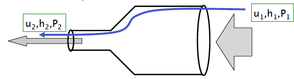
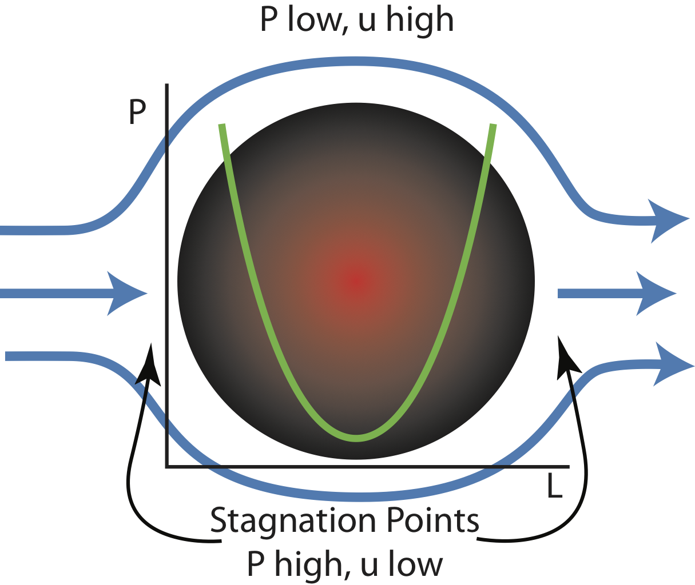
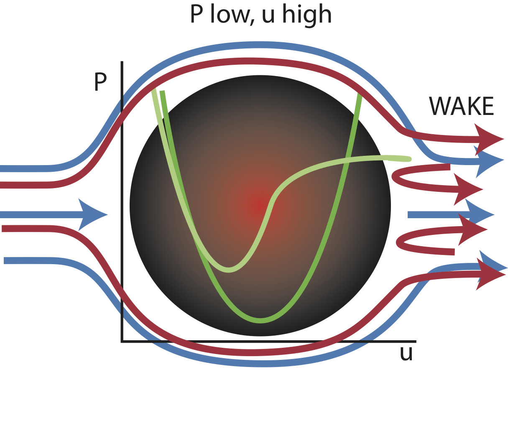
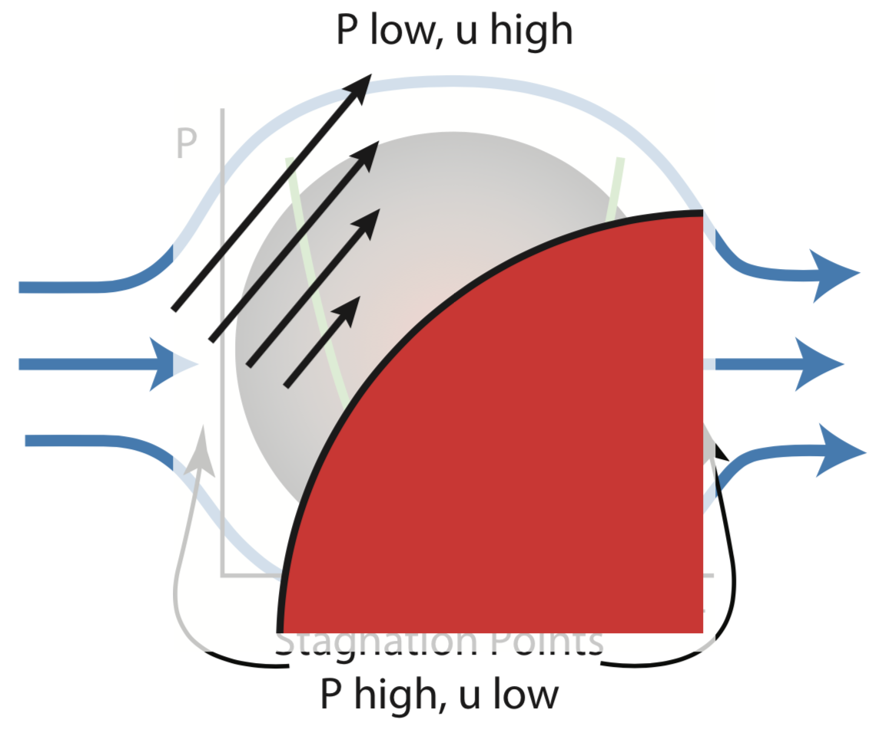
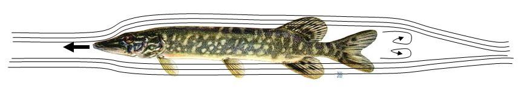
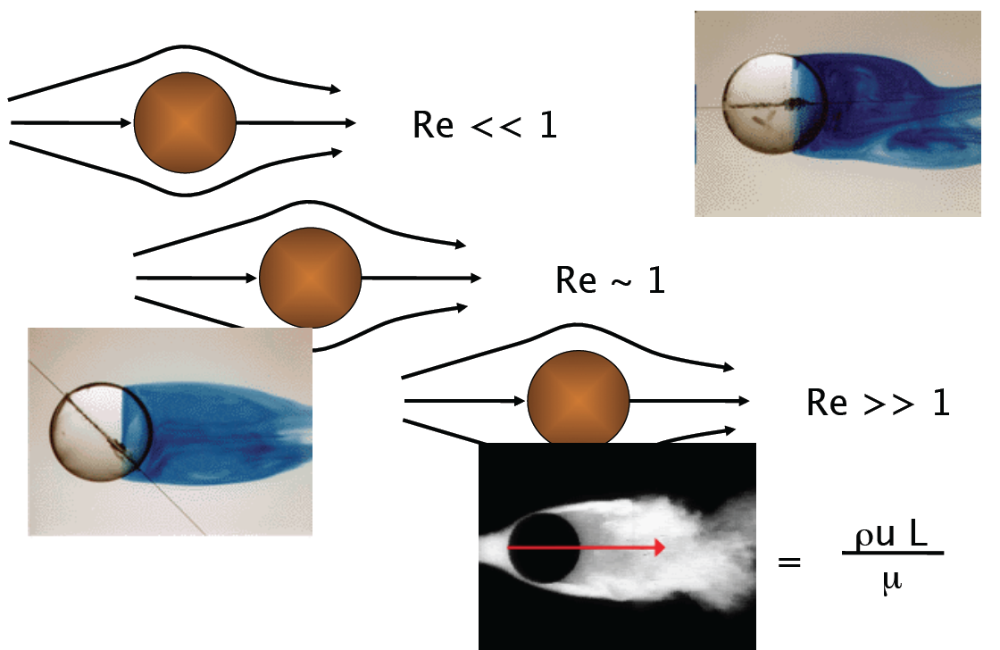

class: top
# Re: Drag

```{r,echo=FALSE,message=FALSE}
library(tidyverse)
library(kableExtra)
library(scales)
```

<!-- Add icon library -->
<link rel="stylesheet" href="https://cdnjs.cloudflare.com/ajax/libs/font-awesome/5.14.0/css/all.min.css">


.pull-left[
Today we'll ....

- A paradox explained by viscosity

- One drag, now two

- Silly example

]


.pull-right[

```{r,echo=FALSE,out.width=200}
knitr::include_graphics("https://dynaimage.cdn.cnn.com/cnn/c_fill,g_auto,w_1200,h_675,ar_16:9/https%3A%2F%2Fcdn.cnn.com%2Fcnnnext%2Fdam%2Fassets%2F200731130539-human-sperm-stock.jpg")

```

```{r,echo=FALSE,out.width=350}
knitr::include_graphics("https://www.active.com/Assets/Triathlon/460x345/Swim+Efficiency.jpg")

```


]


---

class: top

# Conservation of Energy: Bernoulli

.pull-left[

What is the relationship between fluid motion and pressure?

- Potential energy (PE=mgh)

- Kinetic energy ....
$KE =mu^2/2$

- Mechanical work (W=Fd=PAd)

- Along a streamline PE + KE + W = constant


]


.pull-right[

 $(P_2-P_1)/\rho+(u_2^2-u_1^2)/2=0$
 
```{r,echo=FALSE,out.width=650}
#stride length


```
]


---

class: top

# D'Alembert's Paradox

.pull-left[

What is the relationship between fluid motion and pressure?


Along a streamline PE + KE + W = constant

- steady
- incompressible
- inviscid*

]


.pull-right[

 $(P_2-P_1)/\rho+(u_2^2-u_1^2)/2=0$
 
```{r,echo=FALSE,out.width=650}
#stride length


```

No net force?
]


---

class: top

# D'Alembert's Paradox

.pull-left[

What is the relationship between fluid motion and pressure?

Along a streamline PE + KE + W = constant

- steady
- incompressible
- inviscid*


]


.pull-right[

 $(P_2-P_1)/\rho+(u_2^2-u_1^2)/2=0$
 
```{r,echo=FALSE,out.width=650}
#stride length


```

No net force? Not when $\mu\neq0$
]

---

class: top

# D'Alembert's Paradox

.pull-left[

What is the relationship between fluid motion and pressure?

Along a streamline PE + KE + W = constant

- steady
- incompressible
- inviscid*

Viscosity robs fluid of its momentum. There is a shear stress exerted on the sphere and energy is dissipated by viscosity 

]


.pull-right[

 $(P_2-P_1)/\rho+(u_2^2-u_1^2)/2=0$
 
```{r,echo=FALSE,out.width=650}
#stride length


```

No net force? Not when $\mu\neq0$
]


---

class: top

# D'Alembert's Paradox

.pull-left[

What is the relationship between fluid motion and pressure?

Along a streamline PE + KE + W = constant

- steady
- incompressible
- inviscid*

Becomes even more apparent when we consider a shape the results in lots of flow changing velocities quickly (i.e., shape matters!).


]


.pull-right[

 $(P_2-P_1)/\rho+(u_2^2-u_1^2)/2=0$
 
```{r,echo=FALSE,out.width=650}
#stride length
knitr::include_graphics("https://upload.wikimedia.org/wikipedia/commons/thumb/2/23/Form_drag.svg/1200px-Form_drag.svg.png")

```

No net force? Not when $\mu\neq0$
]


---

class: top

# D'Alembert's Paradox

.pull-left[

What is the relationship between fluid motion and pressure?

Along a streamline PE + KE + W = constant

- steady
- incompressible
- inviscid*

What happens when $P_a<P_p$?

]


.pull-right[

 $(P_2-P_1)/\rho+(u_2^2-u_1^2)/2=0$
 
```{r,echo=FALSE,out.width=650}
#stride length
knitr::include_graphics("https://upload.wikimedia.org/wikipedia/commons/thumb/2/23/Form_drag.svg/1200px-Form_drag.svg.png")

```


]


---

class: top

# Consequences of D'Alembert's Paradox

.pull-left[

Flow separation

 
```{r,echo=FALSE,out.width=350}
#stride length
knitr::include_graphics("https://i.pinimg.com/originals/47/e9/e9/47e9e968ed6cede17a46faff1cdc1f3b.jpg")

```

Where we would always have "skin" drag, with $\mu\neq 0$, we now have "pressure" drag.


]


.pull-right[

<br>
<br>
<br>
```{r,echo=FALSE,out.width=500}
#stride length


```

```{r,echo=FALSE,out.width=650}
#stride length


```

]

---

class: top

# Consequences of D'Alembert's Paradox

.pull-left[

Viscosity robs fluid of its momentum. There is a shear stress exerted on the sphere and energy is dissipated by viscosity.

Because of viscosity, velocity cannot increase as
much as in the inviscid case. 

New stagnation point where the flow separates

**Reynolds number:** Ratio of inertial forces to viscous forces within a fluid which is subjected to relative internal movement due to different fluid velocities.


]


.pull-right[

How much does it seprate?

$$\small{\frac{\text{Pressure stress}}{\text{Shear stress}} \rightarrow \frac{P}{\tau} \rightarrow \frac{\rho u^2}{\mu u/L} \rightarrow Re= \frac{\rho uL}{\mu}}$$

 
```{r,echo=FALSE,out.width=650}
#stride length


```


]


---

class: top

# Re across size and velocity scales


.pull-left[

.footnote[
$10^{-5}$ ~ Bacteria

$10^{-4}$ ~ Spermatozoa

$10^{-1}$ ~ Ciliate 

1~Smallest Fish

$10^2$ ~ Blood flow in brain

$10^3$ ~ Blood flow in aorta 

$10^4$ ~ Birds flying 1  

$2  \textrm{x} 10^5$ ~ Typical pitch in Major League Baseball

$4 \textrm{x} 10^6$ ~ Human Swimming

$10^6$ ~ Fastest Fish

$3 \textrm{x} 10^8$ ~Blue Whale

$5 \textrm{x} 10^9$ ~A large ship (RMS Queen Elizabeth 2) 

]
]

.pull-right[

$$\small{\frac{\text{Pressure stress}}{\text{Shear stress}} = Re= \frac{\rho uL}{\mu}}$$
.center[
```{r,echo=FALSE,out.width=175}
knitr::include_graphics("https://www.researchgate.net/profile/David-Kimmel-2/publication/230049116/figure/fig9/AS:668284278038541@1536342796949/Size-and-Reynolds-number-of-multiple-trophic-levels-The-viscous-world-Reynolds-number.png")

```
]
]

---

class: top

# Re across size and velocity scales


.pull-left[

The Re measures the relative importance of inertial vs viscous stresses in determining the flow. Conservation of Re implies identical flow patterns

.footnote[

$10^{-4}$ ~ Spermatozoa

$4 \textrm{x} 10^6$ ~ Human Swimming

```{r,echo=FALSE,out.width=150}
knitr::include_graphics("https://dynaimage.cdn.cnn.com/cnn/c_fill,g_auto,w_1200,h_675,ar_16:9/https%3A%2F%2Fcdn.cnn.com%2Fcnnnext%2Fdam%2Fassets%2F200731130539-human-sperm-stock.jpg")

```

]

What would it feel like to swim like a sperm?

How would you induce flow conditions to experience this?
]

.pull-right[

$$\small{\frac{\text{Pressure stress}}{\text{Shear stress}} = Re= \frac{\rho uL}{\mu}}$$
.center[
```{r,echo=FALSE,out.width=300}


```

```{r,echo=FALSE,out.width=200}
knitr::include_graphics("https://www.active.com/Assets/Triathlon/460x345/Swim+Efficiency.jpg")

```

]
]
---

class: center, middle

# Thanks!

Slides created via the R package [**xaringan**](https://github.com/yihui/xaringan).

