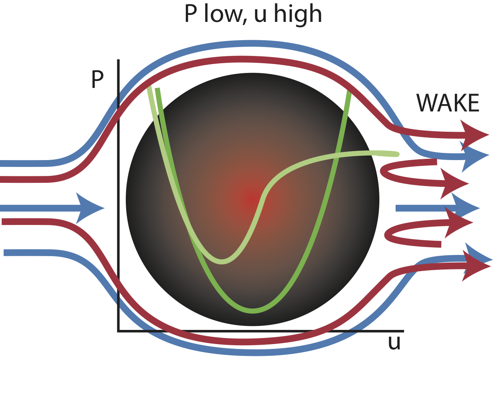
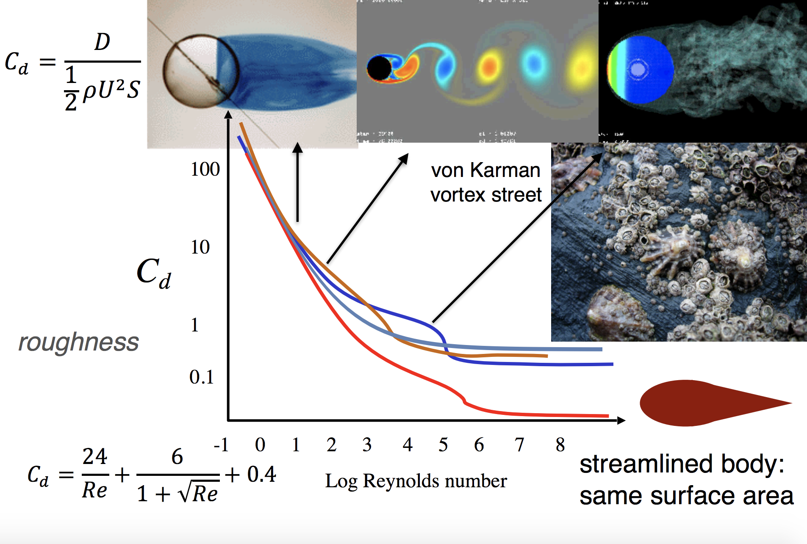

class: top
# Re: Shape

```{r,echo=FALSE,message=FALSE,warning=F}
library(tidyverse)
library(kableExtra)
library(scales)
```

<!-- Add icon library -->
<link rel="stylesheet" href="https://cdnjs.cloudflare.com/ajax/libs/font-awesome/5.14.0/css/all.min.css">


.pull-left[
Today we'll ....

- Review Re

- Consider Shape, drag, and Re

- Sharks, wings, and a crisis


]


.pull-right[

```{r,echo=FALSE,out.width=250}
knitr::include_graphics("https://www.researchgate.net/profile/Marion-Segall/publication/333103343/figure/fig1/AS:758691913547777@1557897656864/Pressure-drag-behind-a-sphere-and-comparison-with-a-streamlined-shape-For-a-streamlined.png")

```

```{r,echo=FALSE,out.width=250}
knitr::include_graphics("https://upload.wikimedia.org/wikipedia/commons/thumb/f/fa/Denticules_cutan%C3%A9s_du_requin_citron_Negaprion_brevirostris_vus_au_microscope_%C3%A9lectronique_%C3%A0_balayage.jpg/1024px-Denticules_cutan%C3%A9s_du_requin_citron_Negaprion_brevirostris_vus_au_microscope_%C3%A9lectronique_%C3%A0_balayage.jpg")

```


]


---

class: top

# Viscocity and Drag

.pull-left[

What is the relationship between fluid motion and pressure?

Along a streamline PE + KE + W + **E dissipated** = constant

Viscosity robs fluid of its momentum. There is a shear stress exerted on the sphere and energy is dissipated by viscosity. 

Because of viscosity, velocity cannot increase as much as in the inviscid case. 

]


.pull-right[

 $(P_2-P_1)/\rho+(u_2^2-u_1^2)/2=0$
 
 $\small{\frac{\text{Pressure stress}}{\text{Shear stress}} = Re= \frac{\rho uL}{\mu}}$
 
```{r,echo=FALSE,out.width=650}
#stride length


```

Net forces when $\mu\neq0$
]

---

class: top

# Viscocity and Drag


.center[

 $(P_2-P_1)/\rho+(u_2^2-u_1^2)/2=0$
 
 Because of viscosity, velocity cannot increase as much as in the inviscid case. 
 
 Therefore, we have flow separation.

 
```{r,echo=FALSE,out.width=550}
#stride length
knitr::include_graphics("https://www.tec-science.com/wp-content/uploads/2021/04/en-gases-liquids-fluid-mechanics-boundary-layer-flow-separation-cylinder-turbulent.jpg")

```
]

---

class: top

# Drag Forces: Friction and Pressure Stresses

.pull-left[

Drag forces arise from pressure and frictional (skin) stresses

$D\sim\rho u^2/2$

$D=C_d\rho S u^2/2$

$C_d$= drag coefficient

$S$= cross sectional (frontal) area

$C_d=\frac{D}{\frac{1}{2}\rho u^2S}$

$C_d$ a function of shape and Re


]


.pull-right[
<br>
<br>
<br>
 
```{r,echo=FALSE,out.width=650}
#stride length
knitr::include_graphics("https://ars.els-cdn.com/content/image/3-s2.0-B9780123973085000155-f15-11-9780123973085.jpg")

```

]

---

class: top

# Shape and drag


.center[

 
```{r,echo=FALSE,out.width=350}
#stride length
knitr::include_graphics("https://upload.wikimedia.org/wikipedia/commons/thumb/c/c3/Drag.svg/1200px-Drag.svg.png")

```


]
.footnote[Must specify Re!]

---

class: top

# Shape and drag


.center[

 
```{r,echo=FALSE,out.width=650}
#stride length


```


]
.pull-left[.footnote[Must specify Re!]]
.pull-right[.footnote[T. Daniel, UW]]


---

class: top

# Shape and drag


.pull-left[

Fineness: manage your wake
 
fineness ratio=L\D

```{r,echo=FALSE,out.width=250}
#stride length


```


]

.pull-right[

```{r,echo=FALSE,out.width=350}
#stride length
knitr::include_graphics("https://i.ytimg.com/vi/JRfb2-tyRyg/maxresdefault.jpg")

```

```{r,echo=FALSE,out.width=350}
#stride length
knitr::include_graphics("https://silodrome.com/wp-content/uploads/2011/05/autowp.ru_mg_ex181_1.jpg")

```


]

---

class: top

# Shape and drag


.pull-left[

Fineness: manage your wake
 
fineness ratio=L\D

```{r,echo=FALSE,out.width=250}
#stride length


```


Where would you find these fishes? What behaviors would the exhibit? Trade offs?
]

.pull-right[


<br>

```{r,echo=FALSE,out.width=350}
#stride length
knitr::include_graphics("https://www.researchgate.net/profile/Christopher-Fulton/publication/258350558/figure/fig1/AS:297544254017547@1447951486996/Body-shape-variation-of-fishes-sampled-in-this-study-The-examples-show-the-range-of.png")

```

```{r,echo=FALSE,out.width=300}
#stride length
knitr::include_graphics("https://isopolar.com/wp-content/uploads/Post_3.jpg")

```


]


---

class: top

# Shape and drag


.pull-left[

Drag isn't always bad!
 
Drag can be a propulsive forces!

```{r,echo=FALSE,out.width=300}
#stride length
knitr::include_graphics("https://greenpestservices.net/wp-content/uploads/2015/06/backswimmers.jpg")
```
]

.pull-right[


```{r,echo=FALSE,out.width=350}
#stride length
knitr::include_graphics("https://encrypted-tbn0.gstatic.com/images?q=tbn:ANd9GcTInHiPn3FeTowXqhCWKzs9vGlwg4h8qAlr09pzcS9F2Xrt_9zsr7Hswk82NB55gRdor6M&usqp=CAU")

```

```{r,echo=FALSE,out.width=400}
#stride length
knitr::include_graphics("https://www.britishrowing.org/wp-content/uploads/2020/07/Windsor-boys-sculler-1600x900-1.jpg")

```


]


          
---

class: top

# Sharks, wind, and a crisis


.center[

The drag crisis

$\small{\frac{\text{Pressure stress}}{\text{Shear stress}} = Re= \frac{\rho uL}{\mu}}$


]


---

class: top

# Sharks, wind, and a crisis


.center[

Skin (friction) drag in the boundary layer under laminar flow (low Re)


]


---

class: top

# Sharks, wind, and a crisis
.center[

Skin (friction) drag in the boundary layer under laminar flow (low Re)

<iframe width="555" height="312" src="https://www.tec-science.com/wp-content/uploads/2020/06/en-gases-liquids-fluid-mechanics-boundary-layer-flow-separation-cylinder.mp4" frameborder="0" allow="accelerometer; autoplay; clipboard-write; encrypted-media; gyroscope; picture-in-picture" allowfullscreen></iframe
]


---

class: top

# Sharks, wind, and a crisis


.center[But what if we disrupt the boundary layer, introducing turbulence?


]

---

class: top

# Sharks, wind, and a crisis


.center[But what if we disrupt the boundary layer, introducing turbulence?

Put, where have you seen this? 


]

---

class: top

# Sharks, wind, and a crisis


.center[But what if we disrupt the boundary layer, introducing turbulence?

Put, where have you seen this? 


]


# Sharks, wind, and a crisis


.center[But what if we disrupt the boundary layer, introducing turbulence?

Put, where have you seen this? 


<iframe width="555" height="312" src="https://www.tec-science.com/wp-content/uploads/2020/06/en-gases-liquids-fluid-mechanics-boundary-layer-flow-separation-cylinder-golf-ball-dimples.mp4" frameborder="0" allow="accelerometer; autoplay; clipboard-write; encrypted-media; gyroscope; picture-in-picture" allowfullscreen></iframe


]
---

class: top

# Sharks, wind, and a crisis


.center[But what if we disrupt the boundary layer, introducing turbulence?

<iframe width="555" height="312" src="https://www.tec-science.com/wp-content/uploads/2020/06/en-gases-liquids-fluid-mechanics-boundary-layer-flow-separation-cylinder-golf-ball-dimples.mp4" frameborder="0" allow="accelerometer; autoplay; clipboard-write; encrypted-media; gyroscope; picture-in-picture" allowfullscreen></iframe
]


---

class: top

# Sharks, wind, and a crisis


.center[But what if we disrupt the boundary layer, introducing turbulence?


]

---

class: top

# Sharks, wind, and a crisis


.center[But what if we disrupt the boundary layer, introducing turbulence?

```{r,echo=FALSE,out.width=350}
#stride length
knitr::include_graphics("https://i.natgeofe.com/n/beb716b4-6755-4421-9bad-1c027238c2ec/01-shark-skin-turbine.jpg")

```

```{r,echo=FALSE,out.width=400}
#stride length
knitr::include_graphics("https://upload.wikimedia.org/wikipedia/commons/thumb/e/e7/Drag_coefficient_on_a_sphere_vs._Reynolds_number_-_main_trends.svg/1200px-Drag_coefficient_on_a_sphere_vs._Reynolds_number_-_main_trends.svg.png")

```


]

---

class: top

# Sharks, wind, and a crisis


.center[But what if we disrupt the boundary layer, introducing turbulence?

```{r,echo=FALSE,out.width=350}
#stride length
knitr::include_graphics("https://i.natgeofe.com/n/beb716b4-6755-4421-9bad-1c027238c2ec/01-shark-skin-turbine.jpg")

```

```{r,echo=FALSE,out.width=400}
#stride length
knitr::include_graphics("https://www.tec-science.com/wp-content/uploads/2021/04/en-boundary-layer-flow-separation-wing-airplane-airfoil-turbulators-vortex-generators.jpg")

```


]


---

class: center, middle

# Thanks!

Slides created via the R package [**xaringan**](https://github.com/yihui/xaringan).

