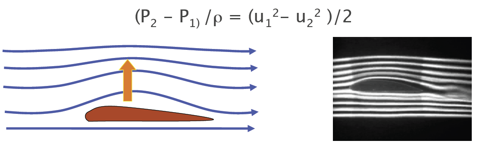
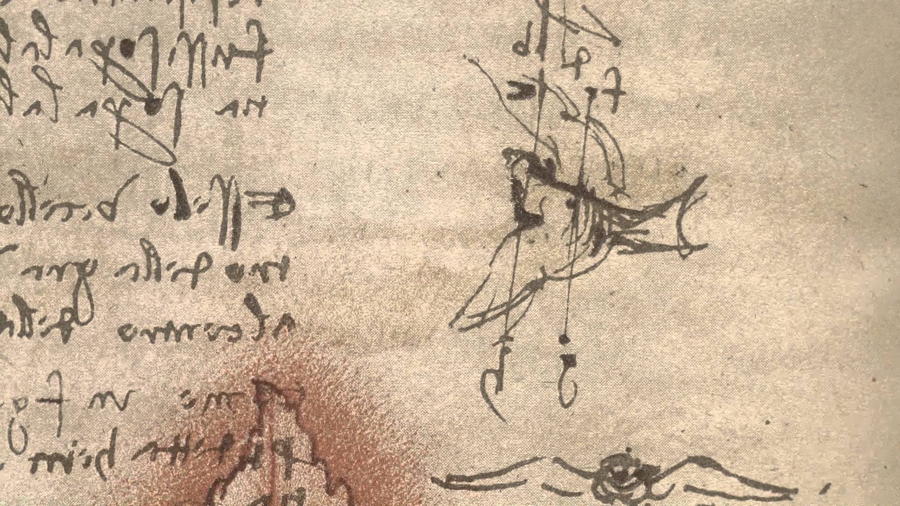
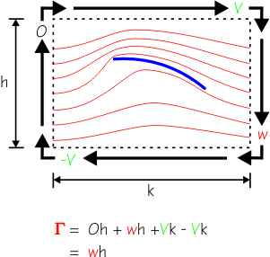
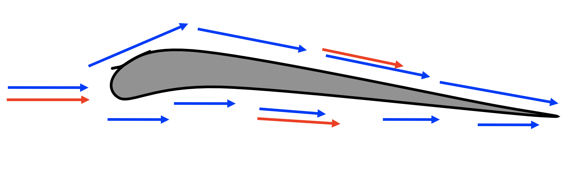
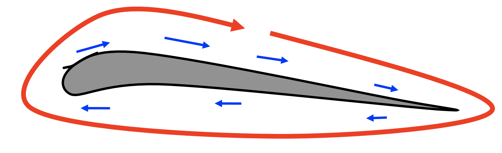
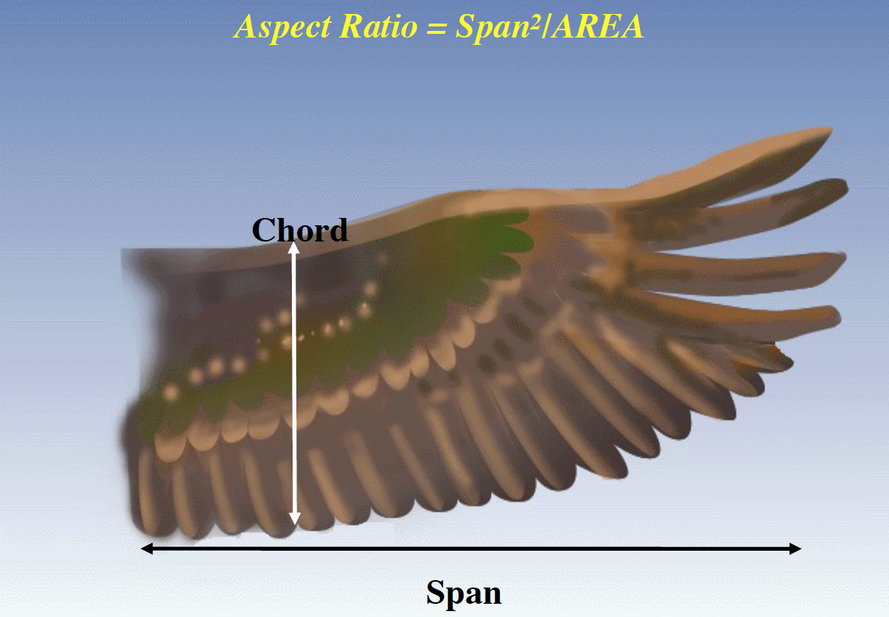
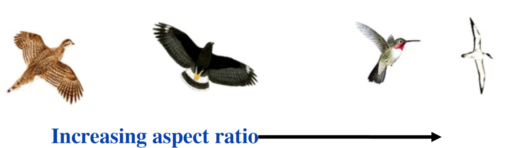
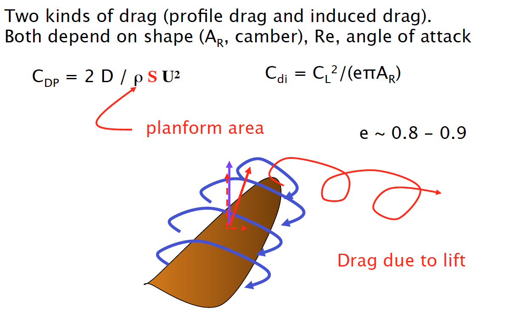
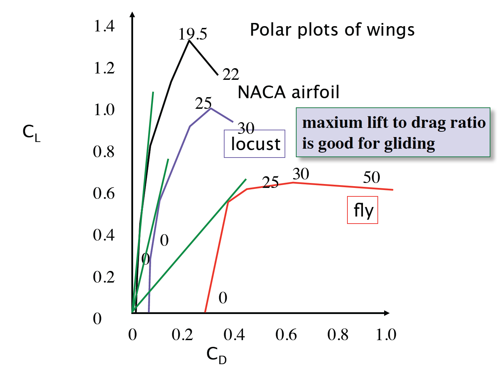

class: top
# Lift for a Living

```{r,echo=FALSE,message=FALSE}
library(tidyverse)
library(kableExtra)
library(scales)
```

<!-- Add icon library -->
<link rel="stylesheet" href="https://cdnjs.cloudflare.com/ajax/libs/font-awesome/5.14.0/css/all.min.css">


.pull-left[
Today we'll talk about ....

- The Eyes have it

- Theories for lift

- Problems (i.e., tradeoffs) with lift

- MP4 and wing design


]


.pull-right[

<iframe width="560" height="315" src="https://www.youtube.com/embed/UqBmdZ-BNig" title="YouTube video player" frameborder="0" allow="accelerometer; autoplay; clipboard-write; encrypted-media; gyroscope; picture-in-picture" allowfullscreen></iframe>


]


---

class: top

# Back to Bernouli

.center[

Along a streamline PE + KE + W + **E dissipated** = constant

 $$(P_2-P_1)/\rho+(u_2^2-u_1^2)/2=0$$ 
```{r,echo=FALSE,out.width=650}
#stride length


```
]


---

class: top

# Lift, as old as DiVinci


.center[

```{r,echo=FALSE,out.width=650}
#stride length


```

]


---

class: top

# A great read

.pull-left[

```{r,echo=FALSE,out.width=500}
#stride length
knitr::include_graphics("https://cdn.powered-by-nitrosell.com/product_images/1/162/large-272169_WRBR%20McCullough%20Book.jpg")

```
]

.pull-right[
```{r,echo=FALSE,out.width=300}
#stride length
knitr::include_graphics("https://www.pbs.org/wgbh/nova/wright/images/repo-wrightbrothers.jpg")

```

]


---

class: top

# A great read

.center[


```{r,echo=FALSE,out.width=250}
#stride length
knitr::include_graphics("https://www.wright-brothers.org/History_Wing/Wright_Story/Inventing_the_Airplane/Wagging_Its_Tail/Wagging_Its_Tail_images/Wing_twisting_Pettigrew_242.jpg")

```

```{r,echo=FALSE,out.width=500}
#stride length
knitr::include_graphics("https://kids.wng.org/sites/default/files/styles/slide/public/3_WingWarp_750x539.jpg?itok=45Dt76jB")

```

]

---

class: top

# A great read

.pull-left[


```{r,echo=FALSE,out.width=250}
#stride length
knitr::include_graphics("https://www.wright-brothers.org/History_Wing/Wright_Story/Inventing_the_Airplane/Wagging_Its_Tail/Wagging_Its_Tail_images/Wing_twisting_Pettigrew_242.jpg")

```

```{r,echo=FALSE,out.width=450}
#stride length
knitr::include_graphics("https://monovisions.com/wp-content/uploads/2015/02/Wright-Brothers-First-Flight-in-1903-06-1040x440.jpg")

```


]

.pull-right[
```{r,echo=FALSE,out.width=500}
#stride length
knitr::include_graphics("https://qph.fs.quoracdn.net/main-qimg-fe4802c2f00aca5bbe453f9100e85c60-c")

```

]


---

class: top

# Lift from Bernoulli
.center[

Path length not a factor

<iframe width="560" height="315" src="https://www.youtube.com/embed/UqBmdZ-BNig" title="YouTube video player" frameborder="0" allow="accelerometer; autoplay; clipboard-write; encrypted-media; gyroscope; picture-in-picture" allowfullscreen></iframe>
]


---

class: top

# Lift from circulation


.pull-left[

 
```{r,echo=FALSE,out.width=300}
#stride length


```

With the mean subtracted, there is an effective
circulation ( Γ ) about the wing. Greater Γ implies a
greater velocity difference 
]

.pull-right[
```{r,echo=FALSE,out.width=450}
#stride length


```


```{r,echo=FALSE,out.width=450}
#stride length


```

]

---

class: top

# Lift from circulation

.center[

w = downwash

<iframe width="560" height="315" src="https://www.youtube.com/embed/UqBmdZ-BNig" title="YouTube video player" frameborder="0" allow="accelerometer; autoplay; clipboard-write; encrypted-media; gyroscope; picture-in-picture" allowfullscreen></iframe>
]

---

class: top

# Lift tradeoffs


.center[

 
```{r,echo=FALSE,out.width=450}
#stride length


```

]
 
 
---

class: top

# Lift tradeoffs


.center[

 
```{r,echo=FALSE,out.width=650}
#stride length


```

Habitats?

Flight behavior?
]
 
 
---

class: top

# Lift tradeoffs


.center[

 
```{r,echo=FALSE,out.width=650}
#stride length


```

]

---

# Lift tradeoffs


.center[

 
```{r,echo=FALSE,out.width=650}
#stride length
knitr::include_graphics("http://blogs.bu.edu/biolocomotion/files/2011/10/trailing-vortex.jpg")

```

]

---

# Lift tradeoffs


.center[

 
```{r,echo=FALSE,out.width=650}
#stride length
knitr::include_graphics("https://www.flytime.ca/files/2013/05/wingtip_vortices_flyingindiancom.jpg")

```

]
 
---

class: top

# Lift tradeoffs


.center[

 
```{r,echo=FALSE,out.width=650}
#stride length
knitr::include_graphics("https://www.grc.nasa.gov/www/k-12/airplane/Images/incline.gif")

```

]

---

class: top

# Lift tradeoffs


.center[

 
```{r,echo=FALSE,out.width=650}
#stride length


```

]
 


---

class: center, middle

# Thanks!

Slides created via the R package [**xaringan**](https://github.com/yihui/xaringan).

