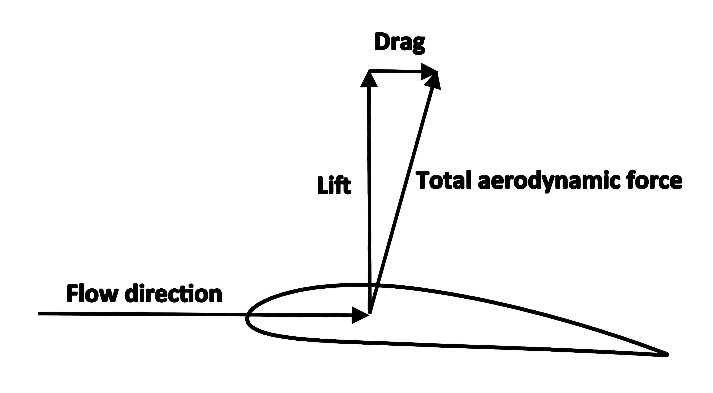
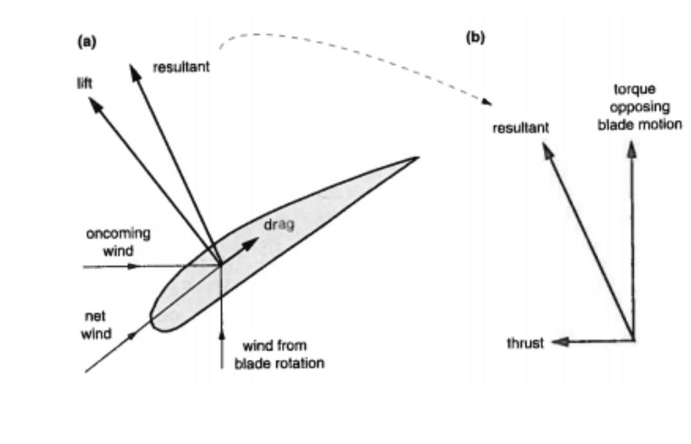
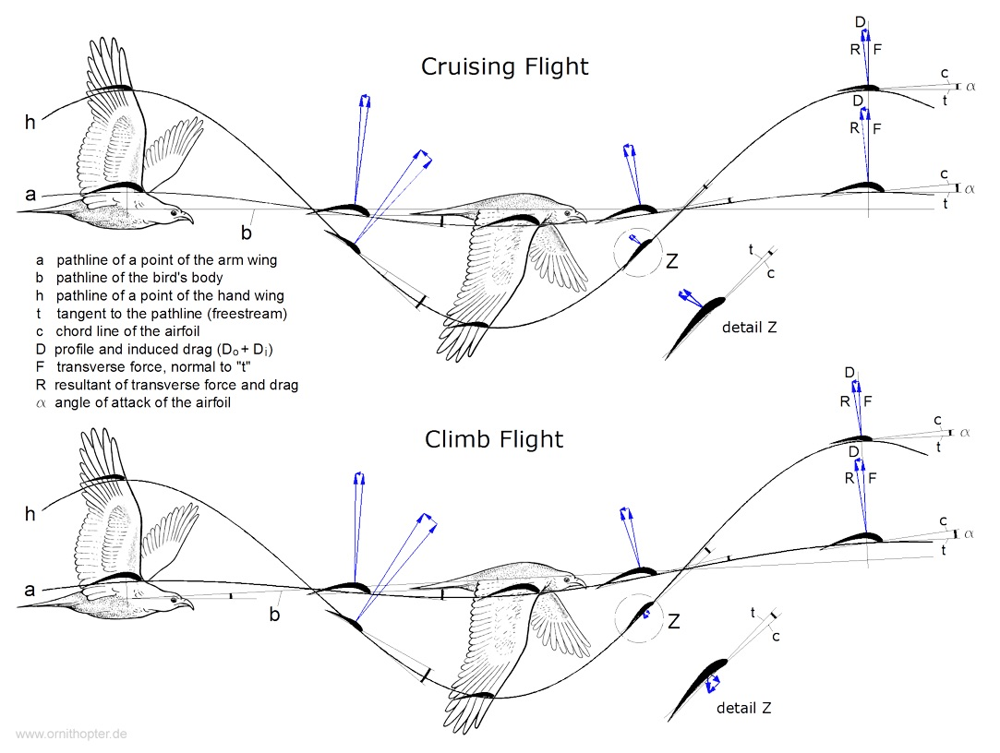
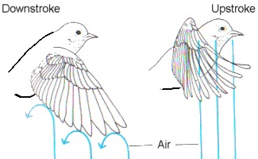
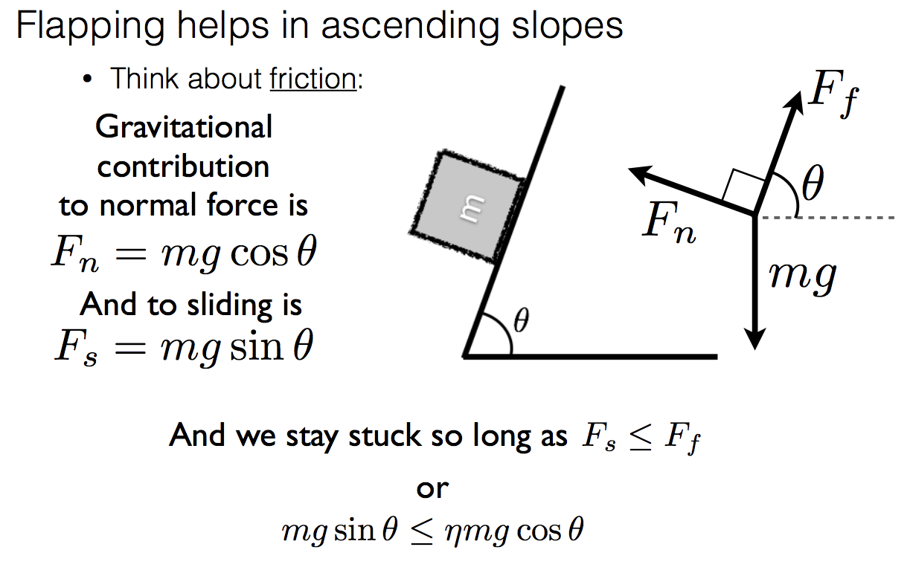
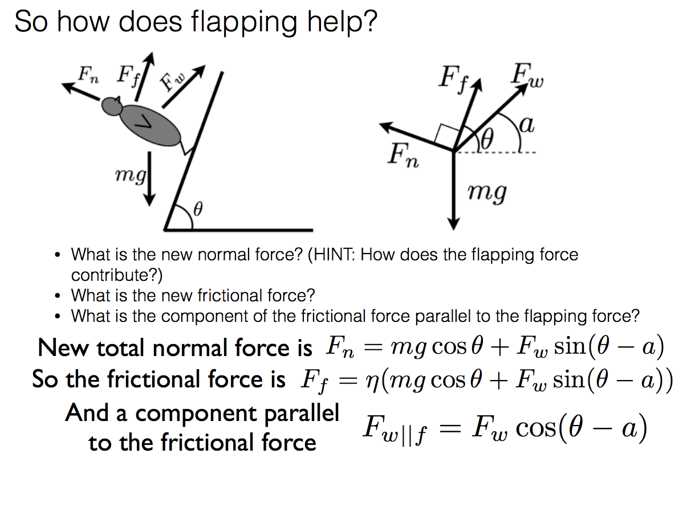

class: top
# Powered flight

```{r,echo=FALSE,message=FALSE}
library(tidyverse)
library(kableExtra)
library(scales)
```

<!-- Add icon library -->
<link rel="stylesheet" href="https://cdnjs.cloudflare.com/ajax/libs/font-awesome/5.14.0/css/all.min.css">


.pull-left[
Today we'll ....

- How birds generate forward thrust

- Evolution of flight


]


.pull-right[

<iframe width="560" height="315" src="https://www.youtube.com/embed/YfAHXY97kTA" title="YouTube video player" frameborder="0" allow="accelerometer; autoplay; clipboard-write; encrypted-media; gyroscope; picture-in-picture" allowfullscreen></iframe>


]


---

class: top

# Review of lift

.center[

Along a streamline PE + KE + W + **E dissipated** = constant

 $$(P_2-P_1)/\rho+(u_2^2-u_1^2)/2=0$$ 
```{r,echo=FALSE,out.width=650}
#stride length
knitr::include_graphics("img/bernlift.png")

```
]

LIFT: component perpendicular to direction of motion
DRAG: component parallel to direction of motion


---

class: top

# But how do animals do it?


.center[

```{r,echo=FALSE,out.width=650}
#stride length
knitr::include_graphics("https://www.scienceabc.com/wp-content/uploads/ext-www.scienceabc.com/wp-content/uploads/2016/04/Lift-2.jpg-.jpg")

```

They don't have props or engines.

]


---

class: top

# But how do animals do it?

.pull-left[

In gliding/soaring
```{r,echo=FALSE,out.width=300}
#stride length


```
]

.pull-right[

Powered flight, i.e., flapping

```{r,echo=FALSE,out.width=500}
#stride length


```

If the glide angle is large enough to
shift the net aerodynamic force
forward, there is a forward force
component.
]


---

class: top

# But how do animals do it?

.center[

Powered flight, i.e., flapping

```{r,echo=FALSE,out.width=400}
#stride length
knitr::include_graphics("https://www.flight-mechanic.com/wp-content/uploads/2017/07/2-35.jpg")

```

Helicopters have to pitch the rotors to produce forward thrust
]


---


class: top

# But how do animals do it?

.center[


```{r,echo=FALSE,out.width=500}
#stride length


```


]

Over flap cycle:

  * lift overcomes weight
  * thrust overcomes drag

---


class: top

# But how do animals do it?

.center[


<iframe width="560" height="315" src="https://www.youtube.com/embed/YfAHXY97kTA" title="YouTube video player" frameborder="0" allow="accelerometer; autoplay; clipboard-write; encrypted-media; gyroscope; picture-in-picture" allowfullscreen></iframe>


]


Over flap cycle:

  * lift overcomes weight
  * thrust overcomes drag


---


class: top

# But how do animals do it?

.pull-left[

Wing is folded on upstroke (amongst other things): 

  * Reduced wing area
  * Drive less air
  * Reduced *drag* and lift
  * Typically undulating flight path

  ]
  
.pull-right[      
```{r,echo=FALSE,out.width=500}
#stride length


```  


 ]

.center[      
```{r,echo=FALSE,out.width=400}
#stride length
knitr::include_graphics("https://cdn.birdwatchingdaily.com/2020/07/Songbird-flight-paths.jpg")

```  


 ]


---

class: top

# Is flight efficient?

.center[


```{r,echo=FALSE,out.width=500}
#stride length
knitr::include_graphics("https://royalsocietypublishing.org/cms/asset/8c609013-d1ee-496f-bb8a-fd5388766e49/rstb20150384f04.jpg")

```

Why somewhere in the middle?

]


---

class: top

# Evolution of bird flight

  * Ostrom's Bug-net Theory

.center[

```{r,echo=FALSE,out.width=500}
#stride length
knitr::include_graphics("http://4.bp.blogspot.com/-4LE4fIp5TqU/T2TQpDLL9sI/AAAAAAAABKk/WjGqtjK75vk/s1600/Dino.jpg")

```

REJECTED

]

---

class: top

# Evolution of bird flight

  * Top-down (arboreal - began gliding from trees)
  * Bottom-up (cursorial - running take-off)
  * WAC (Wing-Assisted climbing) 
  * WAIR (Wing-Assisted Incline Running) 

.center[

```{r,echo=FALSE,out.width=250}
#stride length
knitr::include_graphics("https://www.researchgate.net/profile/Sankar-Chatterjee/publication/278708131/figure/fig3/AS:267540194656302@1440797961634/Four-models-for-the-origin-of-avian-flight-a-Running-for-the-cursorial-model-a.png
")

```
]


---

class: top

# Evolution of bird flight

  * Top-down (arboreal - began gliding from trees)
  * Bottom-up (cursorial - running take-off)
  * WAC (Wing-Assisted climbing) 
  * WAIR (Wing-Assisted Incline Running) 

.center[

<iframe width="560" height="315" src="https://www.youtube.com/embed/5Rjin-tjOxU" title="YouTube video player" frameborder="0" allow="accelerometer; autoplay; clipboard-write; encrypted-media; gyroscope; picture-in-picture" allowfullscreen></iframe>
]


---

class: top

# Evolution of bird flight

## WAIR (Wing-Assisted Incline Running) 

.center[


```{r,echo=FALSE,out.width=700}
#stride length


```
]

---

class: top

# Evolution of bird flight

## WAIR (Wing-Assisted Incline Running) 

.center[


```{r,echo=FALSE,out.width=600}
#stride length


```
]


---

class: center, middle

# Thanks!

Slides created via the R package [**xaringan**](https://github.com/yihui/xaringan).

