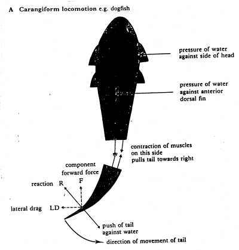
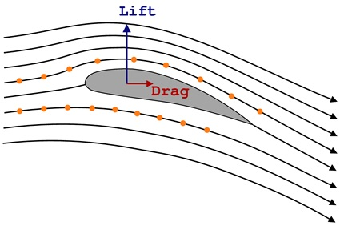
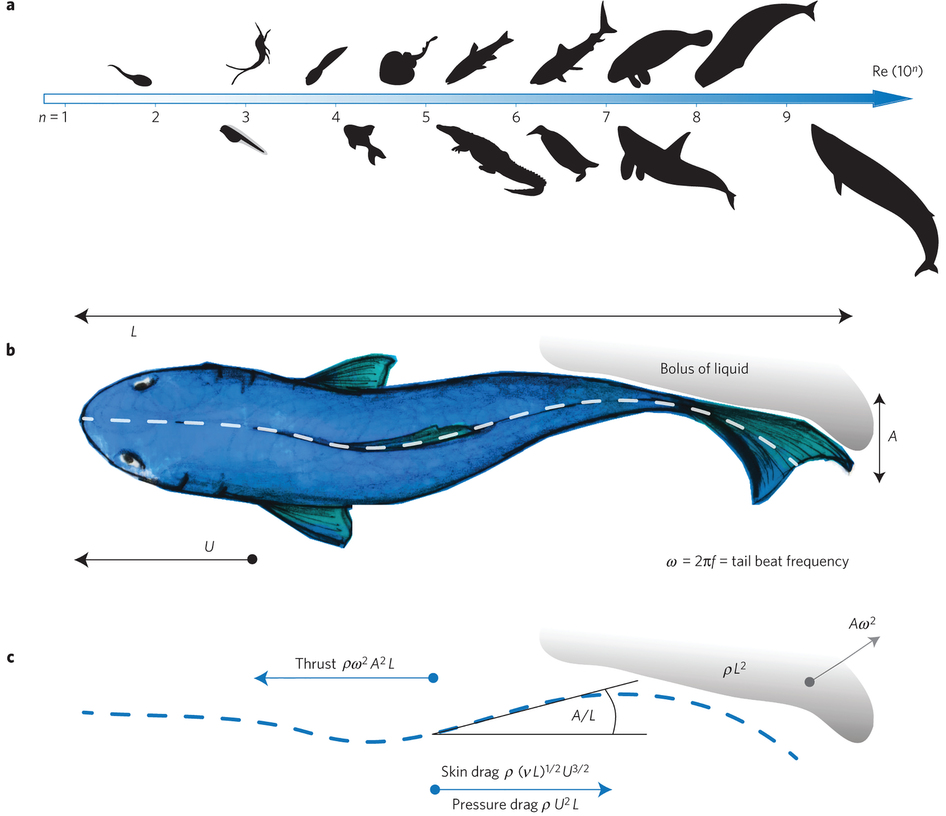
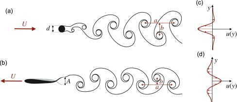
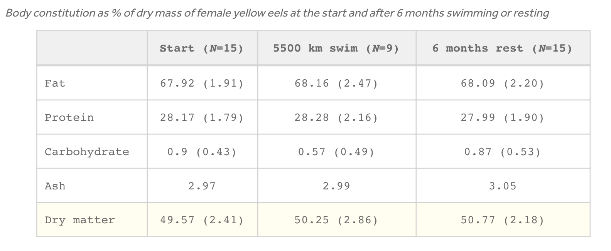

class: top
# Powered flight

```{r,echo=FALSE,message=FALSE,warning=FALSE}
library(tidyverse)
library(kableExtra)
library(scales)
```

<!-- Add icon library -->
<link rel="stylesheet" href="https://cdnjs.cloudflare.com/ajax/libs/font-awesome/5.14.0/css/all.min.css">


.pull-left[
Today we'll introduce

- Fish swimming basics (thrust, modes, etc.)

- Efficiency


]


.pull-right[

<iframe width="400" height="200" src="https://www.youtube.com/embed/Mz7fuqJ8sKY" title="YouTube video player" frameborder="0" allow="accelerometer; autoplay; clipboard-write; encrypted-media; gyroscope; picture-in-picture" allowfullscreen></iframe>


]


---

class: top

# Swimming basics

.pull-left[


```{r,echo=FALSE,out.width=650}
#stride length


```
]

.pull-right[
```{r,echo=FALSE,out.width=650}
#stride length


```

]


---

class: top

# Swimming basics


.center[
```{r,echo=FALSE,out.width=550}
#stride length
knitr::include_graphics("img/swimmingtypes.jpg")

```

]


---

class: top

# Swimming basics


.center[

Elongate Body Theory

```{r,echo=FALSE,out.width=4550}
#stride length


```

]

---

class: top

# Efficient swimming

$\textrm{Strouhal number, S}t=\frac{fA}{U}$

.center[
```{r,echo=FALSE,out.width=450}
#stride length


```


```{r,echo=FALSE,out.width=500}
#stride length
knitr::include_graphics("img/strouhalnums.jpg")

```

]

.center[
Propulsive efficiency peaks when the kinematics result in maximum amplification of the shed vortices in the wake and an average velocity profile equivalent to a jet
]

---

class: top

# Efficient swimming

$\textrm{Froude number, Fr}=\frac{2U_f}{U_f+U_j}$


.center[
```{r,echo=FALSE,out.width=500}
#stride length
knitr::include_graphics("img/froudefish.jpg")

```


Propulsive efficiency peaks when the kinematics result in maximum amplification of the shed vortices in the wake and an average velocity profile equivalent to a jet
]
                         
    
---

class: top

# Swimming modes in fishes


.pull-left[
```{r,echo=FALSE,out.width=650}
#stride length
knitr::include_graphics("https://www.researchgate.net/profile/Fotis-Sotiropoulos/publication/47809555/figure/fig4/AS:277256258768897@1443114451095/Simulated-swimming-modes-and-body-shapes-A-Midline-tracings-of-carangiform-and.png")

```

Once characterized by Amplitude and body "stiffness".

Now being reassessed, but generally a continuum according to where thrust is produced.

]

.pull-right[


<iframe width="400" height="200" src="https://www.youtube.com/embed/wamEGOZXG3Y" title="YouTube video player" frameborder="0" allow="accelerometer; autoplay; clipboard-write; encrypted-media; gyroscope; picture-in-picture" allowfullscreen></iframe>

<iframe width="400" height="200" src="https://www.youtube.com/embed/Mz7fuqJ8sKY" title="YouTube video player" frameborder="0" allow="accelerometer; autoplay; clipboard-write; encrypted-media; gyroscope; picture-in-picture" allowfullscreen></iframe>

]

---


class: top

# Back to efficiency


.center[

```{r,echo=FALSE,out.width=500}
#stride length
knitr::include_graphics("https://images.newscientist.com/wp-content/uploads/2016/03/mg30651001.jpg?width=800")

```


]

---


class: top

# Back to efficiency


.center[

```{r,echo=FALSE,out.width=500}
#stride length


```


]


---

class: top

# Using vortices


.center[

<iframe width="560" height="315" src="https://www.youtube.com/embed/GtuHgl35TT4" title="YouTube video player" frameborder="0" allow="accelerometer; autoplay; clipboard-write; encrypted-media; gyroscope; picture-in-picture" allowfullscreen></iframe>


]
---


class: top

# Using vortices


.center[

```{r,echo=FALSE,out.width=300}
#stride length
knitr::include_graphics("https://www.science.org/cms/10.1126/science.1092367/asset/6dfde647-20e9-4bdd-9b07-6e8aaa937017/assets/graphic/1511-1.gif")

```


]
---

class: top

# Using vortices


.center[

```{r,echo=FALSE,out.width=300}
#stride length
knitr::include_graphics("img/karmangait.png")

```


]


---

class: center, middle

# Thanks!

Slides created via the R package [**xaringan**](https://github.com/yihui/xaringan).

