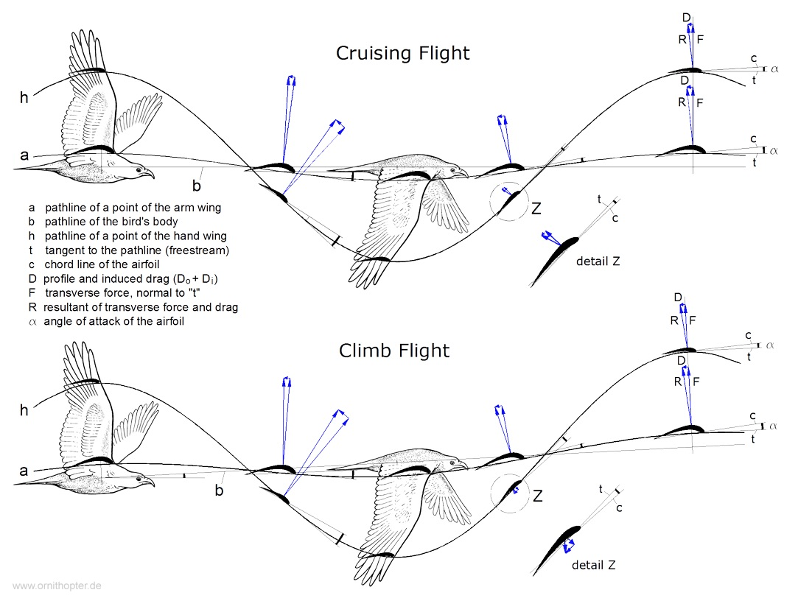
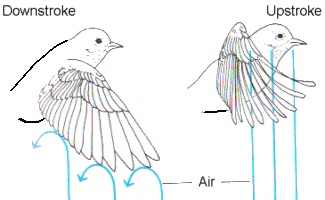

class: top
# Powered flight

```{r,echo=FALSE,message=FALSE}
library(tidyverse)
library(kableExtra)
library(scales)
```

<!-- Add icon library -->
<link rel="stylesheet" href="https://cdnjs.cloudflare.com/ajax/libs/font-awesome/5.14.0/css/all.min.css">


.pull-left[
Today we'll introduce

- Fish swimming basics (thrust, modes, etc.)

- Efficiency


]


.pull-right[

<iframe width="400" height="200" src="https://www.youtube.com/embed/Mz7fuqJ8sKY" title="YouTube video player" frameborder="0" allow="accelerometer; autoplay; clipboard-write; encrypted-media; gyroscope; picture-in-picture" allowfullscreen></iframe>


]


---

class: top

# Swimming basics

.pull-left[


```{r,echo=FALSE,out.width=650}
#stride length
knitr::include_graphics("img/sharkmove1.jpg")

```
]

.pull-right[
```{r,echo=FALSE,out.width=650}
#stride length
knitr::include_graphics("img/lift.jpg")

```

]


---

class: top

# Swimming basics


.center[
```{r,echo=FALSE,out.width=550}
#stride length
knitr::include_graphics("img/swimmingtypes.jpg")

```

]


---

class: top

# Swimming basics


.center[

Elongate Body Theory

```{r,echo=FALSE,out.width=4550}
#stride length
knitr::include_graphics("img/undswim.jpg")

```

]

---

class: top

# Efficient swimming

$\textrm{Strouhal number, S}t=\frac{fA}{U}$

.center[
```{r,echo=FALSE,out.width=450}
#stride length
knitr::include_graphics("img/strouhal.jpg")

```


```{r,echo=FALSE,out.width=500}
#stride length
knitr::include_graphics("img/strouhalnums.jpg")

```

]

.center[
Propulsive efficiency peaks when the kinematics result in maximum amplification of the shed vortices in the wake and an average velocity profile equivalent to a jet
]

---

class: top

# Efficient swimming

$\textrm{Froude number, Fr}=\frac{2U_f}{U_f+U_j}$


.center[
```{r,echo=FALSE,out.width=500}
#stride length
knitr::include_graphics("img/froudefish.jpg")

```


Propulsive efficiency peaks when the kinematics result in maximum amplification of the shed vortices in the wake and an average velocity profile equivalent to a jet
]
                         
    
---

class: top

# Swimming modes in fishes


.pull-left[
```{r,echo=FALSE,out.width=650}
#stride length
knitr::include_graphics("https://www.researchgate.net/profile/Fotis-Sotiropoulos/publication/47809555/figure/fig4/AS:277256258768897@1443114451095/Simulated-swimming-modes-and-body-shapes-A-Midline-tracings-of-carangiform-and.png")

```

Once characterized by Amplitude and body "stiffness".

Now being reassessed, but generally a continuum according to where thrust is produced.

]

.pull-right[


<iframe width="400" height="200" src="https://www.youtube.com/embed/wamEGOZXG3Y" title="YouTube video player" frameborder="0" allow="accelerometer; autoplay; clipboard-write; encrypted-media; gyroscope; picture-in-picture" allowfullscreen></iframe>

<iframe width="400" height="200" src="https://www.youtube.com/embed/Mz7fuqJ8sKY" title="YouTube video player" frameborder="0" allow="accelerometer; autoplay; clipboard-write; encrypted-media; gyroscope; picture-in-picture" allowfullscreen></iframe>

]

---


class: top

# Back to efficiency


.center[

```{r,echo=FALSE,out.width=500}
#stride length
knitr::include_graphics("https://images.newscientist.com/wp-content/uploads/2016/03/mg30651001.jpg?width=800")

```


]

---


class: top

# Back to efficiency


.center[

```{r,echo=FALSE,out.width=500}
#stride length
knitr::include_graphics("img/eeltable.png")

```


]


---

class: top

# Using vortices


.center[

<iframe width="560" height="315" src="https://www.youtube.com/embed/GtuHgl35TT4" title="YouTube video player" frameborder="0" allow="accelerometer; autoplay; clipboard-write; encrypted-media; gyroscope; picture-in-picture" allowfullscreen></iframe>


]
---


class: top

# Using vortices


.center[

```{r,echo=FALSE,out.width=300}
#stride length
knitr::include_graphics("https://science.sciencemag.org/content/sci/302/5650/1511/F1.medium.gif")

```


]
---

class: top

# Using vortices


.center[

```{r,echo=FALSE,out.width=300}
#stride length


```


]


---

class: top

# But how do animals do it?

.pull-left[

In gliding/soaring
```{r,echo=FALSE,out.width=300}
#stride length
knitr::include_graphics("img/liftdrag.jpg")

```
]

.pull-right[

Powered flight, i.e., flapping

```{r,echo=FALSE,out.width=500}
#stride length
knitr::include_graphics("img/glideangle.png")

```

If the glide angle is large enough to
shift the net aerodynamic force
forward, there is a forward force
component.
]


---

class: top

# But how do animals do it?

.center[

Powered flight, i.e., flapping

```{r,echo=FALSE,out.width=500}
#stride length
knitr::include_graphics("https://lh3.googleusercontent.com/proxy/xwK9xWzYp4bIWJt2wEit2jL3R29yB4Cpu7MDG7YAKgZNfno9lM8U-Z1SrOH7Yirq81Xk1QRpUqkux5Ibx428dfiBc3la48eNl_TwkwfevrHzHqJv2K5Yb0hyZyZgxFNiDtDSyTh4zOjQJS_zbt3yVomFpQ53dmc")

```

Helicopters have to pitch the rotors to produce forward thrust
]


---


class: top

# But how do animals do it?

.center[


```{r,echo=FALSE,out.width=500}
#stride length


```


]

Over flap cycle:

  * lift overcomes weight
  * thrust overcomes drag

---


class: top

# But how do animals do it?

.center[


<iframe width="560" height="315" src="https://www.youtube.com/embed/YfAHXY97kTA" title="YouTube video player" frameborder="0" allow="accelerometer; autoplay; clipboard-write; encrypted-media; gyroscope; picture-in-picture" allowfullscreen></iframe>


]


Over flap cycle:

  * lift overcomes weight
  * thrust overcomes drag


---


class: top

# But how do animals do it?

.pull-left[

Wing is folded on upstroke (amongst other things): 

  * Reduced wing area
  * Drive less air
  * Reduced *drag* and lift
  * Typically undulating flight path

  ]
  
.pull-right[      
```{r,echo=FALSE,out.width=500}
#stride length


```  


 ]

.center[      
```{r,echo=FALSE,out.width=400}
#stride length
knitr::include_graphics("https://cdn.birdwatchingdaily.com/2020/07/Songbird-flight-paths.jpg")

```  


 ]


---

class: top

# Is flight efficient?

.center[


```{r,echo=FALSE,out.width=500}
#stride length
knitr::include_graphics("https://royalsocietypublishing.org/cms/asset/8c609013-d1ee-496f-bb8a-fd5388766e49/rstb20150384f04.jpg")

```

Why somewhere in the middle?

]


---

class: top

# Evolution of bird flight

  * Top-down (arboreal - began gliding from trees)
  * Bottom-up (cursorial - running take-off)
  * WAIR (Wing-Assisted Incline Running) 

.center[

<iframe width="560" height="315" src="https://www.youtube.com/embed/5Rjin-tjOxU" title="YouTube video player" frameborder="0" allow="accelerometer; autoplay; clipboard-write; encrypted-media; gyroscope; picture-in-picture" allowfullscreen></iframe>
]


---

class: top

# Evolution of bird flight

## WAIR (Wing-Assisted Incline Running) 

.center[


```{r,echo=FALSE,out.width=700}
#stride length
knitr::include_graphics("img/wair.png")

```
]

---

class: top

# Evolution of bird flight

## WAIR (Wing-Assisted Incline Running) 

.center[


```{r,echo=FALSE,out.width=600}
#stride length
knitr::include_graphics("img/wair2.png")

```
]


---

class: center, middle

# Thanks!

Slides created via the R package [**xaringan**](https://github.com/yihui/xaringan).

