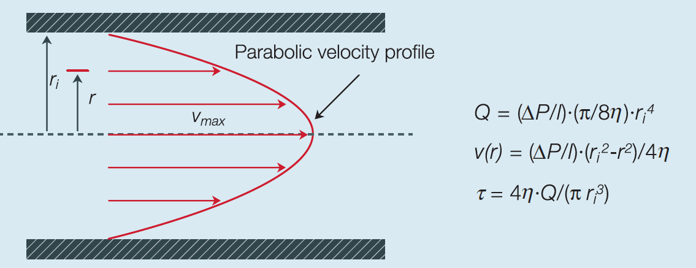
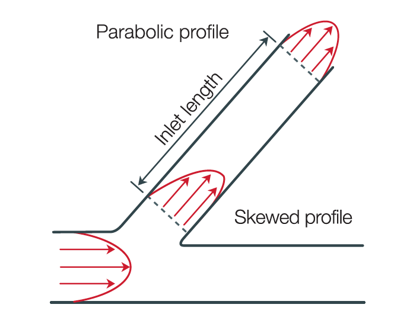
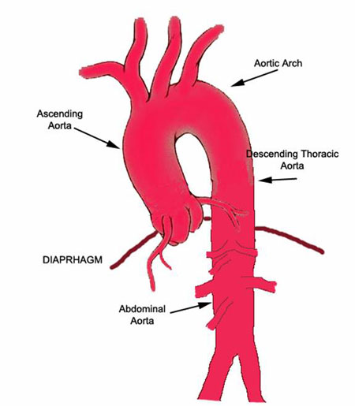
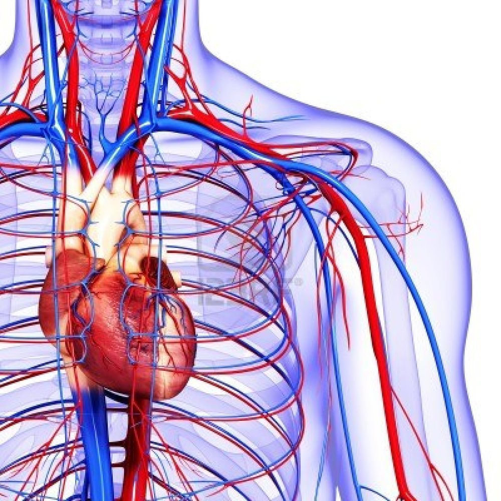

class: top
# There will be blood

```{r,echo=FALSE,message=FALSE,warning=FALSE}
library(tidyverse)
library(kableExtra)
library(scales)
```

<!-- Add icon library -->
<link rel="stylesheet" href="https://cdnjs.cloudflare.com/ajax/libs/font-awesome/5.14.0/css/all.min.css">


.pull-left[
Today we'll introduce

- Hagen-Poiseuille law

- Violation of H-P (how it really works)

- Laundry list of other important laws/models


]


.pull-right[

<iframe width="400" height="200" src="https://www.youtube.com/embed/pwmlP1hLJf0" title="YouTube video player" frameborder="0" allow="accelerometer; autoplay; clipboard-write; encrypted-media; gyroscope; picture-in-picture" allowfullscreen></iframe>


]


---

class: top

# Flow in tubes (inside you!)

Cardiovascular system and elsewhere, too? Where?

.center[

```{r,echo=FALSE,out.width=600}
#stride length
knitr::include_graphics("https://www.cvphysiology.com/uploads/images/h006-laminar-flow.png")

```


]

---

class: top

# Flow in tubes (inside you!)

.center[

```{r,echo=FALSE,out.width=600}
#stride length


```

$$\Delta p={\frac{8\mu LQ}{\pi R^{4}}}={\frac{8\pi \mu LQ}{A^{2}}}$$

]

- The tube is stiff, straight, and uniform

- Blood is Newtonian , i.e., viscosity is constant

- The flow is uniform, laminar and steady, not pulsatile, and the velocity at the wall is zero (no slip at the wall)


---

class: top

# Flow in tubes (inside you!)

.center[

```{r,echo=FALSE,out.width=600}
#stride length


```

$$Q=\frac{R^4\Delta P}{8\mu L}$$
Hagen-Poiseuille law

Valid until the flow is turbulent!
(Re > ~ 2000)
]


---

class: top

# Flow in tubes (inside you!)

.center[

```{r,echo=FALSE,out.width=300}
#stride length
knitr::include_graphics("https://www.mayoclinic.org/-/media/kcms/gbs/patient-consumer/images/2013/11/15/17/35/ds00525_-ds01120_-ds00064_-ds00178_-ds01052_-ds00537_-ds01179_im00642_ww5r236t_jpg.jpg
")

```

$$Q=\frac{R^4\Delta P}{8\mu L}$$
Hagen-Poiseuille law

Effects of ateriosclerosis?
]

---

class: top

# Flow in tubes (inside you!)

.center[

```{r,echo=FALSE,out.width=400}
#stride length
knitr::include_graphics("https://i1.wp.com/www.differencebetween.com/wp-content/uploads/2017/07/Difference-Between-Vasoconstriction-and-Vasodilation-3.png?w=800&ssl=1
")

```

$$Q=\frac{R^4\Delta P}{8\mu L}$$
Hagen-Poiseuille law

Non-linear effects of vasodialation and vasoconstriction?
]


---

class: top

# Flow in tubes (inside you!)

.pull-left[

Flow profile is altered by branches:

- Flow entering a side branch results in skewed profile. 
- It takes a certain inlet length before the velocity develops into a parabolic profile again.....


]

.pull-right[

```{r,echo=FALSE,out.width=400}
#stride length


```

$\frac{l_{inlet}}{D}\approx 0.6Re$

$l_{inlet}\approx 0.6ReD$


]


---

class: top

# Flow in tubes (inside you!)

.pull-left[

 Flow profile is altered by branches (non-uniform):

- Aorta mean blood flow is about 6 l/min
- D=3 cm
- Mean velocity is ~ 15 cm/s
- Re~1350


]

.pull-right[

```{r,echo=FALSE,out.width=400}
#stride length


```

$\frac{l_{inlet}}{D}\approx 0.6Re$

$l_{inlet}\approx 0.6ReD$


]


---

class: top

# Flow in tubes (inside you!)

Flow is pulsatile, but not everywhere.

.center[

```{r,echo=FALSE,out.width=400}
#stride length
knitr::include_graphics("https://www.researchgate.net/publication/343487724/figure/fig2/AS:921709901271042@1596764173575/Windkessel-model-a-schematic-diagram-of-the-windkessel-effect-redrawn-based-on.ppm")

```


]


---

class: top

#  Poiseuille, Bernoulli, Leplace, etc. in design

.pull-left[

- Number of capillaries (Fick's Law for diffusion)
- Diameter of capillaries (Peclet number for balancing diffusion and convection)
- Relative diameter of other vessels (Murray's law for minimizing circulatory work)
- Relative thickness of vessel walls (Leplace's law for how size sets pressure versus wall tension)
- Relative size of capillaries and alveoli (Diffusion coefficients of O2 in air and water.)
- Concentration of RBCs (cell density vs. viscosity and Poiseuille pressure drop)

]

.pull-right[

```{r,echo=FALSE,out.width=400}
#stride length


```


]

---

class: center, middle

# Thanks!

Slides created via the R package [**xaringan**](https://github.com/yihui/xaringan).

