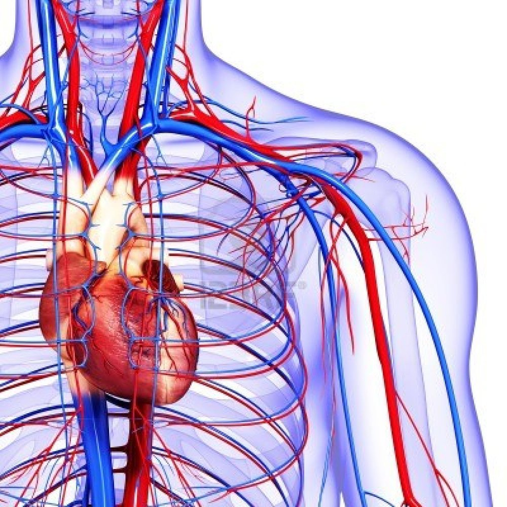

class: top
# There will be blood

```{r,echo=FALSE,message=FALSE}
library(tidyverse)
library(kableExtra)
library(scales)
```

<!-- Add icon library -->
<link rel="stylesheet" href="https://cdnjs.cloudflare.com/ajax/libs/font-awesome/5.14.0/css/all.min.css">


.pull-left[
Today we'll consider

- Being small

- Movement and translocation of the small

- Modeling this


]


.pull-right[


]


---

class: top

# Flow in tubes (inside you!)

Flow is pulsatile, but not everywhere.

.center[

```{r,echo=FALSE,out.width=400}
#stride length
knitr::include_graphics("https://www.researchgate.net/publication/343487724/figure/fig2/AS:921709901271042@1596764173575/Windkessel-model-a-schematic-diagram-of-the-windkessel-effect-redrawn-based-on.ppm")

```


]


---

class: top

#  Poiseuille, Bernoulli, Leplace, etc. in design

.pull-left[

- Number of capillaries (Fick's Law for diffusion)
- Diameter of capillaries (Peclet number for balancing diffusion and convection)
- Relative diameter of other vessels (Murray's law for minimizing circulatory work)
- Relative thickness of vessel walls (Leplace's law for how size sets pressure versus wall tension)
- Relative size of capillaries and alveoli (Diffusion coefficients of O2 in air and water.)
- Concentration of RBCs (cell density vs. viscosity and Poiseuille pressure drop)

]

.pull-right[

```{r,echo=FALSE,out.width=400}
#stride length


```


]


---

class: top

#  Life at low Re

.pull-left[

- disturbances are manifest over huge relative distances.
(boundaries are all important)
- inertia is negligible
-  shape matters considerably less (no wakes)

]

.pull-right[

```{r,echo=FALSE,out.width=400}
#stride length
knitr::include_graphics("https://static.wixstatic.com/media/f4f67b_7db070f86706435fafb5acca66f8db69~mv2_d_2420_1330_s_2.png/v1/fill/w_527,h_286,al_c,q_85,usm_0.66_1.00_0.01/ReynoldsNumbersOrganisms.webp")

```


]

---

class: top

#  Life at low Re

.pull-left[

- disturbances are manifest over huge relative distances.
(boundaries are all important)
- inertia is negligible
-  shape matters considerably less (no wakes)

]

.pull-right[

```{r,echo=FALSE,out.width=400}
#stride length
knitr::include_graphics("https://static.wixstatic.com/media/f4f67b_7db070f86706435fafb5acca66f8db69~mv2_d_2420_1330_s_2.png/v1/fill/w_527,h_286,al_c,q_85,usm_0.66_1.00_0.01/ReynoldsNumbersOrganisms.webp")

```


]

.center[
<iframe width="560" height="315" src="https://www.youtube.com/embed/U9g4gRWkFTs" title="YouTube video player" frameborder="0" allow="accelerometer; autoplay; clipboard-write; encrypted-media; gyroscope; picture-in-picture" allowfullscreen></iframe>
]


---

class: top

#  Life at low Re


.pull-left[
How far will this flagellate go?

]

.pull-right[

```{r,echo=FALSE,out.width=400}
#stride length
knitr::include_graphics("https://water.mecc.edu/courses/ENV108/clipart/PAXIT015.jpg")

```


]

.center[

$$m\frac{dU}{dt}=6\pi r\mu U$$
$$U=U_oe^{-6\pi rt\mu /m}$$

]


---

class: top

#  Life at low Re


.pull-left[
How far will this flagellate go?

speed= 40 μm s^−1

size= 1 μm 

$\textrm{mass=}10^{−12}\textrm{ g}$

$\mu$=1 mPa/s

$$m\frac{dU}{dt}=6\pi r\mu U$$
$$U=U_oe^{-6\pi rt\mu /m}$$

]

.pull-right[

```{r,echo=FALSE,out.width=400}
#stride length
knitr::include_graphics("https://water.mecc.edu/courses/ENV108/clipart/PAXIT015.jpg")

```


]


---

class: top

#  Life at low Re


.pull-left[
How far will this flagellate go?

speed= 40 μm s^−1

size= 1 μm 

$\textrm{mass=}10^{−12}\textrm{ g}$

$\mu$=1 mPa/s

$$m\frac{dU}{dt}=6\pi r\mu U$$
$$U=U_oe^{-6\pi rt\mu /m}$$

]

.pull-right[

```{r,out.height=250,warning=FALSE}
u <- function(Uo,m,mu,t,r){
  Uo*exp(-6*pi*r*t*mu/m)
}

t <- seq(0,1,0.001)
Ut <- u(Uo=40*1e-6,m=10^-12,t=t,r=1e-6,mu=1e-3)

p1 <- qplot(t,log(Ut))+theme_classic(20)+ylab("U (m/s)")+xlab("t (s)")
print(p1)

```


]

.center[


]


---

class: top

#  Life at low Re


.pull-left[

```{r,out.height=300,echo=FALSE,warning=FALSE}

print(p1)

```

]

.pull-right[


```{r,out.height=300,echo=FALSE,warning=FALSE}

dx <- cumsum(Ut*0.001)

p2 <- qplot(t,log(dx))+theme_classic(20)+ylab("Dist. (m)")+xlab("t (s)")

print(p2)

```

dist=U x t

]


---

class: top

#  Life at low Re

How far will it go?
.pull-left[

```{r,out.height=300,echo=FALSE,warning=FALSE}

print(p2)

```

]

.pull-right[


```{r,out.height=300,echo=FALSE,warning=FALSE}

print(p2+xlim(c(0,t[which(Ut==0)][1])))

d <- Ut*t

dx[which(Ut==0)[2]-1]

```

He atom is 1.4 × 10^-10 m

]


---

class: top

#  Life at low Re


.pull-left[
How far will a pollen spore go?

speed= 10 m s^−1 

size= 100 μm 

$\textrm{mass=}2.5^{−10}\textrm{ g}$

$\mu$=.2 mPa/s

In the X . . .
$$m\frac{dU}{dt}=6\pi r\mu U$$
In the Y . . .
$$m\frac{dV}{dt}=6\pi r\mu U-mg$$


]

.pull-right[

```{r,echo=FALSE,out.width=400}
#stride length
knitr::include_graphics("https://www.botany.one/wp-content/uploads/2019/04/Misc_pollen_colorized.jpg")

```


]


---

class: top

#  Life at low Re


.pull-left[
How far will a pollen spore go?

speed= 10 m s^−1 

size= 100 μm 

$\textrm{mass=}2.5^{−10}\textrm{ g}$

$\mu$=.2 mPa/s

In the X . . .
$$m\frac{dU}{dt}=6\pi r\mu U$$
In the Y . . .
$$m\frac{dV}{dt}=6\pi r\mu U-mg$$


]

.pull-right[

```{r,echo=TRUE,out.width=200}

t2 <- seq(0,100,0.001)
uy <- function(Uo,m,mu,t,r,g=9.8){
  Uo*exp(-6*pi*r*t*mu/m-g)*-1}

Uy <- uy(Uo=10,m=12.5*10^-9,t=t2,r=1e-4,mu=2e-5)
Ux <- u(Uo=10,m=12.5*10^-9,t=t2,r=1e-4,mu=2e-5)

dy <- cumsum(Uy*0.001)
dx <- cumsum(Ux*0.001)
qplot(dx,dy)+ylab("dY (m)")+xlab("dX (m)")+theme_classic(20)
```


]


---


class: center, middle

# Thanks!

Slides created via the R package [**xaringan**](https://github.com/yihui/xaringan).

